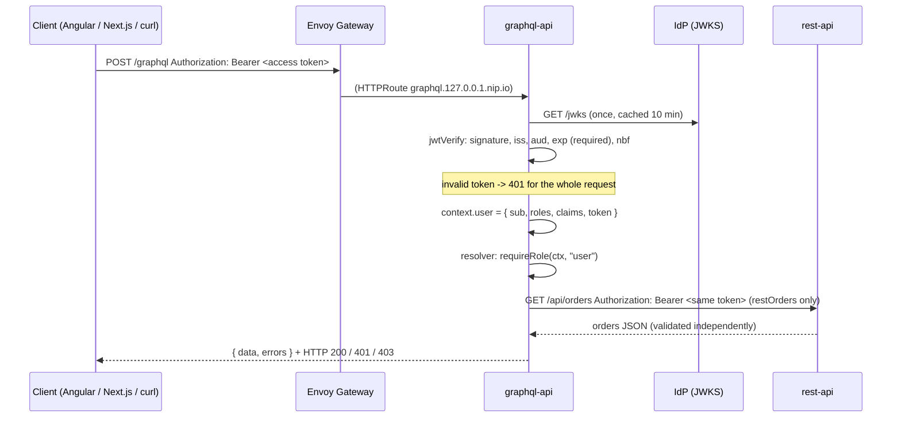

# graphql-api — JWT-protected GraphQL API (Node 22 · Apollo Server 5 · Express 5 · jose)

A small GraphQL service that **only validates tokens**. It never sees a password, never talks to the
identity provider (IdP) except to download its public signing keys, and it works unchanged with the
mock IdP, Keycloak, Microsoft Entra ID or Oracle IAM — only environment variables differ.

It demonstrates four things:

1. **Bearer-token validation with jose** — signature via the IdP's JWKS, exact `iss` match, `aud` must contain
   `k8sgateway-api`, `exp` mandatory, `exp`/`nbf` with 60 s clock tolerance, asymmetric algorithms only
   (`alg=none` / `HS*` rejected) — the same rules the Go REST API applies.
2. **Field-level authorization** — `hello` is public, `me` needs a valid token, `orders`/`createOrder`/`restOrders`
   need the `user` role, `adminStats` needs `admin`. Roles are read from a configurable claim path
   (`roles`, `realm_access.roles`, `groups`, …).
3. **Token relay** — `restOrders` calls the Go REST API inside the cluster and forwards the *same* bearer token.
   The REST API validates it again on its own; nothing is re-issued or trusted transitively.
4. **Resilient startup** — OIDC discovery is lazy and retried with back-off; the pod starts even when the IdP is
   down, `/readyz` says so until the keys are loaded.

## How a request flows



Where things live:

| file               | what                                                                                         |
|--------------------|----------------------------------------------------------------------------------------------|
| `src/config.ts`    | environment variables → typed config (the shared OIDC contract)                              |
| `src/auth.ts`      | discovery with retry, `createRemoteJWKSet` + `jwtVerify`, roles extraction, `authenticate()` |
| `src/schema.ts`    | the SDL                                                                                      |
| `src/resolvers.ts` | resolvers, `requireUser` / `requireRole`, the REST token relay                               |
| `src/orders.ts`    | the in-memory order store (seeded demo data)                                                 |
| `src/app.ts`       | Apollo Server + plugins (HTTP status policy, request log), Express app (CORS, health)         |
| `src/log.ts`       | JSON-lines logger (never logs tokens)                                                        |
| `src/server.ts`    | entrypoint: listen + graceful shutdown                                                       |
| `test/`            | `node --test` suites (see below)                                                             |

## Schema

```graphql
scalar JSON

type Query {
  hello: String!          # public
  me: Me                  # authenticated
  orders: [Order!]!       # role "user" — local in-memory store
  restOrders: [Order!]!   # role "user" — token relay to the REST API
  adminStats: Stats!      # role "admin"
}
type Mutation {
  createOrder(item: String!, quantity: Int!): Order!   # role "user"
}
type Me    { sub: ID!  name: String  preferredUsername: String  email: String  roles: [String!]!  claims: JSON! }
type Order { id: ID!  item: String!  quantity: Int!  owner: String!  createdAt: String! }
type Stats { orders: Int!  users: Int!  uptimeSeconds: Int! }
```

Authorization is enforced in the resolvers, not in the schema, so it is visible in code:

```ts
orders: (_p, _a, ctx) => { requireRole(ctx, cfg.roleUser); return orders.list(); }
```

`requireUser` throws `GraphQLError` with `extensions.code = "UNAUTHENTICATED"`, `requireRole` with
`"FORBIDDEN"` (+ `extensions.requiredRole`).

## Errors and HTTP status codes

GraphQL normally answers `200` even for errors. For API clients a real status code is more useful, so a
small Apollo plugin (`httpStatusPlugin` in `src/app.ts`) applies this policy after execution:

| situation                                                                 | HTTP | `extensions.code`  | extra                                                                 |
|---------------------------------------------------------------------------|------|--------------------|-----------------------------------------------------------------------|
| a token was sent but is invalid (expired, no `exp`, bad signature, wrong `iss`/`aud`, …) — whatever the operation selects | 401 | `UNAUTHENTICATED` | `WWW-Authenticate: Bearer realm="graphql-api", error="invalid_token", error_description="…"` |
| no token **and** a protected field was requested                          | 401  | `UNAUTHENTICATED`  | `WWW-Authenticate: Bearer realm="graphql-api"`                        |
| role missing and **nothing** in the operation succeeded                   | 403  | `FORBIDDEN`        | `extensions.requiredRole`                                             |
| role missing but other fields succeeded                                   | 200  | `FORBIDDEN`        | standard partial result (`data` + `errors`)                           |
| bad arguments                                                             | 200  | `BAD_USER_INPUT`   |                                                                       |
| REST API unreachable / answered non-2xx (`restOrders`)                    | 200  | `UPSTREAM_UNAVAILABLE` / `UPSTREAM_ERROR` | `upstreamStatus` (the upstream body is logged, never echoed) |
| token presented but the IdP keys cannot be loaded                         | 503  | `IDP_UNAVAILABLE`  | fail closed — never treat an uncheckable token as anonymous           |

Public fields (`hello`, introspection) work without a token. A token that **is** sent has to be valid: an
invalid one is refused before the operation runs (RFC 6750 §3.1 — and exactly what Envoy Gateway's JWT
`SecurityPolicy` answers at the edge), so clients see the same 401 with or without the edge policy and can
refresh their token instead of silently getting anonymous data. Stack traces are never included in responses.

## Configuration (environment variables)

| variable                | default                                                | notes                                                                                  |
|-------------------------|--------------------------------------------------------|----------------------------------------------------------------------------------------|
| `PORT`                  | `4000`                                                 |                                                                                        |
| `OIDC_ISSUER`           | `http://idp.127.0.0.1.nip.io`                          | discovery at `${OIDC_ISSUER}/.well-known/openid-configuration`; a stray trailing slash is tolerated (see below) |
| `OIDC_ISSUER_CLAIM`     | = `OIDC_ISSUER`                                        | expected `iss`, byte-for-byte (Oracle: `https://identity.oraclecloud.com/`)            |
| `OIDC_JWKS_URI`         | from discovery                                         | set it to skip discovery (e.g. `http://mock-idp.idp.svc.cluster.local:8080/jwks`)      |
| `OIDC_AUDIENCE`         | `k8sgateway-api`                                       | must be contained in `aud` (string or array)                                           |
| `ROLES_CLAIM`           | `roles`                                                | dotted path; array **or** space-separated string; Keycloak: `realm_access.roles`       |
| `ROLE_USER`             | `user`                                                 | value that grants the `user` role                                                      |
| `ROLE_ADMIN`            | `admin`                                                | value that grants the `admin` role                                                     |
| `CORS_ORIGINS`          | `http://angular.127.0.0.1.nip.io,http://next.127.0.0.1.nip.io` | comma-separated; `*` wildcards allowed (`http://*.127.0.0.1.nip.io`)           |
| `REST_API_INTERNAL_URL` | `http://rest-api.k8sgateway.svc.cluster.local:8080`    | base URL for the `restOrders` relay                                                    |
| `LOG_LEVEL`             | `info`                                                 | rejected tokens are always logged with the reason (never with the token itself)       |
| `DISCOVERY_RETRY_MS`    | `1000`                                                 | first retry delay, doubles up to 30 s                                                  |
| `SHUTDOWN_DELAY_MS`     | `2000`                                                 | wait between "not ready" and draining on SIGTERM                                       |

Typical values per IdP (the overlays in `deploy/overlays/*` set these):

| IdP           | `OIDC_ISSUER`                                              | `OIDC_ISSUER_CLAIM`                     | `ROLES_CLAIM`        |
|---------------|------------------------------------------------------------|-----------------------------------------|----------------------|
| mock          | `http://idp.127.0.0.1.nip.io`                              | (same)                                  | `roles`              |
| Keycloak      | `http://keycloak.127.0.0.1.nip.io/realms/k8sgateway`       | (same)                                  | `realm_access.roles` |
| Entra ID      | `https://login.microsoftonline.com/<TENANT_ID>/v2.0`       | (same)                                  | `roles`              |
| Oracle IAM    | `https://idcs-<guid>.identity.oraclecloud.com`             | `https://identity.oraclecloud.com/`     | `groups` (verify with a decoded token from your tenant) |

For Oracle also set `OIDC_JWKS_URI=https://idcs-<guid>.identity.oraclecloud.com/admin/v1/SigningCert/jwk`.
The discovery document's `issuer` must equal `OIDC_ISSUER_CLAIM`; otherwise discovery is rejected with a
clear message (readiness stays 503) instead of silently trusting a different issuer. The one tolerated
difference is a trailing slash while `OIDC_ISSUER_CLAIM` is **not** set: with `OIDC_ISSUER=http://idp.127.0.0.1.nip.io/`
(a common copy/paste slip) the API adopts the advertised `http://idp.127.0.0.1.nip.io` for the `iss` check and
logs a warning; `/readyz` shows the effective value under `discovery.issuer`.

## Endpoints

| path       | method     | purpose                                                                             |
|------------|------------|-------------------------------------------------------------------------------------|
| `/graphql` | `POST`     | GraphQL over HTTP (`Content-Type: application/json` — required by Apollo's CSRF prevention) |
| `/graphql` | `GET`      | Apollo Sandbox landing page (browser; loads from Apollo's CDN)                     |
| `/healthz` | `GET`      | liveness — always `200`                                                             |
| `/readyz`  | `GET`      | readiness — `200` once the JWKS are loaded, `503` with the discovery state otherwise |

## Try it

From the repository root with the kind cluster up (`make up`) the API is reachable at
`http://graphql.127.0.0.1.nip.io/graphql`. Get an access token from the mock IdP (password grant of the
`cli` client — demo only) or use `scripts/get-token.sh bob`:

```bash
GQL=http://graphql.127.0.0.1.nip.io/graphql
TOKEN=$(curl -s http://idp.127.0.0.1.nip.io/token \
  -d grant_type=password -d client_id=cli -d username=bob -d password=bob \
  -d scope=openid | jq -r .access_token)

# public — no token needed
curl -s $GQL -H 'Content-Type: application/json' -d '{"query":"{ hello }"}'

# protected without token -> 401 + WWW-Authenticate
curl -si $GQL -H 'Content-Type: application/json' -d '{"query":"{ me { sub } }"}' | head -5

# who am I
curl -s $GQL -H "Authorization: Bearer $TOKEN" -H 'Content-Type: application/json' \
  -d '{"query":"{ me { sub name preferredUsername email roles } }"}' | jq .

# role user: local orders + create one
curl -s $GQL -H "Authorization: Bearer $TOKEN" -H 'Content-Type: application/json' \
  -d '{"query":"mutation { createOrder(item: \"Laptop stand\", quantity: 2) { id item owner createdAt } }"}' | jq .
curl -s $GQL -H "Authorization: Bearer $TOKEN" -H 'Content-Type: application/json' \
  -d '{"query":"{ orders { id item quantity owner } }"}' | jq .

# token relay: the same token is forwarded to the REST API
curl -s $GQL -H "Authorization: Bearer $TOKEN" -H 'Content-Type: application/json' \
  -d '{"query":"{ restOrders { id item owner } }"}' | jq .

# role admin: bob gets 403, alice (admin) gets the stats
curl -si $GQL -H "Authorization: Bearer $TOKEN" -H 'Content-Type: application/json' \
  -d '{"query":"{ adminStats { orders users uptimeSeconds } }"}' | head -1
```

Use `carol` (no roles) to see `FORBIDDEN` on `orders`, and `alice` for `adminStats`.

### Run locally without Kubernetes

```bash
source ~/.nvm/nvm.sh && nvm use 22
npm ci
npm run build
OIDC_ISSUER=http://idp.127.0.0.1.nip.io CORS_ORIGINS=http://localhost:4200 npm start
# or with hot reload:  npm run dev
```

Any OIDC provider works — point `OIDC_ISSUER` at it and make sure its access tokens carry
`aud: k8sgateway-api` (Keycloak: audience mapper; Entra: expose an API scope; Oracle: resource audience).

### Tests

```bash
npm test
```

`test/helpers/test-idp.ts` generates an RSA key pair with jose and serves OIDC discovery + JWKS from an
in-process HTTP server, so the suites exercise the real verification path:

- `test/auth.test.ts` — valid token, `aud` string/array, wrong issuer (trailing slash!), expiry with 60 s
  tolerance, missing `exp`, `nbf`, `alg=none` / `HS256`, foreign key / unknown `kid`, roles extraction (dotted
  paths, space-separated strings), `OIDC_JWKS_URI` override, discovery issuer mismatch and trailing-slash
  tolerance, discovery retry and fail-closed behaviour during an outage.
- `test/resolvers.test.ts` — every role gate through `executeOperation` (401/403 mapping,
  `WWW-Authenticate`, partial results, input validation, configurable role values), the 401 for a presented
  but invalid token, and the REST token relay against a fake REST server that checks the forwarded
  `Authorization` header (and that its error body is not echoed).
- `test/http.test.ts` — the real Express app over HTTP: health/readiness transitions, landing page, 401 for
  expired/unsigned/wrong-audience/no-`exp` tokens and for a garbage token on a public field, CORS preflight
  (allowed, wildcard and rejected origins), malformed JSON handling without stack traces.

### Container

```bash
docker build -t k8sgateway/graphql-api:dev .
# idp.127.0.0.1.nip.io resolves to 127.0.0.1 — inside a container that would be the container itself, so
# `-p 4000:4000` alone leaves /readyz at 503 ("fetch failed"). With --network host (Linux) the container
# shares the host's loopback and reaches the mock IdP that the kind cluster publishes on port 80 (`make up`).
docker run --rm --network host -e OIDC_ISSUER=http://idp.127.0.0.1.nip.io k8sgateway/graphql-api:dev
curl -s http://localhost:4000/readyz | jq .
```

On Docker Desktop (macOS/Windows) host networking behaves differently — run the image inside the kind
cluster instead (`make up` builds, loads and deploys it).

Multi-stage: `node:22-alpine` compiles TypeScript with the dev dependencies, the runtime stage installs
production dependencies only and runs `dist/server.js` as the unprivileged `node` user on port 4000.
`NODE_ENV=production` is set; introspection and the Sandbox are enabled explicitly because this is a demo
— disable both for a real deployment (`introspection: false`, `ApolloServerPluginLandingPageDisabled()`).

## Logging

One JSON line per GraphQL operation — operation name, `sub`, roles, HTTP status, error codes and duration.
Tokens and `Authorization` headers are never logged.

```json
{"time":"2026-09-18T10:12:31.412Z","level":"info","msg":"graphql","operationName":null,"operation":"query","sub":"22222222-2222-2222-2222-222222222222","roles":["user"],"status":403,"errors":["FORBIDDEN"],"durationMs":1.3}
```

## Security notes worth copying

- **Allow-list algorithms** (`RS256/RS384/RS512/PS256/ES256`). A JWKS is public; accepting `HS*` would let
  anyone mint tokens with the public key as the secret.
- **Require `exp`.** jose (like most libraries) validates `exp` only when it is present; `requiredClaims: ['exp']`
  makes a never-expiring token invalid, as RFC 9068 demands for JWT access tokens.
- **Reject presented-but-invalid tokens outright** (401), even for public fields — RFC 6750 §3.1, and the
  behaviour an edge JWT filter has anyway.
- **Match `iss` exactly.** Keycloak has no trailing slash, Oracle has one. Copy the value from a decoded token.
- **Check `aud`.** A token issued for another API must not work here, even if it comes from the same IdP.
- **Fail closed** when the keys cannot be fetched (503), never fall back to "anonymous".
- **Forward, don't re-issue.** The relay passes the caller's token through; the REST API makes its own decision.
- **Never log tokens.** The request log has `sub` and roles, which is enough to trace a call.
- **Never echo upstream bodies.** The relay reports the REST status code; the body goes to the log only.
