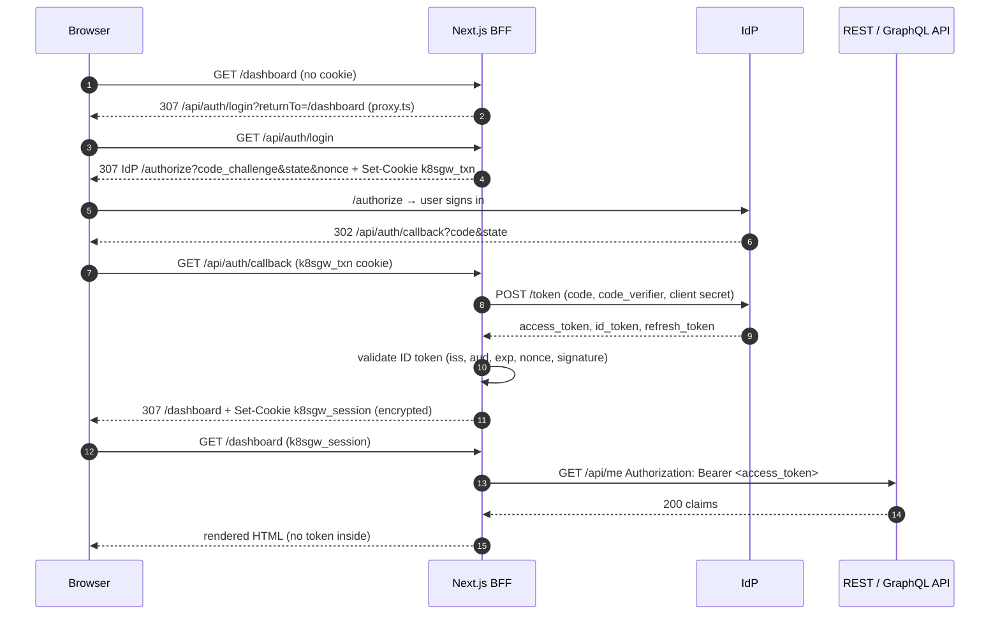

# nextjs-app — a backend-for-frontend (BFF) with OpenID Connect

A Next.js 16 (App Router) application that shows the **BFF model**: the browser never holds a JWT.
The server logs the user in at the identity provider (IdP) with the authorization code flow + PKCE,
keeps the tokens in an **encrypted, httpOnly cookie**, and relays them as `Authorization: Bearer`
to the REST and GraphQL APIs. The IdP is pluggable (mock IdP, Keycloak, Microsoft Entra ID,
Oracle IAM Identity Domains) purely through environment variables — the container image is the same.

No NextAuth, no framework magic: about 900 lines of readable TypeScript for the auth/BFF core (`src/lib`,
`proxy.ts`, the Route Handlers) on top of [`openid-client` 6](https://github.com/panva/openid-client) and
[`jose` 6](https://github.com/panva/jose); pages and components add roughly as much again.

## How the flow works



1. **Login start** (`/api/auth/login`): generates a PKCE `code_verifier`, a random `state` (CSRF
   protection for the callback) and a `nonce` (binds the ID token to this login). All three, plus the
   `returnTo` path, are sealed into the short-lived `k8sgw_txn` cookie. The browser is redirected to the
   IdP's authorization endpoint; `redirect_uri` is built from `PUBLIC_URL`, never from the request host.
2. **Callback** (`/api/auth/callback`): `openid-client` checks `state`, exchanges the code (sending the
   `code_verifier` and the client secret) and validates the ID token: `iss`, `aud` = client id, `exp`/`iat`,
   `nonce` and — because the app calls `enableNonRepudiationChecks()` — its signature against the IdP's JWKS
   (`jwks_uri` from discovery or `OIDC_JWKS_URI`; keys are cached). Without that call openid-client would only
   trust the token endpoint's TLS channel, which does not exist on the plain-http kind setup. The transaction
   cookie is deleted — it is single use.
3. **Session cookie** (`k8sgw_session`): the tokens, expiry and a minimal profile are encrypted with
   AES-256-GCM (JWE `dir`/`A256GCM`, key = `SESSION_SECRET`). Roles are read from the *access* token via
   `ROLES_CLAIM` (the artefact the APIs authorise on). httpOnly + SameSite=Lax; `Secure` when
   `PUBLIC_URL` is https. Browsers cap one cookie at about 4 KB and Keycloak/Entra/Oracle tokens are
   large, so when the session does not fit, the ID token moves to a second cookie (`k8sgw_session_idt`);
   it is only needed again for `id_token_hint` at logout.
4. **Relay** (`/api/bff/*` and Server Components): the server reads the cookie, attaches the bearer token
   and calls the internal Service URLs (`REST_API_INTERNAL_URL`, `GRAPHQL_INTERNAL_URL`). The APIs validate
   the JWT themselves; the BFF only relays their 200/401/403.
5. **Refresh**: when the access token expires within 30 s (capped at half its lifetime, so 30-second demo
   tokens do not loop) a Route Handler refreshes it with the refresh token and rewrites the cookie. Server
   Components cannot write cookies, so pages bounce through `/api/auth/refresh?returnTo=…` when needed.
   Concurrent requests share one refresh (refresh-token rotation safe). The login itself ends 8 h after
   `authTime` regardless of refreshes.
6. **Logout** (`/api/auth/logout`): clears the cookie and, if the IdP publishes `end_session_endpoint`,
   redirects there with `id_token_hint` and `post_logout_redirect_uri=PUBLIC_URL/`.

Everything security-relevant lives in `src/lib/`:

| file | responsibility |
|------|----------------|
| `config.ts` | env parsing with defaults (server-only, read per request) |
| `oidc.ts` | cached `openid-client` `Configuration` (discovery, or manual metadata for issuer mismatch; `OIDC_JWKS_URI` override; ID-token signature checks enabled), `buildLoginUrl`, `handleCallback`, `refresh`, `endSessionUrl`, error mapping |
| `session-crypto.ts` | `seal`/`unseal` (JWE dir/A256GCM), cookie names, `isExpiringSoon`, `safeReturnTo` — pure, unit-tested |
| `session.ts` | `getSession()` (read-only, memoised), `setSession`/`clearSession` (Route Handlers only), login transaction cookie |
| `roles.ts` | dotted-path role extraction from the decoded access token — pure, unit-tested |
| `tokens.ts` | `requireApiSession()` for `/api/bff/*`: refresh-if-needed + cookie rewrite |
| `api.ts` | `restFetch`, `graphqlFetch`, `relay` (bearer attached server-side, `cache: 'no-store'`) |
| `auth.ts` | `requirePageSession(path, { role? })` guard for Server Components: login redirect, refresh bounce, `forbidden()` → HTTP 403 |
| `../proxy.ts` | Next.js 16 proxy (ex-middleware): optimistic cookie check → redirect to login |

## Routes

| route | kind | what it does |
|-------|------|--------------|
| `/` | page (public) | explains the pattern, Login / Continue button |
| `/dashboard` | Server Component | session profile + roles, `GET /api/me` from the REST API rendered server-side |
| `/orders` | Client Component | table + create form via `/api/bff/orders`, friendly 401/403 banners |
| `/admin` | Server Component | server-side role check (`admin`) → stats from REST, or HTTP **403** rendered by `admin/forbidden.tsx` |
| `/graphql` | Client Component | runs `hello`, `me`, `orders`, `restOrders`, `adminStats`, `createOrder` through `/api/bff/graphql` |
| `/profile` | Server Component | access/ID token decoded **on the server**, live expiry countdown; explains why there is no "copy token" button |
| `/auth/error` | page | friendly login error page (`?error=&error_description=`) |
| `GET /api/auth/login?returnTo=` | Route Handler | starts the code flow (PKCE + state + nonce), sets `k8sgw_txn` |
| `GET /api/auth/callback` | Route Handler | code exchange, ID token validation, sets `k8sgw_session` |
| `GET /api/auth/logout` | Route Handler | clears the cookie, RP-initiated logout at the IdP when supported |
| `GET /api/auth/session` | Route Handler | `{authenticated, profile, roles, expiresAt, idp}` — never tokens |
| `GET /api/auth/refresh?returnTo=` | Route Handler | refreshes the access token, rewrites the cookie, redirects back |
| `GET/POST /api/bff/orders` | Route Handler | relay to `REST_API_INTERNAL_URL/api/orders` |
| `GET /api/bff/admin/stats` | Route Handler | relay to `REST_API_INTERNAL_URL/api/admin/stats` |
| `POST /api/bff/graphql` | Route Handler | relay of `{query, variables}` to `GRAPHQL_INTERNAL_URL` |
| `/healthz`, `/readyz` | Route Handlers | liveness; readiness (valid `SESSION_SECRET`) |

BFF handlers answer `401 {"error":"unauthenticated"|"session_expired"}` when there is no usable session;
API answers (including `403 {"error":"forbidden","required_role":…}` and `WWW-Authenticate`) are relayed unchanged.
Network failures towards the APIs become `502 {"error":"upstream_unavailable"}`.

## Configuration (environment, server-only)

| variable | default | notes |
|----------|---------|-------|
| `PORT` | `3000` | read by the standalone `server.js` |
| `PUBLIC_URL` | `http://next.127.0.0.1.nip.io` | public origin; base for `redirect_uri`, all redirects and the callback URL. Must match the IdP client registration byte for byte |
| `OIDC_ISSUER` | `http://idp.127.0.0.1.nip.io` | discovery at `${OIDC_ISSUER}/.well-known/openid-configuration` |
| `OIDC_ISSUER_CLAIM` | = `OIDC_ISSUER` | set when the document's `issuer` differs from the URL it is served from (Oracle: `https://identity.oraclecloud.com/`); switches to manual `Configuration` with an explicit issuer assertion (relative endpoint paths in the document are resolved against `OIDC_ISSUER`) |
| `OIDC_JWKS_URI` | from discovery | override of the JWKS URL used to verify ID-token signatures (Oracle: `<domain-url>/admin/v1/SigningCert/jwk`, or a cluster-internal URL) |
| `OIDC_CLIENT_ID` | `nextjs-app` | |
| `OIDC_CLIENT_SECRET` | `nextjs-secret` (demo) | inject from a Secret in real deployments |
| `OIDC_CLIENT_AUTH` | `client_secret_post` | `client_secret_basic` (Oracle) or `none` (public client, PKCE only). Any other value is logged, the default is used and `/readyz` answers 503 |
| `OIDC_SCOPE` | `openid profile email offline_access` | Entra adds `api://<api-client-id>/access_as_user`, Oracle its resource scopes. **Keycloak and the mock IdP: use `openid profile email`** — Keycloak issues refresh tokens without `offline_access`, and requesting it turns them into never-expiring offline tokens (the kustomize overlays already set this) |
| `OIDC_REQUIRE_HTTPS` | `false` | `true` refuses plain-http issuers; http is only ever allowed when the issuer URL itself is `http://` |
| `ROLES_CLAIM` | `roles` | dotted path in the access token: `realm_access.roles` (Keycloak), `roles` (Entra), `groups` (Oracle) |
| `ROLE_USER` / `ROLE_ADMIN` | `user` / `admin` | values that grant the application roles |
| `REST_API_INTERNAL_URL` | `http://rest-api.k8sgateway.svc.cluster.local:8080` | in-cluster URL used for the relay |
| `GRAPHQL_INTERNAL_URL` | `http://graphql-api.k8sgateway.svc.cluster.local:4000/graphql` | |
| `SESSION_SECRET` | *(required)* | 64 hex chars = 32 bytes: `openssl rand -hex 32`. `/readyz` turns 503 when it is missing or malformed (or when `OIDC_CLIENT_AUTH`, `PUBLIC_URL`, `OIDC_ISSUER` are invalid) |
| `OIDC_IDP_NAME` | `Mock IdP` | display name in the navigation |
| `LOG_LEVEL` | `info` | `debug` for more detail; logs are JSON lines, one per request (Route Handlers log on return, pages from `requirePageSession()`/the page itself, the proxy only its own redirects) with `sub` and `roles` when authenticated; `/healthz`, `/readyz` probes and unknown routes (404) are not logged |

There are deliberately **no `NEXT_PUBLIC_*` variables**: those are inlined at build time and would freeze
the IdP into the image. Everything above is read from `process.env` at request time on the server.

## What is in the cookies

`k8sgw_session` (JWE compact serialisation, `alg=dir`, `enc=A256GCM`, expires 8 h after the login no matter how
often the tokens are refreshed, `iss`/`aud` pinned):

```json
{
  "sub": "…", "name": "Alice Admin", "preferredUsername": "alice", "email": "alice@example.com",
  "roles": ["user", "admin"],
  "accessToken": "<JWT>", "refreshToken": "<opaque or JWT>", "idToken": "<JWT>",
  "issuedAt": 1789696453, "expiresAt": 1789696753, "authTime": 1789696453
}
```

If the sealed cookie would exceed ~3.5 KB (large Entra/Oracle tokens) the ID token is dropped and
`idTokenDropped: true` is stored instead; logout then omits `id_token_hint`.
`k8sgw_txn` (10 min) holds `{codeVerifier, state, nonce, returnTo}` during the redirect round trip.
A tampered, expired or foreign cookie simply fails to decrypt and counts as "logged out".

## Local development

```bash
source ~/.nvm/nvm.sh && nvm use 22
npm ci
export SESSION_SECRET=$(openssl rand -hex 32)
export PUBLIC_URL=http://localhost:3000 OIDC_ISSUER=http://idp.127.0.0.1.nip.io   # mock IdP in kind
export REST_API_INTERNAL_URL=http://api.127.0.0.1.nip.io GRAPHQL_INTERNAL_URL=http://graphql.127.0.0.1.nip.io/graphql
npm run dev            # http://localhost:3000 — register http://localhost:3000/api/auth/callback at the IdP
npm run lint && npm run typecheck && npm test
npm run build          # standalone output in .next/standalone
```

`npm test` runs `node --test` (via `tsx`) against the pure modules: cookie sealing/unsealing, tamper and
expiry rejection, the refresh guard, `returnTo` validation and role extraction for mock/Keycloak/Oracle claim
shapes. `npm run typecheck` runs `next typegen` first, so it also works in a fresh clone before the first build.

Container:

```bash
docker build -t k8sgateway/nextjs-app:dev .
docker run --rm -p 3000:3000 -e PUBLIC_URL=http://localhost:3000 \
  -e SESSION_SECRET=$(openssl rand -hex 32) -e OIDC_ISSUER=http://idp.127.0.0.1.nip.io \
  k8sgateway/nextjs-app:dev
curl -s localhost:3000/api/auth/session        # {"authenticated":false,...}
curl -si localhost:3000/dashboard | head -3      # 307 -> /api/auth/login?returnTo=%2Fdashboard
```

The image is a multi-stage build (`npm ci` → `next build` → `node:22-alpine` runner with the standalone
server, `public/` and `.next/static`), runs as the unprivileged `node` user, listens on `0.0.0.0:3000`.

## Notes and trade-offs

- `proxy.ts` (the Next.js 16 name for middleware) only checks that the cookie decrypts; it never calls the
  IdP. Pages call `requirePageSession()` and handlers call `requireApiSession()` — checks live close to the data.
- `/admin` answers a real HTTP 403 through `forbidden()` + `admin/forbidden.tsx`. In Next.js 16 that API still
  sits behind `experimental.authInterrupts` in `next.config.ts`; without the flag a Server Component can only
  render an explanation with status 200.
- The ID-token signature check is on (`enableNonRepudiationChecks`). `at_hash` is not validated: openid-client
  does not implement it, and the access token is taken from the same token response, not from a front channel.
- Logout and login are `GET` links so they work without JavaScript; the logout link is not state-changing
  for anyone but the cookie owner, and `SameSite=Lax` blocks cross-site cookie delivery on POSTs anyway.
- One replica keeps refresh de-duplication in memory; with several replicas prefer an IdP that allows
  refresh-token reuse for a grace period (Keycloak: "Revoke Refresh Token" off, or a reuse count), or a shared session store.
- `next dev` writes agent instruction files next to `package.json`; they are ignored via `.gitignore`.
