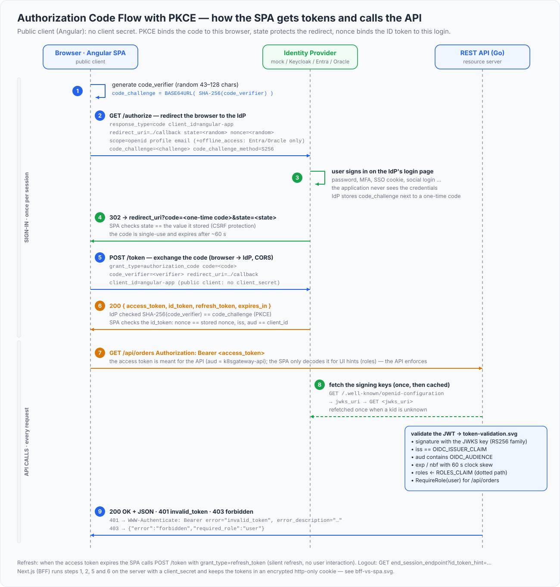
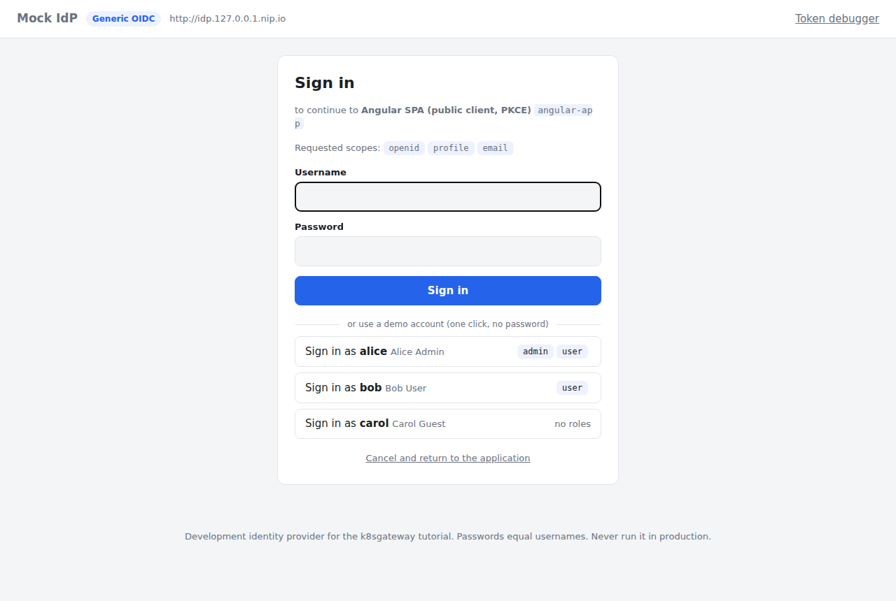
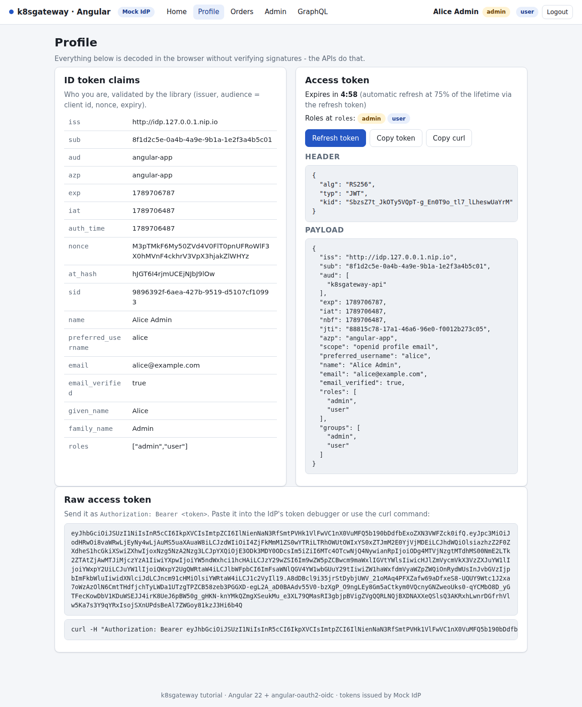
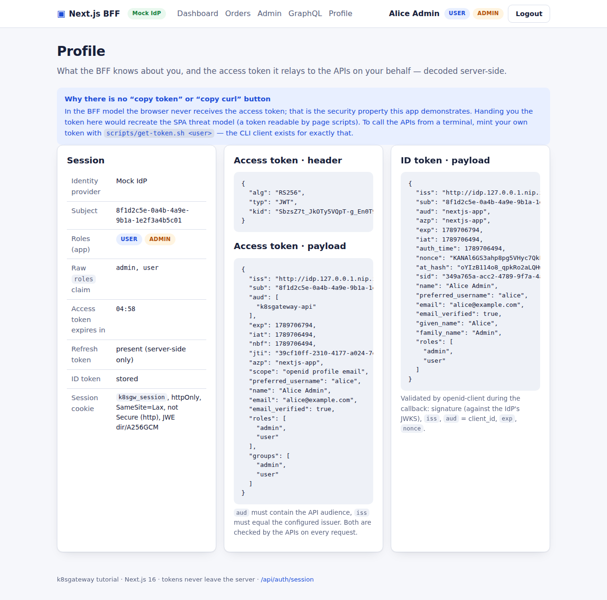
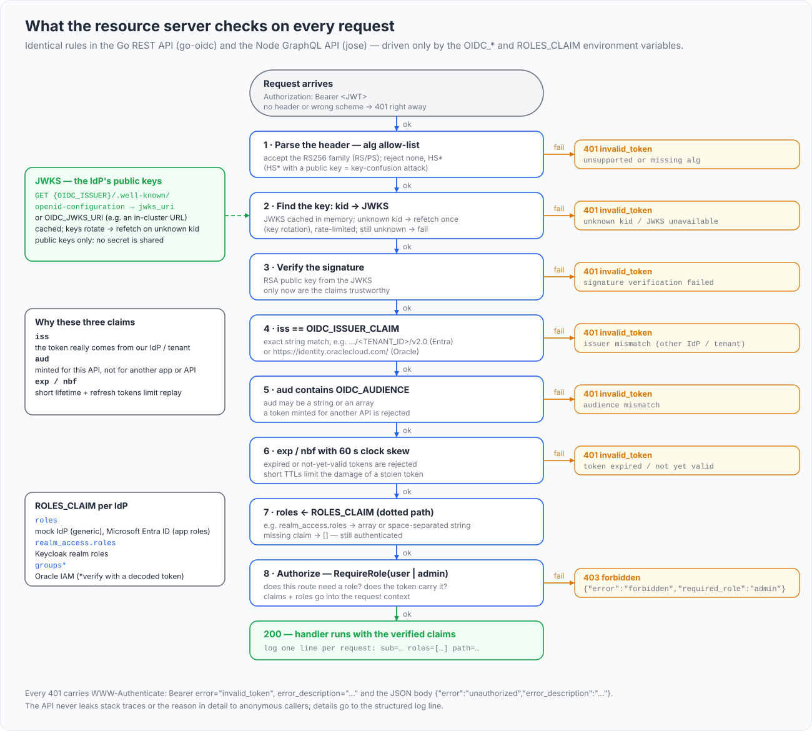

# OIDC and JWT concepts

Every application in this repository does one of two things: it *obtains* tokens from an identity provider (IdP) or it *validates* them. Nobody stores passwords, nobody manages users. This chapter explains the vocabulary and the rules behind that split, using the repository's own code as the reference.

## What you will learn

- what OpenID Connect adds to OAuth 2.0, and which component may consume which of the three tokens
- how a JWT is built, what `kid` is for, and why RS256 lets an API validate tokens without a shared secret
- the Authorization Code flow with PKCE, and what `state`, `nonce` and PKCE each protect against
- public versus confidential clients, and the SPA versus BFF trade-off
- what a resource server must check, what it must never do, and how roles are mapped from IdP-specific claims
- discovery documents, JWKS caching, RP-initiated logout and common mistakes

## OAuth 2.0 and OpenID Connect

OAuth 2.0 (RFC 6749) is a *delegation* protocol: a user lets an application call an API on their behalf without giving it a password. OpenID Connect (OIDC) is a thin *identity* layer on top: it standardizes how the application learns who logged in (the ID token), how it finds the IdP's endpoints (the discovery document) and what the claims mean (`sub`, `name`, `email`, ...).

The four roles map onto this repository as follows: the *resource owner* is the user (alice, bob, carol); the *authorization server* - in OIDC terms the OpenID Provider, here simply "the IdP" - is the mock IdP, Keycloak, Microsoft Entra ID or Oracle IAM Identity Domains (formerly IDCS); the *clients* (relying parties) are the Angular SPA, the Next.js BFF and the `cli`/`svc-batch` machine clients; the *resource servers* are the REST API (Go) and the GraphQL API (Node). Only the IdP ever sees a password; the APIs only download its *public* keys.

## The three tokens

| Token | `aud` (audience) | Consumed by | In this repository |
|---|---|---|---|
| Access token | the API (`k8sgateway-api`) | the resource server only | Angular sends it as `Authorization: Bearer` ([api.service.ts](../apps/angular-app/src/app/core/api.service.ts)); Next.js relays it server-side ([lib/api.ts](../apps/nextjs-app/src/lib/api.ts)) |
| ID token | the client (`angular-app`, `nextjs-app`) | the client, to learn who logged in; never an API | Angular shows its claims ([auth.service.ts](../apps/angular-app/src/app/core/auth.service.ts)); openid-client validates it in the BFF callback |
| Refresh token | none (opaque) | the IdP's token endpoint only | Angular: `localStorage`; Next.js: the encrypted session cookie ([lib/tokens.ts](../apps/nextjs-app/src/lib/tokens.ts)) |

Two rules follow. A client treats the access token as opaque: decoding it for UI hints is fine (the Angular profile page does), security decisions on it are not. An API must never accept an ID token: its `aud` is the client id, not the API.

Whether a refresh token is issued depends on the IdP: the mock IdP always issues one; Keycloak does too, but only *without* `offline_access` (that scope yields offline tokens that never expire and survive logout); Microsoft Entra ID and Oracle IAM Identity Domains *require* `offline_access`. That is why `OIDC_SCOPE` is per-IdP configuration.

## JWT anatomy

Access and ID tokens here are JSON Web Tokens: three base64url segments, `header.payload.signature`. Decode one from the running mock IdP (this and the other commands in this chapter need the stack from the [README quickstart](../README.md#quickstart-5-minutes) - `make up`, explained step by step in [chapter 3](03-quickstart.md)):

```bash
scripts/get-token.sh --decode alice mock     # or: make -s token USER=alice DECODE=1
```

```json
header:  { "alg": "RS256", "typ": "JWT", "kid": "nPy6kGbV6FNl8AtWmwGpzpKt2m2xWG11-DjhWmW112A" }
payload: {
  "iss": "http://idp.127.0.0.1.nip.io",
  "sub": "8f1d2c5e-0a4b-4a9e-9b1a-1e2f3a4b5c01",
  "aud": ["k8sgateway-api"],
  "exp": 1789702807, "iat": 1789702507, "nbf": 1789702507,
  "jti": "8deee8fe-e147-4dec-a3d0-8ed375864fa0",
  "azp": "cli", "scope": "openid profile email",
  "preferred_username": "alice", "name": "Alice Admin", "email": "alice@example.com",
  "roles": ["admin", "user"], "groups": ["admin", "user"]
}
```

| Field | Meaning |
|---|---|
| `alg`, `kid` | signature algorithm (checked against an allow-list *before* the signature is looked at) and the id of the JWKS key that signed the token |
| `iss`, `sub`, `aud` | issuer (compared byte for byte), stable subject id (not a username), who may accept the token (string or array) |
| `exp`, `nbf`, `iat` | expiry, not-before, issued-at (epoch seconds) |
| `jti`, `azp`, `scope` | token id, the client that requested it, granted scopes |
| signature | RS256 signature over `header.payload`, made with the IdP's private key |

### Why RS256 and not HS256

HS256 is an HMAC: the same secret signs and verifies, so every API that can verify a token could also mint one. RS256 (and RS384/RS512, PS256, ES256) is asymmetric: the IdP keeps the private key and publishes the public keys as a JSON Web Key Set - `curl -s http://idp.127.0.0.1.nip.io/jwks | jq .` shows one RSA key whose `kid` equals the one in the token header. Rotation is then simple: the IdP adds a key, signs with it, and verifiers refetch the set on an unknown `kid`. The mock IdP derives `kid` from the key (RFC 7638 thumbprint, [keys.js](../apps/mock-idp/src/keys.js)) and persists it in a Secret so restarts do not invalidate cached key sets.

Because the JWKS is public, a verifier that also accepted HS256 would be open to *algorithm confusion*: an attacker uses the public key as the HMAC secret and forges a token. Both APIs therefore hard-code an asymmetric allow-list (`AllowedAlgs` in [verifier.go](../apps/rest-api/internal/auth/verifier.go), `ALLOWED_ALGS` in [auth.ts](../apps/graphql-api/src/auth.ts)) and reject `alg: none`.

## The Authorization Code flow with PKCE

This is the only login flow the applications use (the implicit flow is obsolete).



1. The client generates a random `code_verifier` and derives `code_challenge = BASE64URL(SHA-256(code_verifier))`.
2. It redirects the browser to the IdP's `authorization_endpoint` with `response_type=code`, `client_id`, `redirect_uri`, `scope`, `state`, `nonce`, `code_challenge` and `code_challenge_method=S256`.
3. The user authenticates *at the IdP* (password, MFA, SSO cookie); the application never sees the credentials.
4. The IdP redirects back to `redirect_uri?code=…&state=…`; the client checks that `state` is the one it sent.
5. The client POSTs `grant_type=authorization_code`, `code`, `redirect_uri`, `client_id` and the `code_verifier` to the `token_endpoint` (a confidential client adds its secret); the IdP recomputes the challenge, compares, and returns access, ID and (usually) refresh token.
6. The client validates the ID token (`iss`, `aud` = its client id, `exp`, `nonce`) and is logged in.
7. API calls carry `Authorization: Bearer <access token>`; the API validates it against the JWKS and answers 200, 401 or 403.



*Step 3: the login page belongs to the IdP, not to the application.*

| Parameter | Protects against | Where it is checked |
|---|---|---|
| `state` | login CSRF: an attacker's callback processed in the victim's browser | angular-oauth2-oidc before the code exchange (Angular also carries the return URL in it, [guards.ts](../apps/angular-app/src/app/core/guards.ts)); `expectedState` in [oidc.ts](../apps/nextjs-app/src/lib/oidc.ts) |
| `nonce` | ID-token replay: an old or foreign ID token accepted for this login | must reappear in the ID token; `expectedNonce` in [oidc.ts](../apps/nextjs-app/src/lib/oidc.ts) |
| PKCE | code interception: a stolen `code` is useless without the verifier, so a public client needs no secret | `verifyPkce()` in [mock-idp/src/oidc.js](../apps/mock-idp/src/oidc.js): constant-time compare, downgrade rejected |

Between steps 2 and 5 the BFF keeps verifier, `state` and `nonce` in a short-lived encrypted cookie (`k8sgw_txn`, [session.ts](../apps/nextjs-app/src/lib/session.ts)); the SPA keeps them in browser storage.

## OAuth 2.1: what it changes and where this repository stands

OAuth 2.1 ([draft-ietf-oauth-v2-1](https://datatracker.ietf.org/doc/draft-ietf-oauth-v2-1/)) is not a new protocol. It consolidates OAuth 2.0 (RFC 6749, RFC 6750), PKCE (RFC 7636) and the OAuth 2.0 Security Best Current Practice into one document and removes the options that turned out to be unsafe. There are no new endpoints or parameters, and identity providers such as Keycloak, Microsoft Entra ID and Oracle IAM Identity Domains still describe what they implement as "OAuth 2.0 / OpenID Connect". You comply with OAuth 2.1 by using the right subset of OAuth 2.0, which is what the two applications in this repository do:

| OAuth 2.1 rule | Status here | Where |
|---|---|---|
| Authorization Code flow **with PKCE for every client**, confidential ones included | done | Angular SPA and Next.js BFF both send `code_challenge` (S256); the mock IdP refuses public clients without PKCE and only accepts S256; the Keycloak clients are pinned to S256 |
| Implicit grant removed | done | nothing requests `response_type=token`; the diagrams and chapters only show the code flow |
| Resource Owner Password Credentials grant removed | **not for scripts** | the applications never use it; the `cli` client in the mock IdP and in the Keycloak realm allows it so that `scripts/get-token.sh` and `scripts/test.sh` can obtain per-user tokens without a browser. That example is OAuth 2.0 only, see below |
| Exact string matching of redirect URIs | done for the BFF, relaxed for development elsewhere | the Next.js client registers exact URIs; the Angular client in Keycloak uses `http://angular.127.0.0.1.nip.io/*` and the mock IdP accepts any redirect URI while `MOCK_ALLOW_ANY_REDIRECT=true` (the default) |
| Refresh tokens for public clients are sender-constrained or rotated | done | the mock IdP rotates refresh tokens on every use (and invalidates a reused one); Keycloak rotates by default; Entra ID rotates and limits SPA refresh tokens to 24 hours |
| No bearer tokens in query strings | done | only the `Authorization: Bearer` header is used, by the applications and by the gateway policy |
| Bearer tokens must not be logged | done | the APIs log `sub` and roles, never the token |

### The per-user token example is OAuth 2.0 only

The quickstart, the Keycloak chapter and the mock IdP chapter obtain a token for alice, bob or carol with:

```bash
TOKEN=$(scripts/get-token.sh alice)
```

That is the Resource Owner Password Credentials grant (`grant_type=password`): the script sends the user's password straight to the token endpoint. It is a valid OAuth **2.0** grant and the simplest way to show the 200/401/403 matrix from a terminal, but OAuth **2.1** removes it, because it hands credentials to the client, bypasses multi-factor authentication and single sign-on, and teaches users to type their password outside the IdP. Treat it as a test fixture: it is enabled on one dedicated client (`cli`), Entra ID and Oracle IAM Identity Domains are not configured for it in this repository, and the browser suite in [e2e/](../e2e) covers the same users through the real code flow. To make an installation strictly OAuth 2.1, disable `cli` (or the password grant on it) and use the `client_credentials` grant of the `svc-batch` client (`scripts/get-token.sh --client-credentials`) for machine-to-machine checks. [Chapter 15](15-production-checklist.md#oauth-21-strict-mode) lists the settings.

## Public and confidential clients

A confidential client runs where a secret can be kept (a server); a public client runs where it cannot (a browser, a CLI) - a secret in a JavaScript bundle is not a secret. The four clients in [clients.json](../apps/mock-idp/clients.json) and [realm-export.json](../deploy/idp/keycloak/realm-export.json):

| Client | Type | Grant | Token-endpoint authentication |
|---|---|---|---|
| `angular-app` | public | authorization code | none; PKCE S256 mandatory |
| `nextjs-app` | confidential | authorization code | `client_secret_post` (mock, Keycloak, Entra) or `client_secret_basic` (Oracle), via `OIDC_CLIENT_AUTH`; PKCE as well |
| `cli` | public | resource-owner password | none; **scripts and tests only** ([get-token.sh](../scripts/get-token.sh)) |
| `svc-batch` | confidential | client credentials | secret; a machine identity without a user, roles from the client registration |

## SPA or BFF?

Both frontends run the same flow; they differ in *where the tokens end up*.


| | A - SPA (Angular) | B - BFF (Next.js) |
|---|---|---|
| Tokens live | in the browser (`localStorage`, see the trade-off comment in [app.config.ts](../apps/angular-app/src/app/app.config.ts)) | in the cookie `k8sgw_session`, AES-256-GCM encrypted ([session-crypto.ts](../apps/nextjs-app/src/lib/session-crypto.ts)), `HttpOnly`, `SameSite=Lax` |
| Pros | static files, no server state, tokens visible for debugging | tokens never reach JavaScript, real client secret, server-side refresh and logout, no CORS |
| Cons | tokens readable by any script on the origin (XSS), refresh token in the browser, CORS everywhere | needs a server and a cookie secret, cookie under ~4 KB, CSRF hygiene, one extra hop |
| Use when | the UI is purely static and the APIs are yours | the UI already has a server, or tokens must never be exposed |



*The SPA can show its access token because it holds it.*



*The BFF decodes the same token server-side; `/api/auth/session` returns claims and roles, never tokens ([session/route.ts](../apps/nextjs-app/src/app/api/auth/session/route.ts)).*

## What a resource server must check

A resource server never asks the IdP "is this token valid?"; it verifies locally with the IdP's public keys. Order matters: structural checks, then the signature, then the claims - only then may the claims be trusted.



| # | Check | REST API (Go, go-oidc) | GraphQL API (Node, jose) |
|---|---|---|---|
| 0 | `Authorization: Bearer <jwt>` present | `bearerToken()` ([middleware.go](../apps/rest-api/internal/auth/middleware.go)) | `authenticate()` ([auth.ts](../apps/graphql-api/src/auth.ts)) |
| 1 | `alg` in the allow-list, never `none`/`HS*` | `SupportedSigningAlgs: AllowedAlgs` | `algorithms: ALLOWED_ALGS` |
| 2 | key by `kid` from the cached JWKS; refetch on an unknown `kid` | `RemoteKeySet` (discovery or `OIDC_JWKS_URI`) | `createRemoteJWKSet` |
| 3 | signature valid | go-oidc | `jwtVerify` |
| 4 | `iss` equals `OIDC_ISSUER_CLAIM` (defaults to `OIDC_ISSUER`), byte for byte | `oidc.NewVerifier(issuerClaim, …)` | `issuer: expectedIssuer` |
| 5 | `aud` (string or array) contains `OIDC_AUDIENCE` | `containsAny(t.Audience, …)` | `audience: cfg.audience` |
| 6 | `exp`/`nbf` with 60 s tolerance; `exp` mandatory | `Now` shifted by the skew, `nbf` re-checked | `clockTolerance: 60`, `requiredClaims: ['exp','sub']` |
| 7 | roles from `ROLES_CLAIM`; missing claim = no roles, still authenticated | `RolesFromClaims()` ([roles.go](../apps/rest-api/internal/auth/roles.go)) | `extractRoles()` |
| 8 | the route's required role is present | `RequireRole()` | `requireRole()` ([resolvers.ts](../apps/graphql-api/src/resolvers.ts)) |

Failures in 0-6 answer **401** with a `WWW-Authenticate` challenge (RFC 6750); a missing role answers **403**:

```bash
curl -si http://api.127.0.0.1.nip.io/api/me | head -4          # no token
TOKEN=$(scripts/get-token.sh bob)                              # bob is "user", not "admin"
curl -si -H "Authorization: Bearer $TOKEN" http://api.127.0.0.1.nip.io/api/admin/stats
```

```http
HTTP/1.1 401 Unauthorized
www-authenticate: Bearer realm="k8sgateway-api"

HTTP/1.1 403 Forbidden
www-authenticate: Bearer error="insufficient_scope", scope="admin"
{"error":"forbidden","required_role":"admin"}
```

`error_description` values are deliberately generic (`issuer mismatch`, `token expired`, ...); the full reason, which contains the expected issuer, goes to the server log only.

## What a resource server must not do

- **Trust unverified claims.** Decoding is not verifying. The Angular app decodes tokens without checking signatures ([jwt.ts](../apps/angular-app/src/app/core/jwt.ts)) - fine for hiding a menu entry, never for authorization.
- **Accept `alg=none` or `HS256` from an RS256 issuer.** The allow-list comes from configuration, not from the token.
- **Validate Microsoft Graph tokens.** With Entra ID, requesting only `openid profile email` yields an access token for Microsoft Graph (a `nonce` in the header, `aud` `00000003-0000-0000-c000-000000000000`) that only Graph can validate. Request your own API scope (`api://<API_CLIENT_ID>/access_as_user`) so `aud` is your API - see [06-entra-id.md](06-entra-id.md).
- **Accept an ID token, or a token issued for another API.** That is what the `aud` check is for.
- **Authorize on mutable claims** such as `email` or `preferred_username`; use `sub` (Entra: `oid`) and the roles claim.
- **Log tokens, or fail open.** Both APIs log `sub` and roles, never the token; the GraphQL API answers 503 when the JWKS cannot be fetched, never "anonymous" ([app.ts](../apps/graphql-api/src/app.ts)).

## Roles and claims: why the path differs per IdP

OAuth 2.0 defines no roles claim, so every product puts roles somewhere else. The applications read them through a configurable dotted path, `ROLES_CLAIM`, from the **access** token:

| IdP | `ROLES_CLAIM` | Why |
|---|---|---|
| mock IdP (generic flavor) | `roles` | flat array, the shape most providers use |
| Keycloak | `realm_access.roles` | the built-in `roles` client scope maps realm roles there, next to Keycloak's automatic roles |
| Microsoft Entra ID | `roles` | app roles defined on the *API* registration and assigned to users |
| Oracle IAM Identity Domains | `groups` | only present through a custom claim; verify with a decoded token from your tenant ([overlays/oracle/README.md](../deploy/overlays/oracle/README.md)) |

A Keycloak token for alice shows why "contains" is the right check and "equals" is not:

```json
"realm_access": { "roles": ["offline_access", "admin", "default-roles-k8sgateway", "uma_authorization", "user"] }
```

The rule, implemented four times ([roles.go](../apps/rest-api/internal/auth/roles.go), [auth.ts](../apps/graphql-api/src/auth.ts), [jwt.ts](../apps/angular-app/src/app/core/jwt.ts), [roles.ts](../apps/nextjs-app/src/lib/roles.ts)): walk the dotted path; accept an array of strings or a space-separated string (like `scp`); the user has role `user`/`admin` if the list contains `ROLE_USER`/`ROLE_ADMIN`; ignore everything else; a missing claim means "authenticated, no roles" - carol can call `/api/me` but gets 403 on `/api/orders`.

## Discovery documents and JWKS caching

Appending `/.well-known/openid-configuration` to `OIDC_ISSUER` yields the discovery document, from which the applications learn every endpoint (`curl -s http://idp.127.0.0.1.nip.io/.well-known/openid-configuration | jq .`). OIDC Discovery requires the document's `issuer` to equal the URL prefix it was fetched from, and go-oidc, openid-client and angular-oauth2-oidc enforce it. Oracle IAM Identity Domains breaks the rule - the document lives under `https://idcs-<guid>.identity.oraclecloud.com` but advertises `https://identity.oraclecloud.com/` - hence the explicit overrides `OIDC_ISSUER_CLAIM` and `OIDC_JWKS_URI`. Entra ID keeps the issuer rule but hosts its endpoints on other paths, hence `strictDiscoveryDocumentValidation: false` in the Angular configuration.

Verifiers cache the key set and refetch on an unknown `kid`: go-oidc has no cooldown (every rejected token with a never-seen `kid` costs one request to the IdP - validate at the gateway or rate-limit 401s in front of the internet), jose waits 30 s between refetches and refreshes every 10 minutes, Envoy Gateway's `SecurityPolicy` caches for 300 s ([securitypolicy-rest-jwt.yaml](../deploy/gateway-policies/securitypolicy-rest-jwt.yaml)). Both APIs run discovery in the background with back-off and answer `503` on `/readyz` until the keys are loaded: a slow IdP delays readiness instead of crash-looping the pod.

## Logout

OIDC RP-initiated logout is a redirect to the IdP's `end_session_endpoint` with `id_token_hint` (which session to end) and a registered `post_logout_redirect_uri`. Angular calls `logOut()`, which clears its storage and redirects ([auth.service.ts](../apps/angular-app/src/app/core/auth.service.ts)); the BFF deletes its cookie and redirects when the IdP publishes the endpoint ([logout/route.ts](../apps/nextjs-app/src/app/api/auth/logout/route.ts)). Limitation: an issued access token stays valid until `exp` - APIs do not learn about logouts - one reason access tokens are short-lived (300 s at the mock IdP).

## Common mistakes

- Normalizing slashes when comparing `iss`. Keycloak's issuer has none, Oracle's has one; copy the value from a decoded token.
- Forgetting the audience. Keycloak does not add your API to `aud` without an audience mapper (the realm export adds one via the `k8sgateway-api` client scope).
- Reading roles from the ID token. Keycloak puts them only into the access token; Entra emits ID-token roles from the *client* registration and access-token roles from the *API* registration.
- Requesting `offline_access` from Keycloak, or forgetting it for Entra and Oracle.
- Testing only the mock IdP's default shape. Its flavors (`MOCK_FLAVOR=keycloak|entra|oracle`, [flavors.js](../apps/mock-idp/src/flavors.js)) let you rehearse the real token shapes before touching a tenant.

## Next

[Architecture](02-architecture.md) - how these pieces are laid out in the kind cluster, and why every hostname works identically from a browser and from a pod.
