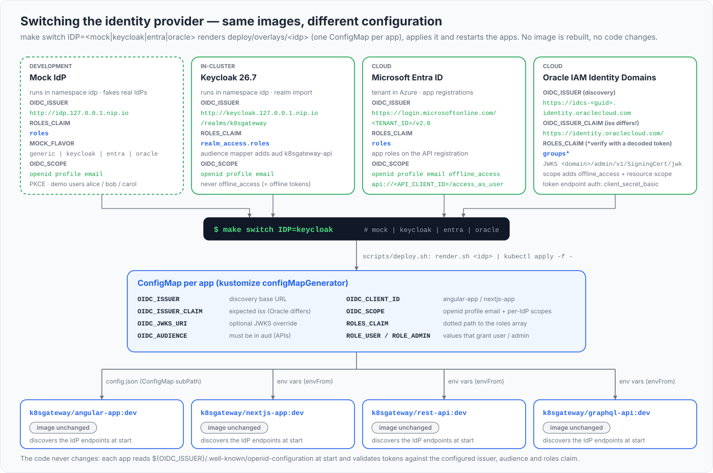
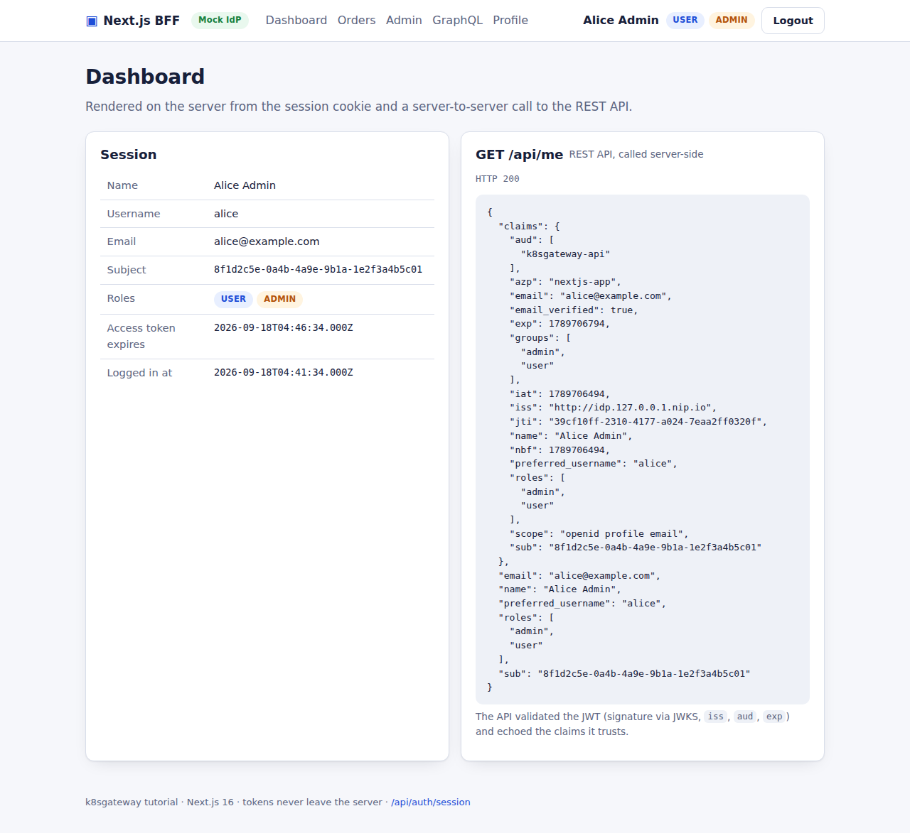
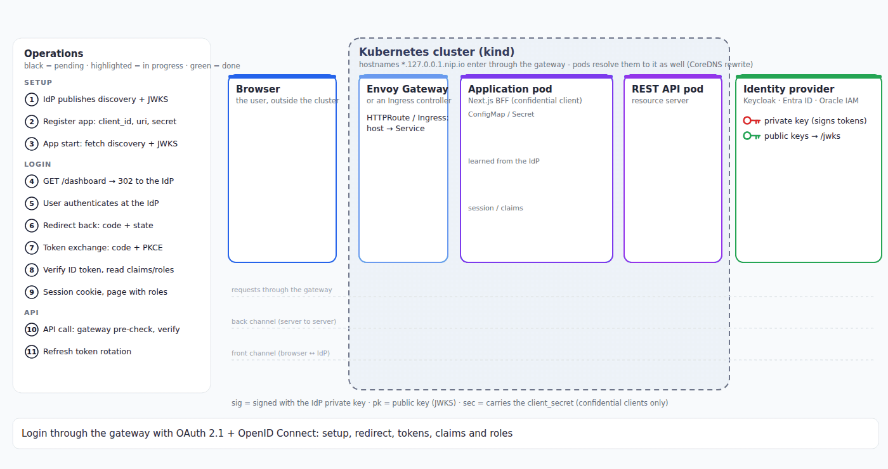

# Architecture

Everything runs in one single-node kind cluster behind one Envoy Gateway listener. Six hostnames under `127.0.0.1.nip.io` reach the two frontends, the two APIs and the two in-cluster identity providers, and a small CoreDNS rewrite makes the very same URLs work from inside the pods. This chapter covers the layout, the network path from browser to container, the configuration contract every application shares, and how images get into the cluster.

## What you will learn

- which namespaces, Gateway API objects, Services and hostnames exist and how they map onto each other
- how host port 80 becomes NodePort 30080, an Envoy Service port and finally a pod port
- why the CoreDNS rewrite exists, what it does line by line, and why `answer auto` is not optional
- the OIDC configuration contract (environment variables and `config.json`) and how an overlay delivers it
- how a request flows for the SPA and for the BFF
- request logging, health endpoints, what runs where, and the image build/load story

## The big picture


| Namespace | What lives there | Created by |
|---|---|---|
| `envoy-gateway-system` | the Envoy Gateway controller and the generated Envoy proxy Deployment/Service | `install.yaml`, [deploy/gateway/](../deploy/gateway/) |
| `k8sgateway` | Gateway `main`, the four applications, their HTTPRoutes and ConfigMaps | [deploy/base/](../deploy/base/) + an overlay |
| `idp` | mock IdP and Keycloak (both may run at once) | [deploy/idp/](../deploy/idp/) |
| `kube-system` | CoreDNS, whose Corefile carries the rewrite | [scripts/coredns-rewrite.sh](../scripts/coredns-rewrite.sh) |

The Gateway API chain: GatewayClass `eg` ([gatewayclass.yaml](../deploy/gateway/gatewayclass.yaml)) points at the EnvoyProxy `k8sgateway-proxy` ([envoyproxy.yaml](../deploy/gateway/envoyproxy.yaml)) for infrastructure settings; Gateway `main` ([gateway.yaml](../deploy/gateway/gateway.yaml)) has one HTTP listener on port 80 with `allowedRoutes.namespaces.from: All`; each application ships an HTTPRoute with `parentRefs: [{name: main, namespace: k8sgateway}]` and one hostname (`kubectl get httproute -A` lists all six):

| Hostname | HTTPRoute (namespace) | Service : port | Container | Image |
|---|---|---|---|---|
| `angular.127.0.0.1.nip.io` | `angular-app` (k8sgateway) | `angular-app:8080` | nginx, uid 101 | `k8sgateway/angular-app:dev` |
| `next.127.0.0.1.nip.io` | `nextjs-app` (k8sgateway) | `nextjs-app:3000` | node, uid 1000 | `k8sgateway/nextjs-app:dev` |
| `api.127.0.0.1.nip.io` | `rest-api` (k8sgateway) | `rest-api:8080` | static Go, uid 65532 | `k8sgateway/rest-api:dev` |
| `graphql.127.0.0.1.nip.io/graphql` | `graphql-api` (k8sgateway) | `graphql-api:4000` | node, uid 1000 | `k8sgateway/graphql-api:dev` |
| `idp.127.0.0.1.nip.io` | `mock-idp` (idp) | `mock-idp:8080` | node, uid 1000 | `k8sgateway/mock-idp:dev` |
| `keycloak.127.0.0.1.nip.io` | `keycloak` (idp) | `keycloak:8080` (management `9000`) | Keycloak, uid 1000 | `quay.io/keycloak/keycloak:26.7.4` |

Every route is `PathPrefix /`, so Envoy picks the backend from the `Host` header alone. Microsoft Entra ID and Oracle IAM Identity Domains (formerly IDCS) have no route: browser and pods reach them over the internet.

## From the browser to a pod

`nip.io` resolves any `<name>.127.0.0.1.nip.io` to `127.0.0.1`, so a browser request lands on the host's port 80. From there:

1. **kind port mapping.** [kind-config.yaml](../deploy/kind/kind-config.yaml) maps host `127.0.0.1:80` to `containerPort: 30080` of the control-plane node (and 443 to 30443 for the optional TLS mode); the mappings are fixed at cluster creation.
2. **NodePort Service.** kind has no cloud load balancer, so the EnvoyProxy sets `envoyService.type: NodePort` and pins `nodePort: 30080` on the generated port-80 entry with a StrategicMerge patch (ports merge by `port`, so `name` and `targetPort` survive). The extra entry `8080 -> 10080` is an in-cluster alias for hosts that cannot bind port 80 (`HTTP_PORT=8080`, see [deploy/README.md](../deploy/README.md)).
3. **Envoy listener.** Envoy Gateway maps privileged listener ports to `port + 10000` inside the pod, so Service port 80 targets container port `10080`; access logs showing `:10080` are normal.
4. **HTTPRoute.** Envoy matches the `Host` header to a route and forwards to the ClusterIP Service and its pod.

The generated Service name is deterministic - `envoy-<namespace>-<gateway>-<first 8 hex chars of sha256("k8sgateway/main")>` - but the scripts select it by label instead (this and the other commands in this chapter assume the cluster from the [README quickstart](../README.md#quickstart-5-minutes) is running):

```bash
kubectl -n envoy-gateway-system get svc -l gateway.envoyproxy.io/owning-gateway-name=main,gateway.envoyproxy.io/owning-gateway-namespace=k8sgateway
```

```text
NAME                             TYPE       CLUSTER-IP      EXTERNAL-IP   PORT(S)                       AGE
envoy-k8sgateway-main-7cab4a6a   NodePort   10.96.253.154   <none>        80:30080/TCP,8080:30207/TCP   131m
```

## Why the CoreDNS rewrite exists

OIDC has one hard requirement that collides with a local cluster: the `iss` claim in a token must equal the issuer configured in every verifier, and that issuer is also the base URL for discovery and the JWKS. The browser can only use `http://idp.127.0.0.1.nip.io`. A pod resolving that name gets `127.0.0.1` - its *own* loopback - and would try to fetch the discovery document from itself.

The alternatives are all worse: a different issuer for pods (`http://mock-idp.idp.svc.cluster.local:8080`) fails the `iss` check; per-application Service URLs break "same image, different ConfigMap"; `/etc/hosts` entries per pod do not scale. Instead [scripts/coredns-rewrite.sh](../scripts/coredns-rewrite.sh) (run by `scripts/up.sh`, idempotent) patches the cluster DNS so that, for pods only, `*.127.0.0.1.nip.io` resolves to the Envoy Service:

```bash
kubectl -n kube-system get configmap coredns -o jsonpath='{.data.Corefile}'
```

```text
.:53 {
    # k8sgateway-rewrite-begin
    rewrite stop {
        name regex ^(.*)\.127\.0\.0\.1\.nip\.io\.$ envoy-k8sgateway-main-7cab4a6a.envoy-gateway-system.svc.cluster.local
        answer auto
    }
    # k8sgateway-rewrite-end
    errors
    kubernetes cluster.local in-addr.arpa ip6.arpa { ... }
    forward . /etc/resolv.conf { ... }
    ...
}
```

- **`rewrite stop { … }`** - a request rewrite; `stop` ends rule processing. CoreDNS runs `rewrite` before the `kubernetes` plugin no matter where the block sits (plugin order is compiled in), so the rewritten name is answered by the cluster DNS.
- **`name regex ^(.*)\.127\.0\.0\.1\.nip\.io\.$ <service FQDN>`** - the query name arrives fully qualified with a trailing dot, hence `\.$`. The regex is *anchored*: pods have `ndots:5` and search domains, and an unanchored pattern would also match `foo.127.0.0.1.nip.io.svc.cluster.local.`. The replacement is the Envoy Service's FQDN, looked up by label when the script runs.
- **`answer auto`** - rewrites the *answer* so the record's owner name equals the original question. Without it the response says `envoy-….svc.cluster.local. A 10.96.253.154` for a question about `idp.127.0.0.1.nip.io.`, and strict resolvers (glibc: Debian/Ubuntu-based images, JVMs) discard it as a possible spoof. musl and Go's pure resolver tolerate the mismatch, which is why a test from an Alpine or distroless-static pod would not reveal the missing line.

Seen from a pod (the mock IdP image is Alpine, so `getent` and `wget` exist):

```bash
kubectl -n idp exec deploy/mock-idp -- getent hosts idp.127.0.0.1.nip.io api.127.0.0.1.nip.io
kubectl -n idp exec deploy/mock-idp -- wget -qO- http://api.127.0.0.1.nip.io/api/public
```

```text
10.96.253.154     idp.127.0.0.1.nip.io  idp.127.0.0.1.nip.io
10.96.253.154     api.127.0.0.1.nip.io  api.127.0.0.1.nip.io
{"hint":"Send 'Authorization: Bearer <access token>' to /api/me to see who you are.","message":"This endpoint is public - no token required.", ...}
```

`10.96.253.154` is the Envoy Service's ClusterIP; the request enters Envoy on Service port 80 with the original `Host` header and is routed like a browser request. The result: one issuer string in discovery, in every token, in every ConfigMap and in the gateway policies. The script restarts CoreDNS after patching, so the change is immediate.

Plain Service DNS is still used where no token claim has to match: the GraphQL API relays bearer tokens to `http://rest-api.k8sgateway.svc.cluster.local:8080` (`REST_API_INTERNAL_URL`), the Next.js server calls both APIs the same way, and the gateway `SecurityPolicy` examples fetch the JWKS from `http://mock-idp.idp.svc.cluster.local:8080/jwks`.

## The OIDC configuration contract

All four applications use the same variable names; an IdP switch changes values, never code or images. The Angular app cannot read environment variables in the browser, so it gets the same keys in camelCase from `/config.json`, a ConfigMap mounted over the file baked into the image ([deployment.yaml](../deploy/base/angular-app/deployment.yaml), `subPath`).



| Variable (`config.json` key) | Used by | Meaning | mock value |
|---|---|---|---|
| `OIDC_ISSUER` (`issuer`) | all | discovery base: `${OIDC_ISSUER}/.well-known/openid-configuration` | `http://idp.127.0.0.1.nip.io` |
| `OIDC_ISSUER_CLAIM` | APIs, Next.js | expected `iss` when it differs from `OIDC_ISSUER` (Oracle) | unset (= issuer) |
| `OIDC_JWKS_URI` | APIs, Next.js | JWKS URL override (Oracle) | unset (from discovery) |
| `OIDC_AUDIENCE` | APIs | value that must appear in `aud` | `k8sgateway-api` |
| `OIDC_CLIENT_ID` (`clientId`) | frontends | client id | `angular-app` / `nextjs-app` |
| `OIDC_CLIENT_SECRET` | Next.js | client secret, from Secret `nextjs-secrets` | `nextjs-secret` (demo) |
| `OIDC_CLIENT_AUTH` | Next.js | `client_secret_post`, `client_secret_basic` (Oracle) or `none` | `client_secret_post` |
| `OIDC_SCOPE` (`scope`) | frontends | scopes requested at login | `openid profile email` (Entra/Oracle add `offline_access` and an API scope) |
| `OIDC_REQUIRE_HTTPS` (`requireHttps`) | frontends | `false` only for plain-http dev IdPs | `false` |
| `ROLES_CLAIM` (`rolesClaim`) | all | dotted path to the roles in the **access** token | `roles` |
| `ROLE_USER`, `ROLE_ADMIN` (`roleUser`, `roleAdmin`) | all | claim values that grant the application roles | `user`, `admin` |
| `API_URL`, `GRAPHQL_URL` (`apiUrl`, `graphqlUrl`) | frontends | public API URLs the browser calls | `http://api.127.0.0.1.nip.io`, `http://graphql.127.0.0.1.nip.io/graphql` |
| `CORS_ORIGINS` | APIs | allowed browser origins (empty = deny all) | `http://angular.127.0.0.1.nip.io,http://next.127.0.0.1.nip.io` |
| `PUBLIC_URL` | Next.js | its own external origin; every `redirect_uri` is built from it, never from the request | `http://next.127.0.0.1.nip.io` |
| `SESSION_SECRET` | Next.js | 64 hex chars (32 bytes) for the AES-256-GCM cookie, from the Secret | demo value |
| `REST_API_INTERNAL_URL`, `GRAPHQL_INTERNAL_URL` | GraphQL API, Next.js | in-cluster Service URLs for the token relay | `http://rest-api.k8sgateway.svc.cluster.local:8080`, `…/graphql-api…:4000/graphql` |
| `OIDC_IDP_NAME` (`idpName`) | frontends | display name | `Mock IdP` |
| `LOG_LEVEL` | all | `info` or `debug` | `info` |

Angular additionally has `strictDiscoveryDocumentValidation` (`false` for Entra ID) and `skipIssuerCheck` (`true` only for Oracle). The per-IdP values live in [deploy/overlays/](../deploy/overlays/) - `rest-api.env`, `graphql-api.env`, `nextjs.env`, `nextjs.secret.env`, `angular-config.json` - and become one ConfigMap per application through kustomize's `configMapGenerator` ([overlays/mock/kustomization.yaml](../deploy/overlays/mock/kustomization.yaml)). kustomize appends a content hash to each name and rewrites the `envFrom` and volume references, so a changed value yields a new ConfigMap name and therefore a rolling restart - essential for the Angular file, which a `subPath` mount would otherwise never refresh:

```bash
scripts/render.sh mock | grep -B2 -A1 configMapRef
kubectl -n k8sgateway get cm -l app.kubernetes.io/part-of=k8sgateway
```

```text
        envFrom:
        - configMapRef:
            name: rest-api-config-tfm4hbmth9
...
NAME                            DATA   AGE
angular-config-kh7g6k725c       1      58m
graphql-api-config-tm866g5hdg   8      58m
nextjs-config-k5t7h2c88b        16     58m
rest-api-config-tfm4hbmth9      7      58m
```

`scripts/render.sh` is `kubectl kustomize` plus a placeholder guard for the Entra/Oracle overlays and an optional hostname rewrite (`BASE_DOMAIN`, `SCHEME`, `HTTP_PORT`); details in [deploy/README.md](../deploy/README.md) and [13-switching-idps.md](13-switching-idps.md).

## How a request flows

**SPA (Angular).** The browser loads static files from `angular.127.0.0.1.nip.io`, fetches `/config.json`, then talks to the IdP directly: discovery, the `/authorize` redirect, the cross-origin `/token` POST (the mock IdP sends CORS headers; Keycloak uses the client's *Web origins*). API calls go from the browser to `api.127.0.0.1.nip.io` and `graphql.127.0.0.1.nip.io` with the bearer token; the APIs answer CORS preflights before authentication ([router.go](../apps/rest-api/internal/api/router.go)). Every hop passes through Envoy.

**BFF (Next.js).** The browser only ever talks to `next.127.0.0.1.nip.io`. [proxy.ts](../apps/nextjs-app/src/proxy.ts) sends a visitor without a session cookie to `/api/auth/login`, which redirects to the IdP; the callback exchanges the code *server-side* - the pod resolves `idp.127.0.0.1.nip.io` through the CoreDNS rewrite and reaches the IdP through Envoy - and sets the encrypted cookie. Pages and `/api/bff/*` handlers then call the APIs over plain Service DNS with the bearer token attached on the server: no CORS, and the browser never sees a token.



*The dashboard is a Server Component: it called `GET /api/me` on the REST API with the bearer token from the cookie before the HTML reached the browser.*

Both paths end at the same place: the REST or GraphQL API validates the token against the IdP's JWKS (fetched once through the gateway and cached) and answers 200, 401 or 403.

## Request logging

Every server component writes one JSON line per request with method, path, status, duration and - once a token was verified - `sub` and roles. Tokens are never logged; probes only at debug level (REST) or not at all (Next.js).

```bash
kubectl -n k8sgateway logs deploy/rest-api --tail=3      # or: make logs APP=rest-api
```

```json
{"time":"…","level":"WARN","msg":"token rejected","reason":"malformed token or unsupported algorithm: oidc: malformed jwt: …","path":"/api/me"}
{"time":"…","level":"INFO","msg":"request","method":"GET","path":"/api/admin/stats","status":403,"duration_ms":0.23,"sub":"e87342e6-…","roles":["user"]}
```

The GraphQL API logs per operation ([app.ts](../apps/graphql-api/src/app.ts)), the BFF per Route Handler and page ([log.ts](../apps/nextjs-app/src/lib/log.ts)), the REST API in [httpx/logging.go](../apps/rest-api/internal/httpx/logging.go); `scripts/logs.sh envoy` tails the Envoy access log ([logs.sh](../scripts/logs.sh)).

## Health endpoints

| Component | Liveness | Readiness | Readiness means |
|---|---|---|---|
| rest-api | `/healthz` | `/readyz` | discovery answered **and** JWKS fetched; otherwise the body carries the last error ([main.go](../apps/rest-api/cmd/api/main.go)) |
| graphql-api | `/healthz` | `/readyz` | keys loaded; the body shows the discovery state |
| nextjs-app | `/healthz` | `/readyz` | configuration valid: `SESSION_SECRET`, `OIDC_CLIENT_AUTH`, `PUBLIC_URL`, `OIDC_ISSUER` ([readyz/route.ts](../apps/nextjs-app/src/app/readyz/route.ts)) |
| angular-app | `/healthz` | `/healthz` | nginx answers `200 ok` ([nginx.conf](../apps/angular-app/nginx.conf)) |
| mock-idp | `/healthz` | `/readyz` | process up |
| keycloak | `/health/live` on 9000 | `/health/ready` on 9000, startup `/health/started` | Keycloak's own checks on the management port; first start may take minutes ([deployment.yaml](../deploy/idp/keycloak/deployment.yaml)) |

```bash
curl -s http://api.127.0.0.1.nip.io/readyz; echo
curl -s http://graphql.127.0.0.1.nip.io/readyz | jq -c .discovery
```

```text
{"status":"ready"}
{"ready":true,"source":"discovery","issuer":"http://keycloak.127.0.0.1.nip.io/realms/k8sgateway","attempts":1,"lastAttemptAt":"…","jwksUri":"http://keycloak.127.0.0.1.nip.io/realms/k8sgateway/protocol/openid-connect/certs"}
```

Coupling readiness to the IdP is deliberate: a pod with a wrong `OIDC_ISSUER` stays `0/1 Running` and `kubectl describe pod` shows why, instead of answering 401 to everyone. Liveness never depends on the IdP, so a slow Keycloak never causes restarts.

## What runs where

| Component | Base image | Notes |
|---|---|---|
| rest-api | `gcr.io/distroless/static-debian13:nonroot` (build: `golang:1.27-alpine`) | uid 65532, read-only root filesystem, 4.6 MB, no shell |
| graphql-api | `node:22-alpine` | uid 1000; TypeScript compiled in a build stage, production dependencies only |
| nextjs-app | `node:22-alpine` | uid 1000; `output: 'standalone'`, `HOSTNAME=0.0.0.0`, no `NEXT_PUBLIC_*` variables |
| angular-app | `nginxinc/nginx-unprivileged:1.30.5-alpine` (build: `node:22.23.2-alpine`) | uid 101; SPA fallback, `Cache-Control: no-store` for `index.html` and `config.json` |
| mock-idp | `node:22-alpine` | uid 1000; signing key from Secret `idp/mock-idp-key`, users from a ConfigMap |
| keycloak | `quay.io/keycloak/keycloak:26.7.4` | uid 1000; `start-dev --import-realm`, H2 database, one replica with `Recreate` |

All Deployments set `runAsNonRoot`, drop all capabilities, use the `RuntimeDefault` seccomp profile and carry `app.kubernetes.io/name` and `app.kubernetes.io/part-of=k8sgateway` labels. The three server-side applications also mount the optional ConfigMap `k8sgateway-ca` for the TLS mode ([deploy/tls/README.md](../deploy/tls/README.md)).

## Images: build, load, never pull

The application images are built locally and never pushed to a registry. [scripts/build.sh](../scripts/build.sh) runs `docker build -t k8sgateway/<app>:dev apps/<app>` (multi-stage Dockerfiles, no host toolchain needed) and then `kind load docker-image <image> --name k8sgateway`, which copies the image into the node's containerd store (with a `docker image save` + `kind load image-archive` fallback for Docker's containerd image store).

Two details make this work with Kubernetes' pull logic: the tag is `:dev`, not `:latest` (`:latest` implies `imagePullPolicy: Always`, and the kubelet would try to pull `docker.io/k8sgateway/rest-api` from Docker Hub and fail), and every Deployment sets `imagePullPolicy: IfNotPresent` explicitly ([rest-api/deployment.yaml](../deploy/base/rest-api/deployment.yaml)). What the node holds:

```bash
docker exec k8sgateway-control-plane crictl images | grep k8sgateway
```

```text
docker.io/k8sgateway/angular-app   dev   120f6ab0c0c97   25.7MB
docker.io/k8sgateway/graphql-api   dev   7debd3abf187b   61.6MB
docker.io/k8sgateway/mock-idp      dev   1cfd7dec649b1   59MB
docker.io/k8sgateway/nextjs-app    dev   ec5d89eae30d3   82MB
docker.io/k8sgateway/rest-api      dev   4c41f7f468150   4.59MB
```

Loading a rebuilt image restarts nothing: running pods keep the old image until recreated. After `scripts/build.sh rest-api` (or `make build APPS=rest-api`) run `kubectl -n k8sgateway rollout restart deployment/rest-api`; `scripts/switch-idp.sh` restarts all four applications anyway. `scripts/up.sh` chains everything - cluster, Envoy Gateway, gateway resources, CoreDNS rewrite, images, overlay - and `SKIP_BUILD=1` skips the build on a re-run.

## The login seen from the cluster



*Setup (keys, client registration, discovery), the login redirect through the gateway, the back-channel token exchange, the claims and roles arriving in the signed ID token, the bearer call to the API. [Chapter 9](09-nextjs.md) walks through every step for the Next.js BFF; [chapter 1](01-concepts.md) has the SPA variant.*

## Ingress instead of the Gateway API

Everything in this chapter that is specific to the Gateway API - `GatewayClass`, `EnvoyProxy`, `Gateway`, `HTTPRoute` - can be replaced by a classic Ingress controller and one `Ingress` per hostname without touching the applications or the IdPs; the CoreDNS rewrite then points at the controller's Service instead of the Envoy proxy. [Chapter 16](16-ingress.md) does exactly that with Traefik (`make ingress-on`).

## Next

[Quickstart: from zero to a running demo](03-quickstart.md) - bring the whole stack up with one command and walk through the first login.
