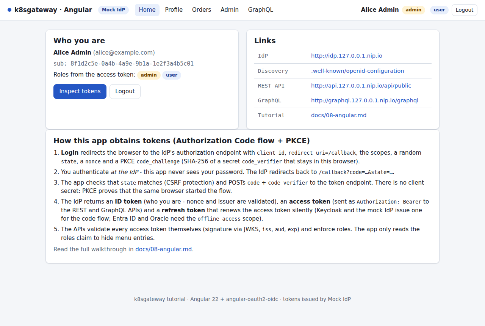

# Quickstart: from zero to a running demo

`make up` turns a machine with Docker into a kind cluster that runs Envoy Gateway, the mock IdP and the four applications, all reachable under `http://*.127.0.0.1.nip.io`. This chapter explains what the script does at each step and how to check it, then takes you on a tour: log in as `alice`, read her tokens, call the REST and GraphQL APIs with `curl`, see the Next.js BFF, run the automated checks and tear everything down again.

## What you will learn

- What the six steps of [scripts/up.sh](../scripts/up.sh) do and the `kubectl` commands that verify each one.
- Why pods need a CoreDNS rewrite to reach `*.127.0.0.1.nip.io`, and how to test it from inside a pod.
- How to obtain an access token from the command line and what the APIs answer with 200, 401 and 403.
- What `make test` and the Playwright checks in `e2e/` cover, and their output when everything works.

## Prerequisites

Docker, kind v0.33 or newer, `kubectl`, `curl`, `jq` and `openssl` (used once, to generate the mock IdP's signing key), and free ports 80 and 443 on `127.0.0.1`. The script checks the first five up front; `openssl` is only checked when the key is generated in step 6, so install it before you start. Images are built with multi-stage Dockerfiles, so no Go or Node is needed on the host. Everything in this chapter is plain http; the optional https listener is described in [deploy/tls/README.md](../deploy/tls/README.md) and used in [chapter 6](06-entra-id.md).

Rootless Docker or Podman cannot bind ports below 1024: either allow it once (`sudo sysctl net.ipv4.ip_unprivileged_port_start=80`) or run `HTTP_PORT=8080 HTTPS_PORT=8443 make up`. The scripts then append `:8080` to every URL, issuer included; keep passing the variables to the other `make` targets. Only 8080/8443 work as alternatives ([deploy/README.md](../deploy/README.md)).

## What `make up` does

`make up` runs `IDP=mock scripts/up.sh`. Every step is idempotent, so re-running after a failure or a reboot is safe.

### 1. Create the kind cluster

```bash
kind create cluster --name k8sgateway --config deploy/kind/kind-config.yaml
```

[deploy/kind/kind-config.yaml](../deploy/kind/kind-config.yaml) pins the node image (`kindest/node:v1.37.0`) and maps two container ports of the node to the host: `30080 -> 127.0.0.1:80` and `30443 -> 127.0.0.1:443`. Those are the NodePorts the Envoy Service binds in step 3; the mapping is what makes `http://angular.127.0.0.1.nip.io` reach the cluster.

```bash
kind get clusters                       # k8sgateway
docker port k8sgateway-control-plane    # 30080/tcp -> 127.0.0.1:80   30443/tcp -> 127.0.0.1:443
kubectl --context kind-k8sgateway get nodes
```

The scripts always pass `--context kind-k8sgateway`, so your current kubeconfig context is never touched.

### 2. Install Envoy Gateway

```bash
kubectl apply --server-side -f https://github.com/envoyproxy/gateway/releases/download/v1.9.1/install.yaml
```

The release manifest bundles the Gateway API CRDs; `--server-side` is required because they are too large for client-side apply. The script waits for the controller and for the `gateways` and `securitypolicies` CRDs to be established.

```bash
kubectl -n envoy-gateway-system get deploy      # envoy-gateway 1/1
```

### 3. Apply the Gateway and wait until it is programmed

```bash
kubectl apply -k deploy/gateway
kubectl -n k8sgateway wait gateway/main --for=condition=Programmed --timeout=300s
```

[deploy/gateway](../deploy/gateway) holds three objects: the `GatewayClass` `eg`, an `EnvoyProxy` that makes the generated proxy Service a `NodePort` pinned to `30080` (kind has no cloud load balancer), and the `Gateway` `main` in namespace `k8sgateway` with one `http` listener on port 80 that accepts `HTTPRoute`s from every namespace (apps live in `k8sgateway`, IdPs in `idp`). `Programmed=True` means Envoy Gateway created a proxy Deployment and Service in `envoy-gateway-system`, named with a hash of `<namespace>/<gateway>`:

```bash
kubectl -n k8sgateway get gateway main
kubectl -n envoy-gateway-system get svc \
  -l gateway.envoyproxy.io/owning-gateway-name=main,gateway.envoyproxy.io/owning-gateway-namespace=k8sgateway
```

```text
NAME   CLASS   ADDRESS      PROGRAMMED   AGE
main   eg      172.22.0.2   True         134m
NAME                             TYPE       CLUSTER-IP      EXTERNAL-IP   PORT(S)                       AGE
envoy-k8sgateway-main-7cab4a6a   NodePort   10.96.253.154   <none>        80:30080/TCP,8080:30207/TCP   131m
```

Inside the Envoy pod the listener is on 10080 (privileged ports are shifted by 10000); port 8080 is the in-cluster alias for the `HTTP_PORT=8080` mode.

### 4. Point `*.127.0.0.1.nip.io` at Envoy for the pods

This is the one non-obvious step. In the browser `idp.127.0.0.1.nip.io` resolves to `127.0.0.1`, where port 80 leads into the cluster; inside a pod `127.0.0.1` is the pod's own loopback, so the REST API would fetch the IdP's discovery document from itself. Because a token's `iss` must equal the issuer the validator was configured with, pods must use the same URL as the browser. [scripts/coredns-rewrite.sh](../scripts/coredns-rewrite.sh) inserts a rewrite rule into the CoreDNS Corefile and restarts CoreDNS:

```text
rewrite stop {
    name regex ^(.*)\.127\.0\.0\.1\.nip\.io\.$ envoy-k8sgateway-main-7cab4a6a.envoy-gateway-system.svc.cluster.local
    answer auto
}
```

Every `*.127.0.0.1.nip.io` query from a pod now returns the ClusterIP of the Envoy Service; Envoy still sees the original `Host` header and routes as usual. `answer auto` rewrites the answer's owner name back to the original question, without which strict resolvers such as glibc discard the response; the regex is anchored because pods have `ndots:5` search suffixes.

Check the Corefile, then a lookup and an HTTP round trip from a pod (the mock IdP image ships `nslookup` and `wget`; the Go API is distroless), once step 6 has run:

```bash
kubectl -n kube-system get configmap coredns -o jsonpath='{.data.Corefile}' | grep -A3 'rewrite stop'
kubectl -n idp exec deploy/mock-idp -- nslookup idp.127.0.0.1.nip.io
kubectl -n idp exec deploy/mock-idp -- wget -qO- http://idp.127.0.0.1.nip.io/.well-known/openid-configuration
```

```text
Server:		10.96.0.10
Address:	10.96.0.10:53

Name:	idp.127.0.0.1.nip.io
Address: 10.96.253.154
{"issuer":"http://idp.127.0.0.1.nip.io","authorization_endpoint":"http://idp.127.0.0.1.nip.io/authorize", ...
```

The address is the Envoy Service's ClusterIP from step 3. Pod-to-pod calls that need not match a token claim (the GraphQL API relaying to the REST API) still use plain Service names such as `http://rest-api.k8sgateway.svc.cluster.local:8080`.

### 5. Build the images and load them into kind

```bash
scripts/build.sh            # or: make build;  SKIP_BUILD=1 make up skips this step
```

[scripts/build.sh](../scripts/build.sh) runs `docker build -t k8sgateway/<app>:dev apps/<app>` for the five apps, then `kind load docker-image` (with an image-archive fallback for hosts using Docker's containerd image store). The Deployments reference the `:dev` tags with `imagePullPolicy: IfNotPresent`, so the kubelet never contacts a registry. Running pods keep their old image after a rebuild until `kubectl -n k8sgateway rollout restart deployment/<app>` or `make switch`.

```bash
docker images 'k8sgateway/*'
docker exec k8sgateway-control-plane crictl images | grep k8sgateway
```

### 6. Deploy the overlay and wait

```bash
scripts/deploy.sh mock      # what `make deploy IDP=mock` runs
```

[scripts/deploy.sh](../scripts/deploy.sh) creates the namespaces `k8sgateway` and `idp`, an empty ConfigMap `k8sgateway-ca` (filled only in TLS mode) and, for the mock IdP, the Secret `idp/mock-idp-key` with an RSA key from `openssl genpkey`, so the IdP's signing key and JWKS `kid` survive pod restarts. Then it renders and applies the overlay:

```bash
scripts/render.sh mock | kubectl apply -f -
```

[scripts/render.sh](../scripts/render.sh) is `kubectl kustomize deploy/overlays/mock` plus a hostname rewrite when `BASE_DOMAIN`, `SCHEME` or the ports differ from the defaults. The overlay combines [deploy/base](../deploy/base) (the four apps, identical for every IdP), [deploy/idp/mock](../deploy/idp/mock) and a `configMapGenerator` that turns [rest-api.env](../deploy/overlays/mock/rest-api.env), `graphql-api.env`, `nextjs.env` and `angular-config.json` into one ConfigMap per app. kustomize appends a content hash to each name (`rest-api-config-tfm4hbmth9`), which is why applying another overlay later rolls the Deployments by itself. The script then waits for `mock-idp`, for the four applications, and for the discovery document to answer from your machine.

```bash
kubectl -n idp get pods
kubectl -n k8sgateway get pods,httproute
kubectl -n k8sgateway get configmap -l app.kubernetes.io/part-of=k8sgateway
curl -s http://idp.127.0.0.1.nip.io/.well-known/openid-configuration | jq .issuer
```

The REST and GraphQL pods become `Ready` only after they fetched discovery and the JWKS (`/readyz`); a pod stuck at `0/1 Running` almost always cannot reach the issuer (step 4). `up.sh` ends with a `curl` against `/api/public` and prints the URLs and demo users ([scripts/urls.sh](../scripts/urls.sh), also `make urls`).

## Guided tour

### The mock IdP

Open <http://idp.127.0.0.1.nip.io>. The dashboard lists the demo users, the registered clients, every endpoint and ready-made `curl` commands; `/debug/token` decodes any JWT you paste and checks its signature against the IdP's keys.


*The mock IdP's dashboard: what you need to inspect the flows during development.*

### Log in with the Angular SPA

Open <http://angular.127.0.0.1.nip.io>. The home page says you are not signed in and names the IdP it read from `/config.json`. Click **Login**: the SPA sends the browser to the IdP's `/authorize` endpoint with a PKCE challenge, a `state` and a `nonce`.


*The mock IdP's login page. Real IdPs show their own page here; the application never sees it.*

Click **Sign in as alice**. The IdP redirects to `/callback?code=...&state=...`, the SPA checks `state`, exchanges the code plus its `code_verifier` for tokens and shows who you are, with the roles it read from the access token.



*Signed in. The badges come from the claim at `rolesClaim` and gate the UI only; the APIs decide for real.*

The screenshots are produced by [e2e/flows.mjs](../e2e/flows.mjs) against whichever IdP is deployed at the time. With the mock IdP the header badge says "Mock IdP" and alice has exactly `admin` and `user`; a "Keycloak" badge with extra realm roles (`offline_access`, `default-roles-k8sgateway`, `uma_authorization`) means the picture was taken after `make switch IDP=keycloak` - the pages are otherwise identical.

### Inspect the tokens on /profile

<http://angular.127.0.0.1.nip.io/profile> shows the ID token claims (validated by the library: issuer, audience = client id, nonce, expiry) next to the decoded access token: header (`alg: RS256`, `kid`) and payload with `iss`, `aud: ["k8sgateway-api"]`, `exp` and `roles`, with a countdown, a **Refresh token** button and **Copy token** / **Copy curl** buttons. Then visit **Orders** (`GET`/`POST /api/orders`, role `user`) and **Admin** (visible because alice has `admin`); **Logout** ends the session at the IdP too.


*Everything on this page is decoded in the browser without signature checks; only the APIs verify signatures.*

### Call the REST API with curl

[scripts/get-token.sh](../scripts/get-token.sh) obtains an access token with the resource-owner password grant on the public client `cli`. That grant exists here for scripts and tests only; applications use the code flow. Note that this per-user token example is **OAuth 2.0 only**: OAuth 2.1 removes the password grant, and the applications in this repository never use it (see [OAuth 2.1 in chapter 1](01-concepts.md#oauth-21-what-it-changes-and-where-this-repository-stands)).

```bash
TOKEN=$(scripts/get-token.sh alice)           # or: make -s token USER=alice
scripts/get-token.sh --decode alice           # header and payload, no verification
curl -s http://api.127.0.0.1.nip.io/api/public | jq .
curl -s -H "Authorization: Bearer $TOKEN" http://api.127.0.0.1.nip.io/api/me | jq .
```

```json
{
  "sub": "8f1d2c5e-0a4b-4a9e-9b1a-1e2f3a4b5c01",
  "name": "Alice Admin",
  "preferred_username": "alice",
  "email": "alice@example.com",
  "roles": ["admin", "user"],
  "claims": {
    "iss": "http://idp.127.0.0.1.nip.io",
    "sub": "8f1d2c5e-0a4b-4a9e-9b1a-1e2f3a4b5c01",
    "aud": ["k8sgateway-api"],
    "exp": 1789702896, "iat": 1789702596, "nbf": 1789702596,
    "jti": "2ffba08b-f317-47da-b954-450715e7099a",
    "azp": "cli", "scope": "openid profile email",
    "preferred_username": "alice", "name": "Alice Admin",
    "email": "alice@example.com", "email_verified": true,
    "roles": ["admin", "user"], "groups": ["admin", "user"]
  }
}
```

The top-level `roles` are the application roles derived from `ROLES_CLAIM`; `claims` is the verified access-token payload. Now the failures: no token gives 401 with a `WWW-Authenticate` challenge (a token that does not verify gets the same status plus `error="invalid_token"`), and a valid token without the required role gives 403.

```bash
curl -si http://api.127.0.0.1.nip.io/api/me
```

```http
HTTP/1.1 401 Unauthorized
content-type: application/json; charset=utf-8
www-authenticate: Bearer realm="k8sgateway-api"

{"error":"unauthorized","error_description":"missing bearer token"}
```

```bash
curl -si -H "Authorization: Bearer $(scripts/get-token.sh bob)" http://api.127.0.0.1.nip.io/api/admin/stats
```

```http
HTTP/1.1 403 Forbidden
www-authenticate: Bearer error="insufficient_scope", scope="admin"

{"error":"forbidden","required_role":"admin"}
```

`carol` is authenticated but has no roles, so even `GET /api/orders` answers `403 {"error":"forbidden","required_role":"user"}`. The full reason for a rejected token (expected issuer, audience) is only in the pod log: `make logs APP=rest-api`.

### Call the GraphQL API with curl

Apollo Server's CSRF prevention rejects requests without a proper `Content-Type`, so always send `application/json`:

```bash
curl -s -H "Authorization: Bearer $TOKEN" -H 'Content-Type: application/json' \
  -d '{"query":"{ me { preferredUsername roles } }"}' http://graphql.127.0.0.1.nip.io/graphql | jq .
```

```json
{ "data": { "me": { "preferredUsername": "alice", "roles": ["admin", "user"] } } }
```

Without the `Authorization` header the same query is refused with HTTP 401, `WWW-Authenticate: Bearer realm="graphql-api"` and a GraphQL error whose `extensions.code` is `UNAUTHENTICATED`:

```json
{"errors":[{"message":"authentication required","locations":[{"line":1,"column":3}],"path":["me"],"extensions":{"code":"UNAUTHENTICATED"}}],"data":{"me":null}}
```

`{ hello }` works anonymously, `restOrders` relays your token to the REST API, `adminStats` needs `admin`; see [11-graphql-api.md](11-graphql-api.md).

### The Next.js BFF

Open <http://next.127.0.0.1.nip.io> and click **Login**. The same IdP page appears, but this time the *server* started the flow, exchanged the code with a client secret and stored the tokens in an encrypted HttpOnly cookie. The dashboard is rendered on the server, including a server-to-server call to `GET /api/me`:


*No token reaches the browser; the page shows what the server learned from the API.*

Verify with `curl` that a protected page without a session redirects to the login route, and the session endpoint exposes claims but never tokens.

```bash
curl -si http://next.127.0.0.1.nip.io/dashboard | head -2
curl -s  http://next.127.0.0.1.nip.io/api/auth/session
```

```text
HTTP/1.1 307 Temporary Redirect
location: http://next.127.0.0.1.nip.io/api/auth/login?returnTo=%2Fdashboard
{"authenticated":false,"idp":"Mock IdP"}
```

Log in as `bob` and open `/admin` to see a real HTTP 403 page rendered by the server ([09-nextjs.md](09-nextjs.md)).

## Automated checks

### make test

[scripts/test.sh](../scripts/test.sh) runs the 200/401/403 matrix with `curl`. It detects the deployed IdP from the REST API's ConfigMap (or takes it as an argument) and exits 1 if any check fails. Expected output right after `make up`:

```text
IdP: mock (http://idp.127.0.0.1.nip.io)
PASS OIDC discovery document -> 200
PASS password grant for alice (client cli)
PASS password grant for bob (client cli)
PASS password grant for carol (client cli)
PASS GET /api/public without token -> 200
PASS GET /api/me without token -> 401
PASS GET /api/me as alice -> roles include admin (["admin","user"])
PASS GET /api/orders as alice (role user) -> 200
PASS GET /api/admin/stats as alice (role admin) -> 200
PASS GET /api/admin/stats as bob (no admin role) -> 403
PASS GET /api/orders as carol (no roles) -> 403
PASS GET /api/me with a garbage token -> 401
PASS GraphQL me as alice -> {"preferredUsername":"alice","roles":["admin","user"]}
PASS GraphQL me without token -> UNAUTHENTICATED
PASS Angular GET / -> 200
PASS Angular /config.json issuer = http://idp.127.0.0.1.nip.io
PASS Next.js GET / -> 200
PASS Next.js GET /dashboard without session -> 307 to http://next.127.0.0.1.nip.io/api/auth/login?returnTo=%2Fdashboard

18 passed, 0 failed
```

After `make switch IDP=keycloak` the header and the issuer line show `http://keycloak.127.0.0.1.nip.io/realms/k8sgateway`, and the GraphQL line also lists Keycloak's built-in realm roles (`offline_access`, `default-roles-k8sgateway`, `uma_authorization`), which the applications ignore.

### Browser checks (e2e/)

[e2e/flows.mjs](../e2e/flows.mjs) drives a headless Chromium through the real flows of both frontends: PKCE login, every page, logout, the HttpOnly cookie session, the relay routes and `bob` being denied on `/admin`. It needs Node 22 and downloads Chromium once:

```bash
cd e2e
npm install && npx playwright install chromium
IDP=mock npm test
```

```text
PASS Angular: anonymous home
PASS Angular: signed in as alice with roles
PASS Angular: profile shows ID token claims and access token audience
PASS Angular: orders loaded from the REST API with the bearer token
PASS Angular: admin page lists all orders (role admin)
PASS Angular: GraphQL me query with the bearer token
PASS Angular: RP-initiated logout returns to the app signed out
PASS Next.js: /api/auth/session anonymous
PASS Next.js: dashboard rendered server-side with /api/me result
PASS Next.js: session endpoint exposes claims but no tokens
PASS Next.js: session cookie is HttpOnly
PASS Next.js: orders via /api/bff/orders relay
PASS Next.js: admin stats (role admin)
PASS Next.js: profile decodes the access token server-side
PASS Next.js: logout clears the session
PASS Next.js: bob is denied on /admin (403)
PASS no browser console/page errors

all browser checks passed
```

`npm run screenshots` writes the PNGs under `docs/images/screenshots/`; `HEADFUL=1` shows the browser. CI ([.github/workflows/ci.yml](../.github/workflows/ci.yml)) runs `up.sh`, `test.sh`, `switch-idp.sh keycloak` and `test.sh` again on a fresh kind cluster in its `e2e-kind` job, in parallel with the image builds and unit tests (the three jobs are independent).

## Tear down

```bash
make down          # kind delete cluster --name k8sgateway
```

This removes everything the tutorial deployed, including the signing-key Secret. The five `k8sgateway/*:dev` images stay in the Docker cache (`docker images 'k8sgateway/*'`), so the next `make up` builds fast; `docker image rm` them if you want the space back.

## Next

[The mock IdP](04-mock-idp.md)
