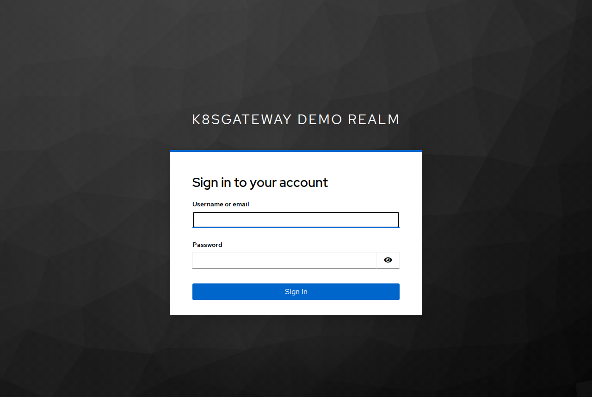
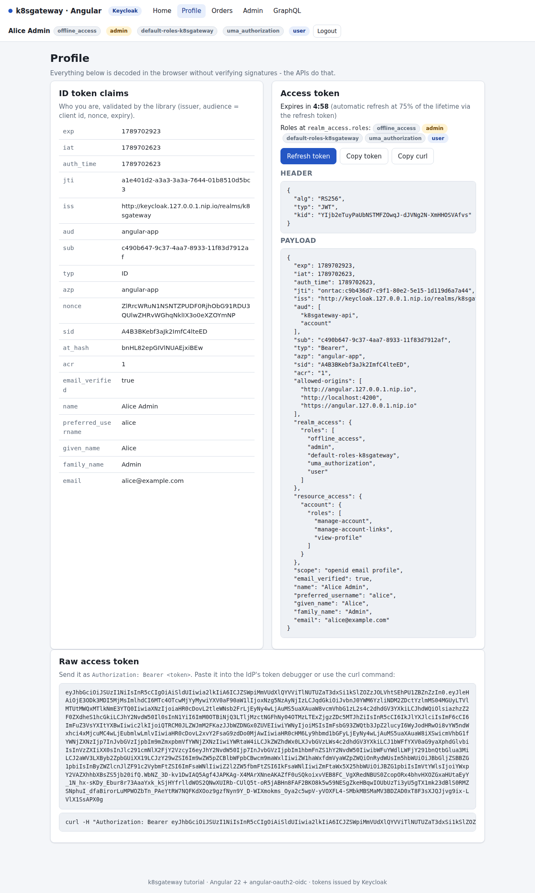

# Keycloak in the cluster

The mock IdP is convenient, but at some point you want a real identity provider with the full protocol and an admin console. This chapter deploys Keycloak 26.7 into the kind cluster, imports a realm with the same demo users, roles and clients as the mock IdP, and switches the four applications over to it without rebuilding an image. On the way you meet the setting that trips up most first integrations: Keycloak does not put your API into the `aud` of an access token unless you add a mapper.

## What you will learn

- how `deploy/idp/keycloak` runs Keycloak with `start-dev --import-realm`, and what each environment variable does
- what the realm file contains: roles, users, four clients and the `k8sgateway-api` client scope with its audience mapper
- how to read a Keycloak access token (`realm_access.roles`, `resource_access`, `aud`, `typ`, `azp`, `sid`) and why `ROLES_CLAIM=realm_access.roles`
- why the scope is `openid profile email` without `offline_access`
- how to switch with `make switch IDP=keycloak`, find things in the admin console, use an existing Keycloak, read the common errors, and what changes for production

## How it works

Keycloak organizes everything in *realms*: isolated tenants with their own users, roles, clients and signing keys. A realm is an OIDC issuer - the issuer URL is `<server URL>/realms/<realm>`, discovery lives at `<issuer>/.well-known/openid-configuration`, the JWKS at `<issuer>/protocol/openid-connect/certs`. The applications need nothing more than that issuer, a client id (plus a secret for the confidential Next.js client), the audience they expect and the claim that holds the roles - exactly the values the [Keycloak overlay](../deploy/overlays/keycloak) puts into the per-app ConfigMaps.

Keycloak runs in namespace `idp` behind the same Envoy Gateway as the apps, at `http://keycloak.127.0.0.1.nip.io`. Pods resolve `*.127.0.0.1.nip.io` to the gateway (the CoreDNS rewrite from [chapter 2](02-architecture.md)), so browser and REST API fetch discovery from the *same* URL - which OIDC requires, because the `iss` claim must equal the issuer the validator was configured with.

## The deployment: `deploy/idp/keycloak`

Five files: [`kustomization.yaml`](../deploy/idp/keycloak/kustomization.yaml), [`deployment.yaml`](../deploy/idp/keycloak/deployment.yaml), [`service.yaml`](../deploy/idp/keycloak/service.yaml) (ports 8080 and 9000), [`httproute.yaml`](../deploy/idp/keycloak/httproute.yaml) (hostname `keycloak.127.0.0.1.nip.io`, the whole server routed to port 8080) and [`realm-export.json`](../deploy/idp/keycloak/realm-export.json), the realm described in the next section. The kustomization turns the realm file into a ConfigMap and deliberately renames it:

```yaml
configMapGenerator:
  - name: keycloak-realm
    files:
      # --import-realm only reads <realm>-realm.json, so the key sets the file name.
      - k8sgateway-realm.json=realm-export.json
```

It is mounted at `/opt/keycloak/data/import`, the directory `--import-realm` scans at startup; only top-level `<realm>-realm.json` files are read, and an existing realm is never overridden. The container is `quay.io/keycloak/keycloak:26.7.4` with `args: ["start-dev", "--import-realm"]` and these variables:

| Variable | Value | Why |
|---|---|---|
| `KC_BOOTSTRAP_ADMIN_USERNAME` / `_PASSWORD` | `admin` / `admin` | Temporary admin of the `master` realm (demo value). Keycloak 26 replaced the old `KEYCLOAK_ADMIN*` names. |
| `KC_HOSTNAME` | `http://keycloak.127.0.0.1.nip.io` | A *full URL* pins the issuer and every advertised endpoint for every caller. Otherwise Keycloak derives them from the `Host` header, and a pod calling the Service would see a different `iss` than the browser. `KC_HOSTNAME_STRICT` is ignored once this is set (Keycloak logs exactly that). |
| `KC_HTTP_ENABLED` | `true` | Envoy terminates the client connection and forwards plain HTTP. Implicit in `start-dev`, mandatory with `start`. |
| `KC_PROXY_HEADERS` | `xforwarded` | Trust `X-Forwarded-For/Proto/Host/Port` from the gateway; without it, origin-checked requests answer `403`. |
| `KC_HEALTH_ENABLED` | `true` | `/health/started`, `/health/ready`, `/health/live` on the **management port 9000**, not 8080. |
| `KC_HOSTNAME_DEBUG` | `true` | Dev only: `GET /realms/k8sgateway/hostname-debug` shows the resolved URLs and forwarded headers. Public through the gateway - never in production. |

The rest follows from the embedded dev-file (H2) database: `replicas: 1`, `strategy: Recreate` (two pods must never share the H2 file), three probes on port `9000` with a startup probe that tolerates five minutes, requests `500m`/`1Gi` and a memory limit of `1536Mi` - the JVM takes 70 % of the limit as heap, so without a limit the heap grows unbounded. On this machine the pod goes from container start to "realm imported" in about 15 seconds; `scripts/deploy.sh` waits up to ten minutes because the first start also pulls the image.

The database lives inside the container, so **every restart re-imports the realm from the JSON file** - deterministic for a tutorial, a trap for console users: edits made in the admin console vanish at the next restart. Edit the JSON instead.

```bash
kubectl -n idp get pods,svc,httproute
make logs APP=keycloak            # = scripts/logs.sh keycloak
# health lives on the management port; the API server proxy reaches it without a port-forward:
kubectl get --raw /api/v1/namespaces/idp/services/keycloak:9000/proxy/health/ready
```

A fresh pod's log shows `Importing from directory /opt/keycloak/bin/../data/import`, `Realm 'k8sgateway' imported`, then `Keycloak 26.7.4 on JVM ... Listening on: http://0.0.0.0:8080. Management interface listening on http://0.0.0.0:9000.` The `WARN ... Non-secure context detected; cookies are not secured` lines that follow are the price of plain HTTP.

## The realm file: `realm-export.json`

[`deploy/idp/keycloak/realm-export.json`](../deploy/idp/keycloak/realm-export.json) is a hand-written `RealmRepresentation` - the same JSON the admin REST API speaks - reduced to what the tutorial needs.

**Realm settings.** `sslRequired: none` for plain HTTP in kind; access tokens live 300 s; the SSO session idles out after 1800 s and ends after 36000 s (a refresh token inherits those two numbers); `registrationAllowed: false`, `loginWithEmailAllowed: true`. The attribute `CreateDefaultClientScopes: "true"` matters: a realm file that defines its own `clientScopes` would otherwise suppress the built-in scopes (`profile`, `email`, `roles`, `web-origins`, `basic`, ...) - and without `roles` there is no `realm_access` claim at all.

**Roles and users.** Two realm roles, `user` and `admin`, and the demo users:

| User | Realm roles in the file | Application roles |
|---|---|---|
| `alice` / `alice` | `default-roles-k8sgateway`, `admin`, `user` | admin, user |
| `bob` / `bob` | `default-roles-k8sgateway`, `user` | user |
| `carol` / `carol` | `default-roles-k8sgateway` | none - authenticated, `403` on `/api/orders` |
| `service-account-svc-batch` | `default-roles-k8sgateway`, `admin`, `user` | admin, user (client credentials, no password) |

`default-roles-k8sgateway` is the composite Keycloak grants to every user created in the console (account roles, `offline_access`, `uma_authorization`); imported users do not get it automatically, so it is listed to keep them identical to hand-made ones. Two import rules are easy to miss: users need `"enabled": true` (omitted means disabled), and `"temporary": false` on the password is ignored by realm import - a forced change needs `"requiredActions": ["UPDATE_PASSWORD"]`.

**Clients.** The same four as in the mock IdP:

| Client | Kind | Flow | Redirect URIs / web origins | Notes |
|---|---|---|---|---|
| `angular-app` | public | code flow | `http(s)://angular.127.0.0.1.nip.io/*`, `http://localhost:4200/*`; origins `+` | `pkce.code.challenge.method: S256` makes PKCE mandatory |
| `nextjs-app` | confidential, `nextjs-secret` | code flow | exact `.../api/auth/callback` on `next.127.0.0.1.nip.io` (http, https) and `localhost:3000`; origins `+` | demo secret, lives in [`nextjs.secret.env`](../deploy/overlays/keycloak/nextjs.secret.env) |
| `cli` | public | password grant only | none | for `scripts/get-token.sh` and `scripts/test.sh` - never in production |
| `svc-batch` | confidential, `svc-batch-secret` | client credentials | none | its service-account user holds `admin` and `user` |

On import, client booleans default to *false* (except `enabled` and `standardFlowEnabled`), so every client spells out `publicClient`, `standardFlowEnabled`, `implicitFlowEnabled`, `directAccessGrantsEnabled` and `serviceAccountsEnabled`. `webOrigins: ["+"]` means "the origins of the valid redirect URIs". Post-logout redirect URIs live in the client attribute `post.logout.redirect.uris`, several values joined with `##`: the realm file lists `http(s)://angular.127.0.0.1.nip.io/*` and `http://localhost:4200/*` for the SPA and the `next.`/`localhost:3000` equivalents for the BFF. Keycloak also accepts `+` there (all valid redirect URIs), the same convention as `webOrigins`. A trailing `/*` in a redirect URI is a wildcard; anything else must match exactly.

**The audience mapper - and why it is needed.** Keycloak's built-in "audience resolve" mapper adds a client to `aud` only when the user holds a *client role* of that client - which is why `account` shows up in every token (the demo users hold `manage-account` and friends) but a resource server you never modeled does not. The REST and GraphQL APIs require `aud` to contain `OIDC_AUDIENCE=k8sgateway-api` and answer `401 audience mismatch` otherwise. Hence a client scope with a hardcoded audience:

```json
"clientScopes": [{
  "name": "k8sgateway-api",
  "protocol": "openid-connect",
  "protocolMappers": [{
    "name": "k8sgateway-api audience",
    "protocolMapper": "oidc-audience-mapper",
    "config": { "included.custom.audience": "k8sgateway-api",
                "access.token.claim": "true", "id.token.claim": "false" }
  }]
}],
"defaultDefaultClientScopes": ["k8sgateway-api"]
```

`defaultDefaultClientScopes` makes it a *realm default* scope, so every client - present and future - gets it without per-client wiring. It touches the access token only; the ID token keeps `aud = <client id>`, as OIDC demands. Do not add `defaultClientScopes` to a client in the JSON unless you list *all* of its scopes: when present, the list is authoritative and everything else is removed.

## Issuer and discovery

```bash
curl -s http://keycloak.127.0.0.1.nip.io/realms/k8sgateway/.well-known/openid-configuration | jq '{issuer, token_endpoint, jwks_uri, end_session_endpoint}'
```

```json
{
  "issuer": "http://keycloak.127.0.0.1.nip.io/realms/k8sgateway",
  "token_endpoint": "http://keycloak.127.0.0.1.nip.io/realms/k8sgateway/protocol/openid-connect/token",
  "jwks_uri": "http://keycloak.127.0.0.1.nip.io/realms/k8sgateway/protocol/openid-connect/certs",
  "end_session_endpoint": "http://keycloak.127.0.0.1.nip.io/realms/k8sgateway/protocol/openid-connect/logout"
}
```

The issuer is exactly the overlay's `OIDC_ISSUER`: no port (80 is normalized away), no trailing slash. `curl -s http://keycloak.127.0.0.1.nip.io/realms/k8sgateway/hostname-debug` (dev only) renders the frontend/backend/admin URLs - all three the pinned one - and the headers Keycloak received (`X-Forwarded-For: 172.22.0.1`, `X-Forwarded-Proto: http`): the first place to look when an issuer does not match.

## Getting a token and reading it

[`scripts/get-token.sh`](../scripts/get-token.sh) reads the discovery document and uses the password grant on the `cli` client. `--decode` prints header and payload; the `keycloak` argument is optional once Keycloak is the deployed IdP. The password grant is OAuth 2.0 only (OAuth 2.1 removes it): it is enabled on this one test client ("Direct access grants" in the admin console) and on no application client, see [chapter 1](01-concepts.md#the-per-user-token-example-is-oauth-20-only).

```bash
scripts/get-token.sh --decode alice keycloak
```

```json
{
  "exp": 1789702767, "iat": 1789702467,
  "jti": "onrtro:854f6e6a-7794-3589-addd-acdd4c8492b5",
  "iss": "http://keycloak.127.0.0.1.nip.io/realms/k8sgateway",
  "aud": ["k8sgateway-api", "account"],
  "sub": "cb4f0d96-e150-4574-a118-a44106f1255e",
  "typ": "Bearer", "azp": "cli", "sid": "Co0NoM-Jyna-4LPo_8yUWqBa", "acr": "1",
  "realm_access": { "roles": ["offline_access", "admin", "default-roles-k8sgateway", "uma_authorization", "user"] },
  "resource_access": { "account": { "roles": ["manage-account", "manage-account-links", "view-profile"] } },
  "scope": "openid email profile",
  "email_verified": true, "name": "Alice Admin", "preferred_username": "alice",
  "given_name": "Alice", "family_name": "Admin", "email": "alice@example.com"
}
```

| Claim | Meaning |
|---|---|
| `iss`, `aud` | Checked by the APIs: `iss` must equal `OIDC_ISSUER`, `aud` must contain `k8sgateway-api` (`account` is the audience-resolve by-product). |
| `azp` | *Authorized party*: the client that requested the token. |
| `typ` | `Bearer` for access tokens, `ID` for ID tokens, `Refresh` or `Offline` for refresh tokens. |
| `sid` | The SSO session id, shared with the ID token and used for logout; absent for `svc-batch`, which has no user session. |
| `realm_access.roles` | The user's realm roles - `user`/`admin` **plus** Keycloak's automatic `default-roles-k8sgateway`, `offline_access`, `uma_authorization`. |
| `resource_access.<client>.roles` | Client roles per client. Had you modeled the API as a client with its own roles, `ROLES_CLAIM=resource_access.k8sgateway-api.roles` would read them here. |
| `scope` | Granted scopes; `k8sgateway-api` is not listed because the scope sets `include.in.token.scope: false`. |

Compare `bob` (no `admin`), `carol` (only the automatic roles) and the machine token `scripts/get-token.sh --decode --client-credentials`: `azp: svc-batch`, `preferred_username: service-account-svc-batch`, no `sid`.

### The roles claim

The overlay sets `ROLES_CLAIM=realm_access.roles`, `ROLE_USER=user`, `ROLE_ADMIN=admin`. Every app walks that dotted path and keeps only the values it knows - [`roles.go`](../apps/rest-api/internal/auth/roles.go), [`auth.ts`](../apps/graphql-api/src/auth.ts), [`roles.ts`](../apps/nextjs-app/src/lib/roles.ts), [`jwt.ts`](../apps/angular-app/src/app/core/jwt.ts) - so the noise roles are harmless. `/api/me` shows both views:

```bash
TOKEN=$(scripts/get-token.sh alice keycloak)
curl -s -H "Authorization: Bearer $TOKEN" http://api.127.0.0.1.nip.io/api/me | jq '{roles, raw: .claims.realm_access.roles}'
```

```json
{ "roles": ["admin", "user"],
  "raw": ["offline_access", "admin", "default-roles-k8sgateway", "uma_authorization", "user"] }
```

### Scope without `offline_access` - the offline-token trap

[`nextjs.env`](../deploy/overlays/keycloak/nextjs.env) and [`angular-config.json`](../deploy/overlays/keycloak/angular-config.json) request `openid profile email` - not `offline_access`, which the Microsoft Entra ID and Oracle IAM Identity Domains overlays need for refresh tokens. Keycloak issues a refresh token in the code flow anyway, and if you *do* ask for `offline_access` you get something else. Same user, same client:

| Requested scope | `refresh_expires_in` | Refresh token |
|---|---|---|
| `openid profile email` | `1800` (SSO idle timeout) | `typ: Refresh`, expires in 30 min |
| `openid profile email offline_access` | `0` | `typ: Offline`, no `exp` |

An offline token does not expire with the SSO session and **survives logout**; it exists for daemons acting for absent users. A web app that stores one in the browser or a cookie has created a credential that logout no longer revokes - and Keycloak hands it out readily, because every user holds the `offline_access` role via the default roles and the scope is optional on every client. Keep it out of the Keycloak scope; the mock IdP accepts it as a no-op.

## Switching the running installation


*The application images never change; the overlay swaps the ConfigMaps and the pods re-read them at startup.*

```bash
make switch IDP=keycloak          # = scripts/switch-idp.sh keycloak
```

[`scripts/switch-idp.sh`](../scripts/switch-idp.sh) runs `scripts/deploy.sh keycloak`, which renders [`deploy/overlays/keycloak`](../deploy/overlays/keycloak) (`base` + `idp/keycloak` + one ConfigMap per app), applies it, and waits for the Keycloak rollout and for the discovery document to answer through the gateway. It then restarts the four Deployments so every pod re-reads its configuration, waits until they answer again, and warns if a gateway `SecurityPolicy` still trusts the mock issuer - apply [`securitypolicy-rest-jwt-keycloak.yaml`](../deploy/gateway-policies/securitypolicy-rest-jwt-keycloak.yaml) instead ([chapter 12](12-gateway-jwt.md)). The mock IdP keeps running; `make switch IDP=mock` goes back. Your browser still holds a session from the previous IdP, so log out in the app or clear cookies for `*.127.0.0.1.nip.io` before logging in again.

Compared with the mock overlay only three values change ([`rest-api.env`](../deploy/overlays/keycloak/rest-api.env), [`graphql-api.env`](../deploy/overlays/keycloak/graphql-api.env), `nextjs.env`, `angular-config.json`): `OIDC_ISSUER` becomes `http://keycloak.127.0.0.1.nip.io/realms/k8sgateway`, `ROLES_CLAIM` becomes `realm_access.roles`, and the display name becomes `Keycloak`. Audience, scope, client ids and the demo secret are identical by design. Verify:

```bash
scripts/test.sh keycloak      # 18 curl checks: discovery, 401/403/200 per user, GraphQL, Angular config, Next.js redirect
scripts/urls.sh
```



*The Angular Login button now lands on Keycloak's own page, titled with the realm's display name; `alice` / `alice` signs in.*



*After a Keycloak login the Angular profile shows the ID token with `aud: angular-app`, the access token with `aud: ["k8sgateway-api","account"]`, `allowed-origins` and the full `realm_access.roles`; the header badges are the raw roles before mapping.*

## Admin console tour

Open `http://keycloak.127.0.0.1.nip.io/admin/`, sign in with `admin` / `admin`, and pick the **k8sgateway** realm in the selector at the top left.

| Where | What you find |
|---|---|
| **Clients** → `angular-app` → *Settings* | *Client authentication* Off, *Standard flow* On, *Valid redirect URIs*, *Valid post logout redirect URIs*, *Web origins* `+` |
| → *Advanced* | *Proof Key for Code Exchange Code Challenge Method* = `S256` |
| → *Client scopes* | `k8sgateway-api` listed as *Default*; the *Evaluate* sub-tab generates an example access token for any user - the fastest way to inspect claims |
| **Clients** → `nextjs-app` → *Credentials* | the client secret; regenerate it there and copy it into `nextjs.secret.env` |
| **Clients** → `svc-batch` → *Service accounts roles* | realm roles of the service-account user |
| **Client scopes** → `k8sgateway-api` → *Mappers* | the *Audience* mapper: *Included Custom Audience* `k8sgateway-api`, *Add to access token* On; the list page's *Assigned type* column marks the scope *Default* |
| **Realm roles**, **Users** → `alice` → *Role mapping* | `user`, `admin` and the automatic roles; who holds what |
| **Realm settings** → *Sessions* / *Tokens* | SSO timeouts, access token lifespan |

Console edits die with the pod. To keep one, transfer it to `realm-export.json` (field names match the JSON from *Realm settings* → *Action* → *Partial export*) and re-deploy.

## The same setup in an existing Keycloak

By hand instead of import: create a realm; add realm roles `user` and `admin`; create users and assign them; create a **client scope** `k8sgateway-api` of type *Default* with an *Audience* mapper (*Included Custom Audience* `k8sgateway-api`, *Add to access token* on); create `angular-app` (public, *Standard flow*, your SPA URL plus `/*` as redirect URI, `+` as web origin, PKCE `S256` under *Advanced*) and `nextjs-app` (*Client authentication* on, exact callback `https://<host>/api/auth/callback`); optionally `svc-batch` with *Service accounts roles* on. Skip the `cli` client - direct access grants have no place in a shared instance.

Then point the apps at it. Copy the overlay to a git-ignored `*.local` directory, remove the `../../idp/keycloak` line from its `kustomization.yaml` so no in-cluster Keycloak is deployed, and edit the values: `OIDC_ISSUER`/`issuer` to `https://<your keycloak>/realms/<realm>`, `OIDC_REQUIRE_HTTPS` and `requireHttps` to `true`, the real secret in `nextjs.secret.env`.

```bash
cp -r deploy/overlays/keycloak deploy/overlays/kc-external.local
# edit kustomization.yaml, rest-api.env, graphql-api.env, nextjs.env, nextjs.secret.env, angular-config.json
scripts/deploy.sh kc-external.local
```

Do not start the directory name with `keycloak`: `scripts/deploy.sh` would wait for the in-cluster Deployment. `scripts/get-token.sh` and `scripts/test.sh` only know the in-cluster issuers, so test with `curl` against the external token endpoint. A private CA goes into the `k8sgateway-ca` ConfigMap the server-side apps mount ([deploy/tls/README.md](../deploy/tls/README.md)).

## Common errors

| Symptom | Cause and fix |
|---|---|
| Keycloak page **"We are sorry... Invalid parameter: redirect_uri"** (HTTP 400); log `LOGIN_ERROR ... error="invalid_redirect_uri"` | The `redirect_uri` is not covered by *Valid redirect URIs* - scheme, host, port and path all count. With `HTTP_PORT=8080` or TLS the app origin changes; `scripts/render.sh` rewrites the realm file, an existing Keycloak needs the URI added. |
| **"Client not found"** | Wrong client id, or the issuer names another realm. |
| App receives `error=invalid_request ... Missing parameter: code_challenge_method` | The client requires PKCE `S256`; the request had none. |
| Browser: token request "blocked by CORS policy"; Keycloak answers `403 {"error":"Invalid origin"}` | The SPA's origin is not in *Web origins*. The preflight `OPTIONS` succeeds for any origin - only the real `POST` is refused, which is what makes it confusing. |
| API: `401`, `error_description="audience mismatch"` | No `k8sgateway-api` in `aud`: the client scope is missing from that client or was removed by a `defaultClientScopes` list. Check with `scripts/get-token.sh --decode`. |
| API: `401 ... "issuer mismatch"` | `OIDC_ISSUER` and `KC_HOSTNAME` disagree - port suffix, scheme, trailing slash, realm name. Compare discovery `issuer` with the ConfigMap. |
| API: `403 {"error":"forbidden","required_role":"admin"}` for a user who has the role | `ROLES_CLAIM` still says `roles` (mock value); Keycloak puts realm roles under `realm_access.roles`. |
| Token endpoint: `Invalid user credentials`, `Client not allowed for direct access grants`, `Invalid client or Invalid client credentials` | Wrong password; password grant on a client other than `cli`; wrong secret for `svc-batch`. |
| Admin console insists on HTTPS | The `master` realm keeps `sslRequired: external`: HTTP only from private client addresses (true inside kind, not necessarily elsewhere). |
| Pod `OOMKilled` or never ready | Raise the memory limit (heap = 70 % of it) or the startup probe's `failureThreshold`; `kubectl -n idp describe pod -l app.kubernetes.io/name=keycloak`. |

## Production notes

The pod logs it itself: `Running the server in development mode. DO NOT use this configuration in production.` What changes:

- **`start` instead of `start-dev`.** Secure by default: HTTP off (enable `KC_HTTP_ENABLED` only behind a TLS-terminating proxy that sets `X-Forwarded-*`), `KC_HOSTNAME` mandatory, distributed caching on - a single replica needs `KC_CACHE=local`, several replicas need a shared database.
- **A real database.** `dev-file` is for development only: `KC_DB=postgres` (or another supported value) with `KC_DB_URL`, `KC_DB_USERNAME`, `KC_DB_PASSWORD`. Stop importing at startup - `--import-realm` never overrides, so a persistent database silently ignores JSON changes; manage realms through the admin API, `kc.sh import` or infrastructure-as-code.
- **TLS and hostname.** `KC_HOSTNAME=https://sso.example.com`; certificates on Keycloak (`KC_HTTPS_CERTIFICATE_FILE`, `KC_HTTPS_CERTIFICATE_KEY_FILE`) or at the gateway; realm `sslRequired` back to `external` or `all`; apps on `OIDC_REQUIRE_HTTPS=true`.
- **Expose less.** Route only `/realms/<realm>/` and `/resources/` publicly; keep `/admin/`, `/realms/master/`, `/health`, `/metrics` internal; drop `KC_HOSTNAME_DEBUG`.
- **Credentials.** The bootstrap admin is temporary by design - create a named admin and delete it; rotate `nextjs-secret`, `svc-batch-secret` and the demo passwords; remove the `cli` client.
- **Sizing and tokens.** Keycloak's guidance starts at about 1.25 GB RAM per pod plus roughly 300 MB non-heap, with 2 GB as the recommended limit for small production deployments. Keep access tokens short (300 s is a fine default) and never request `offline_access` from web apps.

## Next

[Microsoft Entra ID](06-entra-id.md)
