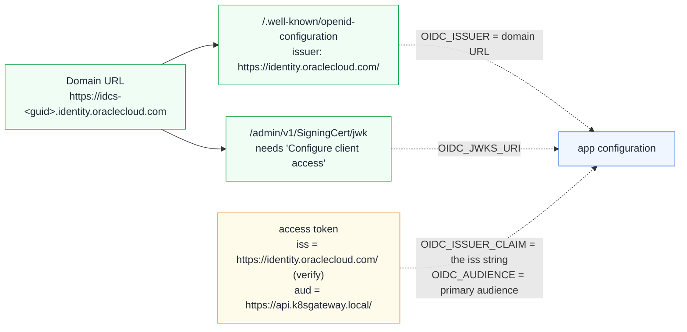

# Oracle IAM Identity Domains

Oracle IAM Identity Domains (formerly Oracle Identity Cloud Service, IDCS) is the identity provider in this tutorial that bends the most OIDC defaults: discovery is fetched from *your* domain URL but names a *different* issuer, the signing keys are private until a domain setting is switched on, the token endpoint accepts only `client_secret_basic`, scopes are qualified by an audience URL, and roles do not appear in access tokens out of the box. This chapter explains each point, shows the console settings and the values in [deploy/overlays/oracle](../deploy/overlays/oracle), and says which statements come from Oracle's documentation and which you must confirm with a decoded token from your tenant.

## What you will learn

- Why `OIDC_ISSUER`, `OIDC_ISSUER_CLAIM` and `OIDC_JWKS_URI` are three different values for Oracle, and how each validator uses them
- Which applications to create in the identity domain and which switches matter
- How fully qualified scopes turn into `aud` and `scope` claims
- What is known about groups and roles in Oracle tokens, and how to choose `ROLES_CLAIM`
- Token lifetimes, refresh-token rotation and logout at `/oauth2/v1/userlogout`
- How to rehearse it all with the mock IdP (`MOCK_FLAVOR=oracle`) before touching a tenant

## How Oracle differs from a textbook OIDC provider

In [chapter 1](01-concepts.md) the issuer was one URL with three jobs: discovery lives at `<issuer>/.well-known/openid-configuration`, the document's `issuer` equals that URL, and tokens carry it in `iss`. Oracle splits this. Your domain has a **domain URL** such as `https://idcs-1234abcd.identity.oraclecloud.com` (the console may show `:443`); discovery and all endpoints live under it, but Oracle's REST reference shows the document's `issuer` as the fixed string `https://identity.oraclecloud.com/` and documents the same string as the `iss` of access and ID tokens, while newer guide pages say `https://<domainURL>/`. Oracle's documentation disagrees with itself, so this repository makes the expected `iss` an explicit setting and asks you to verify it.



The other differences, all from Oracle's documentation, and the setting each drives:

- **The JWKS is private.** `/admin/v1/SigningCert/jwk` answers 401 until *Access signing certificate → Configure client access* is enabled, so the APIs never become ready → `OIDC_JWKS_URI`.
- **Token endpoint authentication** is `client_secret_basic` or `client_secret_jwt`; openid-client's default `ClientSecretPost` gets `invalid_client` → `OIDC_CLIENT_AUTH=client_secret_basic`.
- **No `code_challenge_methods_supported`** is advertised although PKCE is documented; a client deriving PKCE from discovery would skip it → the BFF always sends `S256`, angular-oauth2-oidc uses PKCE by default.
- **Scopes are fully qualified** (primary audience + value): request `https://api.k8sgateway.local/orders.read` → `OIDC_SCOPE` / config.json `scope`, which also carries `offline_access` because Oracle, unlike Keycloak ([chapter 5](05-keycloak.md)), returns a refresh token only when asked.
- **Groups** are documented in the ID token (`get_groups`) and via userinfo (`groups`), not in the access token → `ROLES_CLAIM=groups` is unverified ([Roles](#roles-what-is-verified-and-what-is-not)).

## Step 1: create the applications in your identity domain

In the OCI console (*Identity & Security → Domains → your domain → Integrated applications*) create three applications; names as in [deploy/overlays/oracle/README.md](../deploy/overlays/oracle/README.md).

| Application | Console type | Settings |
|---|---|---|
| `k8sgateway-api` | Confidential Application, **Resource server** configuration only | Primary audience `https://api.k8sgateway.local/` (keep the trailing slash: it prefixes every fully qualified scope); scope `orders.read` (plus `orders.admin` for scope-based mapping); **Allow token refresh** |
| `k8sgateway-angular` | **Mobile Application** - the console's public-client type: client ID, no secret (the Confidential Application wizard offers only *Confidential* and *Trusted*) | Grants **Authorization code** + **Refresh token**; Redirect URL `http://angular.127.0.0.1.nip.io/callback`; Post-logout redirect URL `http://angular.127.0.0.1.nip.io/`; **Allow non-HTTPS URLs**; Token issuance policy → resource `k8sgateway-api`, scope `orders.read`; **Bypass consent** |
| `k8sgateway-nextjs` | Confidential Application, **Client** configuration, type *Confidential* | Same grants; Redirect URL `http://next.127.0.0.1.nip.io/api/auth/callback`; Post-logout redirect URL `http://next.127.0.0.1.nip.io/`; **Allow HTTP URLs**; same resource and scope; **Bypass consent**; note client ID and secret |

*Allow HTTP URLs* / *Allow non-HTTPS URLs* (REST `allUrlSchemesAllowed`) is for development only - Oracle's help text says so, and it also disables the redirect-host validation; the TLS mode ([deploy/tls/README.md](../deploy/tls/README.md), set up in [chapter 6](06-entra-id.md#3-deploy-in-tls-mode)) removes the need for it. *Bypass consent* avoids a consent page on every login. Activate each application after creating it.

Then enable *your domain → Settings → Domain settings → Access signing certificate → Configure client access → Save changes* and check both URLs (`DOMAIN_URL` without scheme):

```bash
export DOMAIN_URL=idcs-1234abcd.identity.oraclecloud.com
curl -s "https://$DOMAIN_URL/.well-known/openid-configuration" | jq '{issuer, token_endpoint, jwks_uri, end_session_endpoint, token_endpoint_auth_methods_supported}'
curl -s "https://$DOMAIN_URL/admin/v1/SigningCert/jwk" | jq '.keys[] | {kid, alg, kty}'
```

The JWKS call must answer 200 with at least one key. Oracle's 2023 whitepaper says public access to the discovery URL is *not* enabled by default and can be configured; whether that is the same switch is an open question. If discovery answers 401 while the JWKS answers 200, the APIs still work (with `OIDC_JWKS_URI` they never call discovery), but the BFF and the SPA cannot log anyone in until discovery is public.

## Step 2: fill in the overlay

[deploy/overlays/oracle](../deploy/overlays/oracle) holds one env file per server-side app, the Angular `config.json` and `nextjs.secret.env`. [scripts/render.sh](../scripts/render.sh), which `make deploy` and `make switch` call, refuses to render while a placeholder is left outside a `#` comment and lists every offending line.

| Placeholder | Value | Files |
|---|---|---|
| `<DOMAIN_URL>` | domain URL **host only**, e.g. `idcs-1234abcd.identity.oraclecloud.com` (no scheme, no `:443`) | all `*.env`, `angular-config.json` |
| `<ANGULAR_CLIENT_ID>` | client ID of `k8sgateway-angular` | `angular-config.json` |
| `<NEXTJS_CLIENT_ID>` | client ID of `k8sgateway-nextjs` | `nextjs.env` |
| `<NEXTJS_CLIENT_SECRET>` | its client secret | `nextjs.secret.env` (a Kubernetes Secret, with `SESSION_SECRET`) |

Work on a copy - `deploy/overlays/*.local/` is git-ignored, so tenant values never reach a commit:

```bash
cp -r deploy/overlays/oracle deploy/overlays/oracle.local
sed -i \
  -e 's|<DOMAIN_URL>|idcs-1234abcd.identity.oraclecloud.com|g' \
  -e 's|<ANGULAR_CLIENT_ID>|00000000000000000000000000000000|g' \
  -e 's|<NEXTJS_CLIENT_ID>|11111111111111111111111111111111|g' \
  -e 's|<NEXTJS_CLIENT_SECRET>|your-secret|g' \
  deploy/overlays/oracle.local/*
scripts/render.sh oracle.local | less     # inspect the generated ConfigMaps
make switch IDP=oracle.local              # render, apply, restart the four apps
```

`make switch` ([scripts/switch-idp.sh](../scripts/switch-idp.sh)) applies the overlay and restarts the four apps so every pod re-reads its configuration; no in-cluster IdP is deployed, and `scripts/test.sh` (which needs the `cli` password grant) does not apply - test in the browser. The env files carry the values from the bullet list plus `OIDC_REQUIRE_HTTPS=true` and `OIDC_AUDIENCE=https://api.k8sgateway.local/`; lines to verify against your tenant are marked `VERIFY`.

## Step 3: how each component copes with the issuer split


*The validation chain from [chapter 1](01-concepts.md): for Oracle, step 2 loads keys from `OIDC_JWKS_URI` and step 4 compares `iss` with `OIDC_ISSUER_CLAIM`.*

| Component | Code | With the Oracle values |
|---|---|---|
| REST API (Go) | [verifier.go](../apps/rest-api/internal/auth/verifier.go) | `OIDC_JWKS_URI` set: discovery skipped, `oidc.NewVerifier(issuerClaim, oidc.NewRemoteKeySet(...))`. Unset: `oidc.InsecureIssuerURLContext` reads metadata from the domain URL, still requiring `iss == OIDC_ISSUER_CLAIM`. `aud` string or array. |
| GraphQL API (Node) | [auth.ts](../apps/graphql-api/src/auth.ts) | Same rule: `cfg.jwksUri ?? (await discoverJwksUri())`; if discovery runs, its `issuer` must equal `OIDC_ISSUER_CLAIM` byte for byte. |
| Next.js BFF | [oidc.ts](../apps/nextjs-app/src/lib/oidc.ts), [config.ts](../apps/nextjs-app/src/lib/config.ts) | Skips `client.discovery()` because `OIDC_ISSUER_CLAIM !== OIDC_ISSUER`: fetches the document, resolves relative endpoints against `OIDC_ISSUER`, applies `OIDC_JWKS_URI`, asserts `server.issuer === OIDC_ISSUER_CLAIM`, builds `new client.Configuration(server, clientId, metadata, ClientSecretBasic(secret))`. Always PKCE `S256`, `state`, `nonce`; `enableNonRepudiationChecks` verifies the ID-token signature. |
| Angular SPA | [auth.service.ts](../apps/angular-app/src/app/core/auth.service.ts), [config.service.ts](../apps/angular-app/src/app/core/config.service.ts) | `skipIssuerCheck: true` disables the comparison of the discovery `issuer` *and* the ID token's `iss` with the issuer URL; `strictDiscoveryDocumentValidation: false` allows endpoints outside the issuer prefix; `requireHttps: true` checks IdP URLs only, not the app's `http://` redirect URI. |

Stated plainly: with `skipIssuerCheck` the SPA performs no issuer check at all; the APIs still enforce `iss` on every access token, which is where authorization happens. The BFF needs discovery `issuer`, token `iss` and `OIDC_ISSUER_CLAIM` to agree - a tenant whose tokens say `https://<DOMAIN_URL>/` while discovery says `https://identity.oraclecloud.com/` fails in the callback and is not supported.

## Step 4: audience and scopes in the access token

A resource server has a **primary audience** (a URI) and **scopes** (short names); concatenated they form the *fully qualified scope* a client requests: `https://api.k8sgateway.local/` + `orders.read`. The client must be granted it (Token issuance policy; REST `allowedScopes[].fqs`). Per Oracle's validation guide and ORDS tutorial the issued token's `aud` holds the audience - a string for one, an array with secondary audiences - and `scope` the space-delimited *bare* names (`openid orders.read ...`). Hence `OIDC_AUDIENCE=https://api.k8sgateway.local/`, trailing slash included. Whether `scope` can carry the fully qualified form is an open question; check a decoded token before relying on scope-based role mapping.

## Roles: what is verified and what is not

The APIs read `ROLES_CLAIM` from the **access token** ([roles.go](../apps/rest-api/internal/auth/roles.go), `extractRoles` in [auth.ts](../apps/graphql-api/src/auth.ts)). What Oracle's documentation supports:

- **Verified:** `scope=get_groups` puts the user's groups into the **ID token**; `scope=groups` lets the access token fetch them from `/oauth2/v1/userinfo`; `approles`/`get_approles` do the same for app roles.
- **Not documented anywhere fetched:** a groups or app-roles claim inside the **access token**; the claim name and value shape of groups in the ID token.
- **Documented, unverified for this purpose:** the custom-claims API (`POST /admin/v1/CustomClaims`, `tokenType: "AT"`, expressions like `$user.emails.*.value`); no Oracle page shows a `$user.groups...` expression, and legacy IDCS documentation says Oracle Support had to enable custom claims.

`ROLES_CLAIM=groups` in the overlay therefore mirrors the mock IdP's Oracle flavor, not a guaranteed Oracle behavior. Decide with a real token:

1. Log in and open `/profile` in Angular or Next.js; both show the decoded access token (Angular decodes in the browser, the BFF server-side). The mock IdP's `/debug/token` page decodes any pasted JWT too.
2. If an array of group or role names is there, set `ROLES_CLAIM` to its (dotted) path and `ROLE_USER`/`ROLE_ADMIN` to the exact values, then `make switch IDP=oracle.local`.
3. If not, either add a custom claim of token type `AT` and point `ROLES_CLAIM` at it, or use **scope-based authorization**: define scopes `orders.read` and `orders.admin` on `k8sgateway-api`, grant them to the clients, request them in `OIDC_SCOPE`, and set

   ```dotenv
   ROLES_CLAIM=scope
   ROLE_USER=orders.read
   ROLE_ADMIN=orders.admin
   ```

   in the three `*.env` files and (`rolesClaim`/`roleUser`/`roleAdmin`) in `angular-config.json`; all four apps split a string-valued claim on whitespace, as for Microsoft Entra ID's `scp`. Mind the semantics: scopes say what the *client application* may do and every user of that client gets the same ones - they distinguish applications, not users; a per-user admin role needs a group or app-role claim.

The APIs never call `/oauth2/v1/userinfo` per request - a deliberate limitation of this tutorial (one signed token, no extra round trip), not an Oracle constraint.


*Angular `/profile`: the decoded access token - where to look for a groups claim after an Oracle login (mock IdP screenshot); Next.js `/profile` shows the same, decoded server-side.*

## Token lifetimes, refresh and logout

| Token | Oracle default | Configured on |
|---|---|---|
| Authorization code | 3 minutes | fixed |
| Access token | 3600 s (effective: minimum of global setting, resource-server expiry, remaining user session) | resource server app |
| Refresh token | 1 week (`refreshTokenExpiry` 604800) | resource server app (*Allow token refresh*) |
| ID token | equals the SSO session expiry (8 hours by default) | domain session settings |

Oracle rotates the refresh token on every use and, per its whitepaper, treats a reused one as stolen and invalidates all tokens of that grant. Both frontends cope: angular-oauth2-oidc stores the newest refresh token and refreshes at 75 % of the access-token lifetime; the BFF keeps the newest token in its cookie, serializes concurrent refreshes per refresh token ([tokens.ts](../apps/nextjs-app/src/lib/tokens.ts)) and caps a login at 8 hours from `auth_time` ([session.ts](../apps/nextjs-app/src/lib/session.ts)).

Logout uses the discovered `end_session_endpoint`, `/oauth2/v1/userlogout`, which **requires both** `id_token_hint` and `post_logout_redirect_uri` (`state` optional). Angular's `logOut()` sends `id_token_hint` when an ID token is present plus `postLogoutRedirectUri` (`http://angular.127.0.0.1.nip.io/`); the BFF calls `client.buildEndSessionUrl` with `${PUBLIC_URL}/` ([logout/route.ts](../apps/nextjs-app/src/app/api/auth/logout/route.ts)). Register both as post-logout redirect URLs; whether Oracle enforces an exact match is not stated, so assume it does. Two limitations: when the session cookie would exceed 3.5 KB the BFF moves the ID token to a second cookie and, if even that one is too large, drops it (log line `session cookie too large, dropping id_token`), after which Oracle refuses the logout while the local session is still cleared; and `userlogout` ends the SSO session but, per the whitepaper, leaves issued tokens valid - the apps do not call `/oauth2/v1/revoke`.

## Rehearse the Oracle token shape with the mock IdP

The mock IdP's `oracle` flavor ([apps/mock-idp/src/flavors.js](../apps/mock-idp/src/flavors.js)) mints access tokens with Oracle's documented claims (`sub` = login name, `user_id`, `user_displayname`, `tenant`, `tok_type: "AT"`, `scope`, `groups[]`); `MOCK_ISSUER_CLAIM` reproduces the issuer split (endpoints under `MOCK_ISSUER`, `issuer` and `iss` = `https://identity.oraclecloud.com/`). Locally, with Node 22:

```bash
cd apps/mock-idp && npm ci
MOCK_ISSUER=http://localhost:8080 MOCK_FLAVOR=oracle \
  MOCK_ISSUER_CLAIM=https://identity.oraclecloud.com/ node src/server.js
```

In a second terminal:

```bash
curl -s -X POST http://localhost:8080/token -d grant_type=password -d client_id=cli \
  -d username=bob -d password=bob -d 'scope=openid profile email' \
  | jq -r .access_token | cut -d. -f2 | tr '_-' '/+' | base64 -d 2>/dev/null | jq .
```

```json
{
  "iss": "https://identity.oraclecloud.com/",
  "sub": "bob",
  "user_displayname": "Bob User",
  "tok_type": "AT",
  "aud": ["k8sgateway-api"],
  "scope": "openid profile email",
  "groups": ["user"]
}
```

To run the whole cluster against this shape, edit the mock overlay and the mock IdP's env file, then switch (edit existing keys in place: kustomize rejects an env file that repeats a key):

```bash
sed -i 's/^MOCK_FLAVOR=generic$/MOCK_FLAVOR=oracle/' deploy/idp/mock/mock-idp.env
echo 'MOCK_ISSUER_CLAIM=https://identity.oraclecloud.com/' >> deploy/idp/mock/mock-idp.env
sed -i 's/^ROLES_CLAIM=roles$/ROLES_CLAIM=groups/' deploy/overlays/mock/{rest-api,graphql-api,nextjs}.env
for f in deploy/overlays/mock/{rest-api,graphql-api,nextjs}.env; do
  echo 'OIDC_ISSUER_CLAIM=https://identity.oraclecloud.com/' >> "$f"
done
sed -i -e 's/"rolesClaim": "roles"/"rolesClaim": "groups"/' \
  -e 's/"strictDiscoveryDocumentValidation": true/"strictDiscoveryDocumentValidation": false/' \
  -e 's/"skipIssuerCheck": false/"skipIssuerCheck": true/' deploy/overlays/mock/angular-config.json
make switch IDP=mock && make test
```

`make test` checks alice, bob and carol against both APIs, so it shows at once whether the `groups` mapping works. If the gateway JWT policy from [chapter 12](12-gateway-jwt.md) is applied, delete it first (`kubectl delete -f deploy/gateway-policies/securitypolicy-rest-jwt.yaml`): its `issuer` is compared verbatim. Revert with `git checkout -- deploy/idp/mock deploy/overlays/mock && make switch IDP=mock`.

## Troubleshooting

| Symptom | Likely cause | Fix |
|---|---|---|
| API pods not ready; logs say `jwks ...: HTTP 401` | *Configure client access* not enabled | Domain settings → Access signing certificate |
| BFF lands on `/auth/error`: `discovery issuer "..." does not match OIDC_ISSUER_CLAIM` | Your domain advertises another issuer string | Put it into `OIDC_ISSUER_CLAIM` (three env files), `make switch` |
| `401 invalid_token`, pod log `issuer mismatch` | Token `iss` differs from `OIDC_ISSUER_CLAIM` (trailing slash counts) | Decode the token; correct `OIDC_ISSUER_CLAIM` |
| `401 ... audience mismatch` | `aud` is not `https://api.k8sgateway.local/`, or the client lacks the resource scope | Compare with the decoded `aud`; check the Token issuance policy |
| Oracle rejects the redirect URL | Not registered exactly, or *Allow HTTP URLs* not ticked | Register the callback URLs from Step 1 |
| Logged in, but `/orders` is 403 for everyone | No usable roles claim in the access token | [Roles](#roles-what-is-verified-and-what-is-not) procedure |

General debugging (pod logs, `/readyz`, browser console): [chapter 14](14-troubleshooting.md).

## Next

[Angular SPA: tokens in the browser (code flow + PKCE)](08-angular.md) - code flow with PKCE in the browser, runtime configuration and role-based UI.
