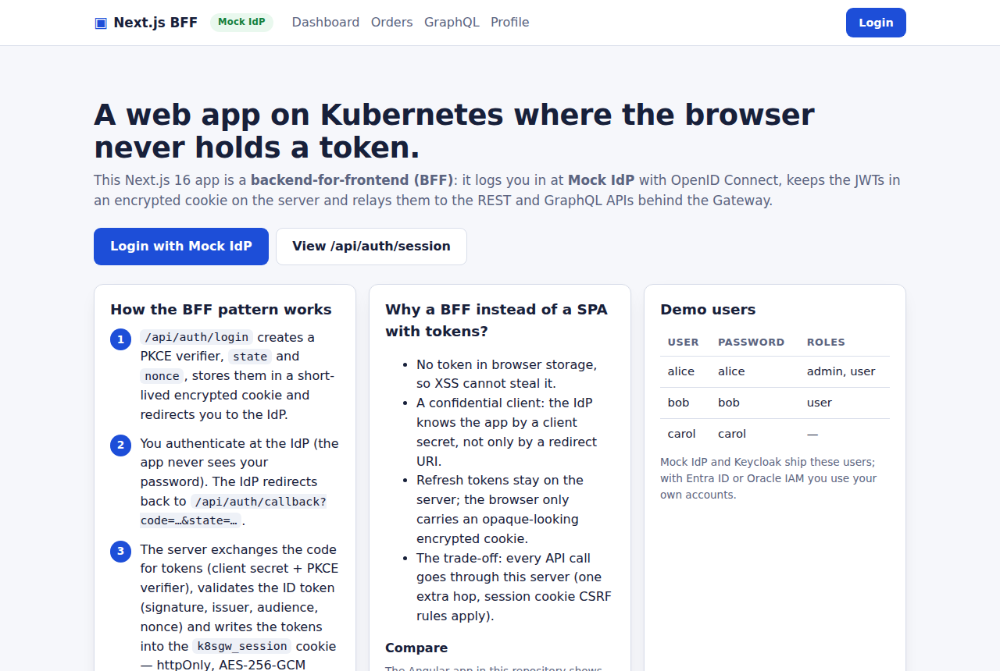
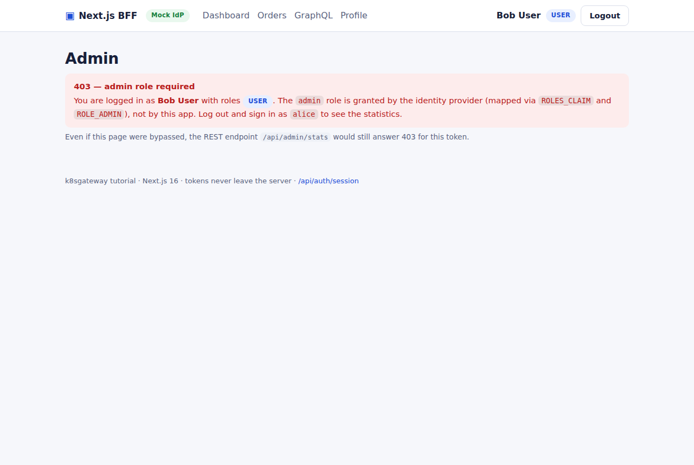

# Next.js BFF: tokens never reach the browser

The Next.js application in [apps/nextjs-app](../apps/nextjs-app) shows the **backend-for-frontend (BFF)** model. The server, not the browser, is the OIDC client: it runs the Authorization Code flow + PKCE as a *confidential* client with a client secret, keeps the tokens in an encrypted `HttpOnly` cookie and relays them as `Authorization: Bearer` to the REST and GraphQL APIs. Browser JavaScript never sees a JWT. There is no NextAuth: about 2,000 lines of TypeScript (800 of them the OIDC and session core in `src/lib`) on [openid-client](https://github.com/panva/openid-client) 6 and [jose](https://github.com/panva/jose) 6, configured only through environment variables.

## What you will learn

- why a BFF is the safer choice when a server is available anyway
- what the `/api/auth/login`, `/callback` and `/logout` Route Handlers do, and which check happens where
- what is inside the encrypted session cookie, and how its size and attributes are managed
- where authorization is checked (`proxy.ts` versus pages and handlers) and why refresh happens only in Route Handlers
- how Server Components and Client Components reach the APIs, and what `/api/auth/session` may reveal
- the environment variables, the standalone image and the IdP-specific settings

## The BFF pattern


The animation below plays the whole story for this app inside the cluster: the one-time setup (the IdP's key pair, the client registration with `client_id`, exact `redirect_uri` and `client_secret`, the app fetching the discovery document and the public keys at start), the login through the gateway with OAuth 2.1 (code flow + PKCE), the ID token and `/userinfo` delivering identity claims and roles/groups, the bearer call to the API and the refresh-token rotation.


*Regenerate with `node docs/images/animation/render.mjs login-flow-k8s.html login-flow-k8s.gif`; the scene is [login-flow-k8s.html](images/animation/login-flow-k8s.html).*

*Left: the SPA of [chapter 8](08-angular.md), a public client with tokens in the browser. Right: this app, a confidential client (PKCE **and** a client secret) with tokens server side in an encrypted cookie and API calls over in-cluster URLs (no CORS). The APIs are identical. The price of the BFF: a server, a cookie secret, cookie size limits, CSRF hygiene.*

## The login round trip

Five Route Handlers live under `src/app/api/auth/` (`login`, `callback`, `logout`, `refresh`, `session`); the first three implement the flow: `proxy.ts` sends an anonymous browser to `/api/auth/login`, the IdP authenticates and returns a code to `/api/auth/callback`, the server exchanges it and sets the session cookie; every later request carries only that cookie.

### Step 1: `GET /api/auth/login?returnTo=/orders`

[login/route.ts](../apps/nextjs-app/src/app/api/auth/login/route.ts) calls `buildLoginUrl()` in [lib/oidc.ts](../apps/nextjs-app/src/lib/oidc.ts):

```ts
const codeVerifier = client.randomPKCECodeVerifier();
const state = client.randomState();
const nonce = client.randomNonce();
const url = client.buildAuthorizationUrl(config, {
  redirect_uri: redirectUri(cfg),     // PUBLIC_URL + /api/auth/callback, byte for byte as registered
  scope: cfg.oidcScope,
  code_challenge: await client.calculatePKCECodeChallenge(codeVerifier),
  code_challenge_method: "S256",
  state,
  nonce,
});
```

Verifier, `state`, `nonce` and the sanitized `returnTo` (`safeReturnTo()` accepts only same-origin absolute paths) are sealed into the **transaction cookie** `k8sgw_txn` (10 minutes, encrypted like the session), and the browser is redirected:

```bash
curl -si 'http://next.127.0.0.1.nip.io/api/auth/login?returnTo=%2Forders' | grep -iE '^(HTTP|location|set-cookie)'
# HTTP/1.1 307 Temporary Redirect
# location: <authorization_endpoint>?redirect_uri=...&code_challenge=...&code_challenge_method=S256&state=...&nonce=...&client_id=nextjs-app&response_type=code
# set-cookie: k8sgw_txn=eyJhbGciOiJkaXIiLCJlbmMiOiJBMjU2R0NNIn0..…; Path=/; Max-Age=600; HttpOnly; SameSite=lax
```

### Step 2: `GET /api/auth/callback?code=...&state=...`

[callback/route.ts](../apps/nextjs-app/src/app/api/auth/callback/route.ts) first calls `takeLoginTransaction()`, which reads **and deletes** `k8sgw_txn`: a login transaction is single use, whether or not the exchange succeeds. Without it (cookies blocked, 10 minutes passed, callback opened by hand) the user lands on `/auth/error?error=missing_transaction`. Otherwise:

```ts
const currentUrl = new URL(`/api/auth/callback${search}`, cfg.publicUrl); // never request.url (pod host)
return client.authorizationCodeGrant(config, currentUrl, {
  pkceCodeVerifier: txn.codeVerifier,
  expectedState: txn.state,   // we sent state, so it MUST come back unchanged
  expectedNonce: txn.nonce,   // we sent nonce, so the ID token MUST carry it
  idTokenExpected: true,
});
```

openid-client derives the token request's `redirect_uri` from `currentUrl` (query stripped); it is rebuilt from `PUBLIC_URL` because behind the gateway `request.url` may show the pod's host, and the IdP compares byte for byte.

| Check | Done by | Protects against |
|---|---|---|
| `state` equals the one in `k8sgw_txn` | openid-client (`expectedState`) | login CSRF |
| `code` + `code_verifier` + client secret accepted | the IdP's token endpoint | code interception, an impostor client |
| ID token `iss`, `aud` = client id, `exp`/`iat`, `nonce` | openid-client | tokens from another issuer or client, replay |
| ID token JWS signature against the IdP's JWKS | openid-client, because the app calls `enableNonRepudiationChecks()` | a forged token on plain http, where there is no TLS channel to trust |
| access token signature, `aud`, roles | **not here**: the REST and GraphQL APIs, on every request | the BFF only decodes the access token for display and role hints |

`sessionFromTokens()` in [lib/tokens.ts](../apps/nextjs-app/src/lib/tokens.ts) turns the response into a `Session`, `setSession()` writes the cookie and the browser is redirected to `returnTo`. Failures never show a stack trace: `describeOidcError()` maps them to a short `{error, description}` for the [/auth/error](../apps/nextjs-app/src/app/auth/error/page.tsx) page, which adds a hint per code (`invalid_client` for a wrong `OIDC_CLIENT_AUTH`, `idp_unreachable`, ...).

### Step 3: `GET /api/auth/logout`

[logout/route.ts](../apps/nextjs-app/src/app/api/auth/logout/route.ts) deletes the session cookie and, if the discovery document has an `end_session_endpoint`, redirects there with `post_logout_redirect_uri=PUBLIC_URL/` and `id_token_hint` (when an ID token is still available, in `k8sgw_session` or in the overflow cookie `k8sgw_session_idt` described below), so the IdP session ends too. `clearSession()` deletes both cookies. If the IdP is unreachable, the local logout still happens.

## The encrypted session cookie

`seal()` in [lib/session-crypto.ts](../apps/nextjs-app/src/lib/session-crypto.ts) (pure, unit-tested with `node --test`) produces a compact JWE with `alg: "dir"` and `enc: "A256GCM"`: the 32-byte `SESSION_SECRET` *is* the content-encryption key (no key wrapping, tiny header), and AES-GCM gives confidentiality and integrity in one step, so a tampered or forged cookie simply fails to decrypt. `unseal()` pins both algorithms, checks the baked-in `iss`/`aud` `k8sgateway-nextjs` and the expiry, and returns `null` for any failure. `SESSION_SECRET` must be 64 hex characters (`openssl rand -hex 32`); `/readyz` answers 503 otherwise.

`k8sgw_session` holds the `Session` interface: a minimal profile (`sub`, `name`, `preferredUsername`, `email`), the application `roles` mapped from `ROLES_CLAIM`, `accessToken`, `refreshToken`, `idToken`, and three timestamps (`issuedAt`, `expiresAt` from `expires_in`, `authTime`). The login has an **absolute lifetime of 8 hours** from `authTime`: cookie and payload expire then no matter how often the access token was refreshed.

**Size.** Browsers cap a cookie at about 4 KB and oversized request headers fail at the gateway; three JWTs plus JSON plus base64 come close, and Microsoft Entra ID and Oracle IAM Identity Domains tokens are large. `setSession()` in [lib/session.ts](../apps/nextjs-app/src/lib/session.ts) seals, measures and, above 3500 bytes, moves the ID token into a second encrypted cookie, `k8sgw_session_idt` (it is only needed again for `id_token_hint` at logout); `getSession()` merges it back when its `sub` matches the session's. Only if even that cookie would exceed 4000 bytes is the ID token dropped and `idTokenDropped: true` stored, after which logout omits `id_token_hint`; the log line tells you which happened (`moving id_token to its own cookie` or `dropping id_token`). With Keycloak's tokens the ID token is moved, not dropped, as the Profile screenshot shows ("ID token: stored"). Big tokens belong in a server-side store keyed by an opaque session id.

**Attributes.** `cookieOptions()` sets `HttpOnly` (scripts can never read the tokens), `SameSite=Lax` (`Strict` would not send the cookie on the redirect back from the IdP), `Path=/`, `Max-Age`, and `Secure` **exactly when `PUBLIC_URL` starts with `https://`**: `http://next.127.0.0.1.nip.io` is not a secure context and browsers drop `Secure` cookies there (see the `set-cookie` line above).

## Where checks happen

**`proxy.ts` is an optimistic gate.** [src/proxy.ts](../apps/nextjs-app/src/proxy.ts) is the Next.js 16 name for middleware (file and export renamed; Node.js runtime). Matched only for `/dashboard`, `/orders`, `/admin`, `/graphql` and `/profile`, it does one cheap thing: can the session cookie be decrypted? If not, it redirects to `PUBLIC_URL/api/auth/login?returnTo=<path>`. No network call, no refresh, no role check; Next.js itself documents the proxy as not the only line of defense.

```bash
curl -si http://next.127.0.0.1.nip.io/dashboard | grep -iE '^(HTTP|location)'
# HTTP/1.1 307 Temporary Redirect
# location: http://next.127.0.0.1.nip.io/api/auth/login?returnTo=%2Fdashboard
```

**Pages re-verify.** Server Components call `requirePageSession(path, { role? })` from [lib/auth.ts](../apps/nextjs-app/src/lib/auth.ts). It re-reads the session close to the data, redirects to login when there is none and, when a required role is missing (`/admin`), answers a **real HTTP 403** via `forbidden()`, rendered by [admin/forbidden.tsx](../apps/nextjs-app/src/app/admin/forbidden.tsx). `forbidden()` still sits behind `experimental.authInterrupts` in [next.config.ts](../apps/nextjs-app/next.config.ts); like `redirect()` it throws, so the call is never wrapped in `try/catch`.

**Route Handlers refresh.** Server Components cannot set cookies (no new headers once the response streams), so refresh lives in one place, `requireApiSession()` in [lib/tokens.ts](../apps/nextjs-app/src/lib/tokens.ts), used by every `/api/bff/*` handler:

1. `getSession()` (a `React.cache`d, read-only lookup) decrypts the cookie; no cookie means `401 {"error":"unauthenticated"}`.
2. `isExpiringSoon()` checks whether the access token expires within 30 seconds (capped at half the lifetime, so short demo tokens do not loop).
3. If so, `refreshTokenGrant()` runs and `setSession()` rewrites the cookie. Concurrent requests with the same refresh token share one in-flight promise, because Keycloak and the mock IdP rotate refresh tokens and two racing tabs would otherwise log the user out.
4. If the refresh fails (`invalid_grant`, IdP down, no refresh token) the cookie is cleared and the answer is `401 {"error":"session_expired"}`.

Pages get the same behavior by bouncing through [/api/auth/refresh?returnTo=](../apps/nextjs-app/src/app/api/auth/refresh/route.ts), a Route Handler that refreshes, rewrites the cookie and sends the browser back.

## Reaching the APIs

- **Server Components call the REST API server-side.** `/dashboard` and `/admin` use `restFetch()` from [lib/api.ts](../apps/nextjs-app/src/lib/api.ts): `fetch(REST_API_INTERNAL_URL + path)` with the bearer header, `cache: 'no-store'` (never cache or prerender one user's data) and a 10-second timeout; the HTML arrives already rendered. The target is the in-cluster Service, not the gateway hostname, because no token claim has to match it.
- **Client Components call `/api/bff/*` relays.** `/orders` and `/graphql` are interactive, so [orders-client.tsx](../apps/nextjs-app/src/app/orders/orders-client.tsx) and [graphql-client.tsx](../apps/nextjs-app/src/app/graphql/graphql-client.tsx) call `/api/bff/orders` and `/api/bff/graphql` with `credentials: 'same-origin'`. The handlers ([bff/orders](../apps/nextjs-app/src/app/api/bff/orders/route.ts), [bff/admin/stats](../apps/nextjs-app/src/app/api/bff/admin/stats/route.ts), [bff/graphql](../apps/nextjs-app/src/app/api/bff/graphql/route.ts)) run `requireApiSession()` and `relay()`: same status, same JSON body, `WWW-Authenticate` preserved on 401, `Cache-Control: no-store` added, a network failure becomes `502 {"error":"upstream_unavailable"}`.

The APIs enforce roles themselves; the BFF relays their 401/403 unchanged and the pages render them as banners ([components/banner.tsx](../apps/nextjs-app/src/components/banner.tsx)).

## Roles and the `/api/auth/session` contract

Roles come from the **access token**, the artifact the APIs authorize on. [lib/roles.ts](../apps/nextjs-app/src/lib/roles.ts) reads `ROLES_CLAIM` as a dotted path (array or space-separated string), maps `ROLE_USER`/`ROLE_ADMIN` to `user`/`admin` (`admin` does not imply `user`) and falls back to the validated ID-token claims only when the access token is opaque or lacks the claim. Decoding without verifying is safe here: the token came straight from the token endpoint, and the APIs verify it anyway.

The browser may learn who is logged in, but never the tokens. That is the whole contract of [/api/auth/session](../apps/nextjs-app/src/app/api/auth/session/route.ts):

```bash
curl -s http://next.127.0.0.1.nip.io/api/auth/session
# {"authenticated":false,"idp":"<OIDC_IDP_NAME>"}
# logged in: {"authenticated":true,"profile":{"sub":"…","name":"Alice Admin","preferredUsername":"alice","email":"…"},"roles":["user","admin"],"expiresAt":"…","idp":"…"}
```

[e2e/flows.mjs](../e2e/flows.mjs) asserts that this response contains no JWT and that the session cookie is `HttpOnly`.

## A tour of the pages

The IdP badge in the header shows which IdP was deployed when [e2e/flows.mjs](../e2e/flows.mjs) took the pictures; the `USER`/`ADMIN` badges are the app roles derived from `ROLES_CLAIM` and look the same with every IdP.



*Home (`/`, public): "Login" is a plain link to `/api/auth/login?returnTo=%2Fdashboard`, so it works without JavaScript.*


*Dashboard (`/dashboard`): a Server Component. Left, the decrypted session; right, `GET /api/me` called on the server with the bearer token.*


*Profile (`/profile`): the access token decoded **on the server**; only header and claims reach the browser. There is deliberately no "copy token" button: use `scripts/get-token.sh <user>` for a terminal.*



*Admin (`/admin`) as `bob`: `requirePageSession("/admin", { role: "admin" })` answers HTTP 403 and renders `forbidden.tsx`; `/api/admin/stats` would refuse the same token anyway.*

`/orders` (through `/api/bff/orders`) and `/graphql` (the Angular page's operations, through `/api/bff/graphql`) complete the tour. Every request writes one JSON log line with method, path, status, duration and, when authenticated, `sub` and `roles`; follow them with `make logs APP=nextjs-app`.

## Configuration

All settings are read from `process.env` at request time in [lib/config.ts](../apps/nextjs-app/src/lib/config.ts); there is no `NEXT_PUBLIC_*` variable, because those are inlined at build time and would freeze the IdP into the image. In Kubernetes the values come from the overlay's `nextjs.env` (ConfigMap) and `nextjs.secret.env` (Secret) via `envFrom`; the openid-client configuration is cached per process, so a change needs a pod restart (`make switch` does that).

| Variable | Default | Notes |
|---|---|---|
| `PUBLIC_URL` | `http://next.127.0.0.1.nip.io` | own external origin; base for `redirect_uri` and all redirects; decides the `Secure` flag |
| `OIDC_ISSUER` | `http://idp.127.0.0.1.nip.io` | discovery at `${OIDC_ISSUER}/.well-known/openid-configuration` |
| `OIDC_ISSUER_CLAIM` | = `OIDC_ISSUER` | set when the document's `issuer` differs from its URL (Oracle) |
| `OIDC_JWKS_URI` | from discovery | override of the JWKS URL used for ID-token signatures |
| `OIDC_CLIENT_ID`, `OIDC_CLIENT_SECRET` | `nextjs-app`, `nextjs-secret` (demo) | the secret comes from the Secret `nextjs-secrets` |
| `OIDC_CLIENT_AUTH` | `client_secret_post` | `client_secret_basic` (Oracle) or `none` (public client); anything else makes `/readyz` answer 503 |
| `OIDC_SCOPE` | `openid profile email offline_access` | mock and Keycloak overlays set `openid profile email` (see below) |
| `OIDC_REQUIRE_HTTPS` | `false` | `true` refuses a plain-http issuer |
| `ROLES_CLAIM`, `ROLE_USER`, `ROLE_ADMIN` | `roles`, `user`, `admin` | role extraction from the access token |
| `REST_API_INTERNAL_URL`, `GRAPHQL_INTERNAL_URL` | `http://rest-api.k8sgateway.svc.cluster.local:8080`, `http://graphql-api.k8sgateway.svc.cluster.local:4000/graphql` | relay targets |
| `SESSION_SECRET` | required | 64 hex characters (`openssl rand -hex 32`); replace the demo value in `nextjs.secret.env` |
| `OIDC_IDP_NAME`, `LOG_LEVEL`, `PORT` | `Mock IdP`, `info`, `3000` | |

## The container image

[Dockerfile](../apps/nextjs-app/Dockerfile) has three stages on `node:22-alpine`: `npm ci`, `next build` with `output: "standalone"`, and a runner that copies `.next/standalone` (a minimal `server.js` plus the `node_modules` it needs), `public/` and `.next/static` (both missing from the standalone output by default), sets `HOSTNAME=0.0.0.0` and `PORT=3000` and runs `node server.js` as the unprivileged `node` user. [deploy/base/nextjs-app/deployment.yaml](../deploy/base/nextjs-app/deployment.yaml) runs it as uid 1000 with all capabilities dropped, points `NODE_EXTRA_CA_CERTS` at the optional local CA for TLS mode and probes `/readyz`, which validates `SESSION_SECRET`, `OIDC_CLIENT_AUTH`, `PUBLIC_URL` and `OIDC_ISSUER` so a misconfigured BFF never receives traffic.

```bash
curl -s http://next.127.0.0.1.nip.io/readyz    # {"status":"ready","issuer":"…","idp":"…"}
```

The [app README](../apps/nextjs-app/README.md) covers local `npm run dev`; both in-cluster IdPs register `http://localhost:3000/api/auth/callback`.

## IdP specifics

- **Mock IdP and Keycloak**: `OIDC_CLIENT_AUTH=client_secret_post`, scope `openid profile email`. Both issue a refresh token without `offline_access`; asking Keycloak for it would produce *offline* tokens that never expire and survive logout. The issuer is plain `http://`, so `buildConfiguration()` adds `allowInsecureRequests`, gated on the scheme: the same image refuses http with a real IdP.
- **Microsoft Entra ID**: register the redirect URI under the *Web* platform with a client secret; Entra accepts `http://` redirect URIs only for `localhost`, so the nip.io hostnames need TLS mode ([chapter 6](06-entra-id.md)). The scope must contain `offline_access` (required for a refresh token) and the API scope `api://<API_CLIENT_ID>/access_as_user`, otherwise the access token is a Microsoft Graph token the APIs cannot validate. Use the tenant-specific issuer.
- **Oracle IAM Identity Domains**: the discovery document under `https://<DOMAIN_URL>` announces `issuer: https://identity.oraclecloud.com/`, so `client.discovery()` would (rightly) reject it. With `OIDC_ISSUER_CLAIM` set, [lib/oidc.ts](../apps/nextjs-app/src/lib/oidc.ts) fetches the document itself, resolves relative endpoint paths, applies `OIDC_JWKS_URI` (`https://<DOMAIN_URL>/admin/v1/SigningCert/jwk`), asserts `metadata.issuer === OIDC_ISSUER_CLAIM` and builds `new Configuration(...)` manually. Oracle advertises only `client_secret_basic` and `client_secret_jwt`, hence `OIDC_CLIENT_AUTH=client_secret_basic`. `ROLES_CLAIM=groups` assumes a custom claim; verify `iss` and the claim name with a decoded token from your tenant ([chapter 7](07-oracle-iam.md)).

## Security notes and limitations

- **Refresh de-duplication is per process.** The in-flight map lives in memory, so the Deployment runs one replica. Several replicas with an IdP that rotates refresh tokens need a reuse grace period at the IdP or a shared session store.
- **Cookie size** is the structural limit of the stateless design (see above).
- **CSRF.** The `POST /api/bff/*` handlers rely on `SameSite=Lax`, which keeps browsers from attaching the cookie to cross-site POSTs; a production app would add a CSRF token or origin check.
- **`at_hash` is not validated**: openid-client does not implement it, and the access token comes from the same token response, not from a front channel.
- **Session lifetime** is a fixed 8 hours; there is no idle timeout beyond the IdP's refresh token.
- **Demo secrets.** `nextjs-secret` and the `SESSION_SECRET` in the overlays are public demo values; generate your own before exposing the app ([chapter 15](15-production-checklist.md)).

## Next

[The Go REST API](10-rest-api-go.md)
