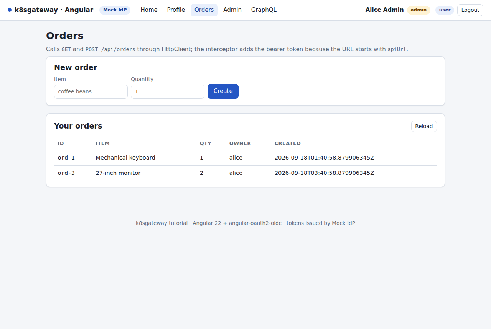

# The Go REST API

The REST API is the smallest resource server in this repository: a Go binary that never sees a password and never asks the identity provider whether a user is logged in. It downloads the IdP's public keys once, validates every `Authorization: Bearer` token locally, turns the verified claims into application roles and lets a handful of handlers do their work. One image runs against the mock IdP, Keycloak, Microsoft Entra ID and Oracle IAM Identity Domains; only environment variables change.

## What you will learn

- how the validation pipeline is built on `github.com/coreos/go-oidc/v3`: discovery with retry, one shared verifier, an algorithm allow-list, issuer/audience/expiry checks
- why `OIDC_JWKS_URI` and `OIDC_ISSUER_CLAIM` exist (Oracle-style issuers)
- how the chi middleware chain is ordered (CORS before auth, then `RequireRole`) and what 401 and 403 look like on the wire
- how roles are read from any IdP's access token with one dotted path
- logs, the distroless image and CA certificates, tests, and running the API without Kubernetes

Source: [apps/rest-api](../apps/rest-api).

## How a request is validated


*Each step is a few lines in `verifier.go` or `middleware.go`.*

1. `Authorization: Bearer <jwt>` is extracted; no header means `401` right away.
2. The JWT header's `alg` must be in the allow-list `RS256 RS384 RS512 PS256 ES256`. `none` and `HS*` are refused before any key lookup - with a symmetric algorithm the public JWKS would double as the signing secret.
3. The header's `kid` selects a key from the JWKS cached in memory since startup; an unknown `kid` triggers one re-fetch (key rotation).
4. Signature, then `iss` == `OIDC_ISSUER_CLAIM` byte for byte, `aud` contains one of the `OIDC_AUDIENCE` values (string or array), `exp`/`nbf` with 60 seconds of tolerance.
5. Only now are the claims trusted: `ROLES_CLAIM` is read via its dotted path and mapped onto the application roles `user` and `admin`.
6. `RequireRole` answers `403` or lets the handler run with a `Principal` in the request context.

### One verifier per process

`NewVerifier` in [internal/auth/verifier.go](../apps/rest-api/internal/auth/verifier.go) is called once and the `*Verifier` is shared by every request: go-oidc's `RemoteKeySet` caches keys in memory and re-fetches only on an unseen `kid`, so a per-request verifier would mean a JWKS download per request.

```go
oc := &oidc.Config{
    SupportedSigningAlgs: AllowedAlgs, // RS256 RS384 RS512 PS256 ES256 - never none/HS*
    SkipClientIDCheck:    true,        // aud is checked in Verify against a LIST of audiences
    Now: func() time.Time { return now().Add(-skew) }, // go-oidc has no exp leeway: shift "now"
}
if jwks != "" { // OIDC_JWKS_URI set: keys from a known URL, no discovery
    idt = oidc.NewVerifier(issuerClaim, oidc.NewRemoteKeySet(ctx, jwks), oc)
} else {
    dctx := ctx
    if issuerClaim != cfg.Issuer { // Oracle: metadata under the tenant URL, iss is a fixed string
        dctx = oidc.InsecureIssuerURLContext(ctx, issuerClaim)
    }
    provider, err := oidc.NewProvider(dctx, cfg.Issuer) // ... jwks = metadata jwks_uri
    idt = provider.Verifier(oc)                         // shares the provider's single RemoteKeySet
}
if err := probeJWKS(ctx, client, jwks); err != nil { return nil, err }
```

Three details worth copying:

- **Discovery with retry, never a crash loop.** `main.go` runs `NewVerifier` in a goroutine with exponential backoff (1 s doubling to 15 s) while the HTTP server is already listening: `/healthz` answers `200`, `/readyz` and the protected routes answer `503` until the verifier is attached. On kind this is routine - Keycloak needs a minute or two to start.
- **Readiness means "keys really loaded".** `probeJWKS` fetches the key set once and requires HTTP 200 with a non-empty `keys` array, so a wrong `OIDC_ISSUER` shows up as `0/1 Running`, not as 401s later.
- **Clock skew.** go-oidc enforces `exp` with zero leeway and `nbf` with five minutes; the contract says 60 seconds for both, so `Config.Now` is shifted back by the skew and `nbf` is re-checked in `Verify`.

### Oracle-style issuers: `OIDC_ISSUER_CLAIM` and `OIDC_JWKS_URI`

OIDC Discovery requires the `issuer` in the metadata document to equal the URL it was fetched from; go-oidc's `NewProvider` refuses anything else. Oracle IAM Identity Domains breaks that rule: the document lives under `https://idcs-<guid>.identity.oraclecloud.com` but advertises `"issuer": "https://identity.oraclecloud.com/"`, and tokens carry that fixed string (verify with a decoded token from your tenant, see [chapter 7](07-oracle-iam.md)). Two variables cover this without vendor-specific code:

- `OIDC_ISSUER_CLAIM` - the exact `iss` every token must carry. When it differs from `OIDC_ISSUER`, discovery runs under `oidc.InsecureIssuerURLContext`: metadata comes from `OIDC_ISSUER`, `iss` is validated against this value. go-oidc calls it "insecure" because a wrong value would accept another tenant's tokens - review it, do not guess it.
- `OIDC_JWKS_URI` - skips discovery and builds the verifier from `oidc.NewRemoteKeySet(ctx, uri)`. Use it when the key URL is known (Oracle: `<domain-url>/admin/v1/SigningCert/jwk`) or to keep key fetches in-cluster (`http://mock-idp.idp.svc.cluster.local:8080/jwks`).

The Oracle overlay sets all three ([deploy/overlays/oracle/rest-api.env](../deploy/overlays/oracle/rest-api.env)); the others set only `OIDC_ISSUER`.

## The middleware chain

[internal/api/router.go](../apps/rest-api/internal/api/router.go) wires chi in a deliberate order:

```go
r.Use(middleware.RequestID, httpx.RequestLogger(d.Log), httpx.Recoverer(d.Log), middleware.Timeout(30*time.Second))
r.Use(cors.Handler(corsOpts))          // CORS BEFORE auth: a preflight carries no token
r.Get("/healthz", h.healthz)
r.Get("/readyz", h.readyz)
r.Route("/api", func(r chi.Router) {
    r.Get("/public", h.public)
    r.Group(func(r chi.Router) {
        r.Use(d.Auth.Middleware)       // everything below needs a valid access token
        r.Get("/me", h.me)
        r.With(auth.RequireRole(auth.RoleUser)).Get("/orders", h.listOrders)
        r.With(auth.RequireRole(auth.RoleUser)).Post("/orders", h.createOrder)
        r.Route("/admin", func(r chi.Router) {
            r.Use(auth.RequireRole(auth.RoleAdmin))
            r.Get("/stats", h.stats)
            r.Get("/orders", h.allOrders)
        })
    })
})
```

**CORS first.** A browser preflight (`OPTIONS`) never carries `Authorization`; if authentication ran first, every cross-origin call from the Angular SPA would die with a 401 before the real request. `AllowedHeaders` lists `Authorization` explicitly (go-chi/cors defaults to `Origin`, `Accept` and `Content-Type` only, so `Authorization` must be listed), `ExposedHeaders` lists `WWW-Authenticate` so the SPA can read `error_description` on a 401, `AllowCredentials` stays `false`. One trap: go-chi/cors treats an *empty* `AllowedOrigins` like `*`, so the router turns an empty `CORS_ORIGINS` into deny-all.

**Authenticate.** `Authenticator.Middleware` in [internal/auth/middleware.go](../apps/rest-api/internal/auth/middleware.go):

```go
v := a.verifier.Load()
if v == nil { httpx.WriteError(w, 503, "unavailable", "..."); return } // discovery still pending
raw, ok := bearerToken(r)
if !ok { a.unauthorized(w, "", "missing bearer token"); return } // no error code: nothing was sent
tok, err := v.Verify(r.Context(), raw)
if err != nil {
    a.Log.Warn("token rejected", "reason", err.Error(), "path", r.URL.Path) // never the token itself
    a.unauthorized(w, "invalid_token", desc) // desc: the fixed auth.Error description
    return
}
rawRoles := RolesFromClaims(tok.Claims, a.RolesClaim)
p := &Principal{Subject: tok.Subject, Roles: a.Roles.AppRoles(rawRoles), RawRoles: rawRoles, Claims: tok.Claims}
next.ServeHTTP(w, r.WithContext(context.WithValue(r.Context(), principalKey{}, p)))
```

The `error_description` sent to clients is one of a few fixed strings (`token expired`, `issuer mismatch`, `audience mismatch`, `invalid signature`, `token not yet valid`, `malformed token or unsupported algorithm`). The go-oidc error text contains the expected issuer and audience, so it is only ever logged.

**Authorize.** `RequireRole` is plain middleware, composable per route or per sub-router:

```go
p, ok := FromContext(r.Context()) // set by Authenticator.Middleware
if !ok { // misuse: RequireRole without Middleware in front
    httpx.WriteError(w, http.StatusUnauthorized, "unauthorized", "not authenticated")
    return
}
if !p.HasRole(role) {
    w.Header().Set("WWW-Authenticate", fmt.Sprintf(`Bearer error="insufficient_scope", scope=%q`, role))
    httpx.WriteJSON(w, http.StatusForbidden, map[string]string{"error": "forbidden", "required_role": role})
    return
}
next.ServeHTTP(w, r)
```

## Roles: from claim to application role

[internal/auth/roles.go](../apps/rest-api/internal/auth/roles.go) contains the only IdP-specific knowledge in the binary, and it is data, not code: `RolesFromClaims(claims, path)` walks the dotted `ROLES_CLAIM` path through the payload and accepts either a JSON array of strings or one space-separated string (`scp`, RFC 9068 `scope`) via `strings.Fields`; anything missing or differently typed yields `nil`. `RoleNames.AppRoles` maps the raw values onto `admin`/`user` via `ROLE_ADMIN`/`ROLE_USER` and ignores everything else - Keycloak's `default-roles-k8sgateway`, `offline_access` and `uma_authorization` simply do not match. A missing claim yields an authenticated principal with no roles; that is `carol`.

| IdP | `ROLES_CLAIM` | What the access token carries |
|---|---|---|
| mock IdP (generic flavor) | `roles` | `"roles": ["admin","user"]` |
| Keycloak | `realm_access.roles` | `"realm_access": {"roles": ["offline_access","admin","default-roles-k8sgateway","uma_authorization","user"]}` (captured, [chapter 5](05-keycloak.md)) |
| Microsoft Entra ID | `roles` | `"roles": ["admin","user"]` - the *values* of the app roles assigned on the API registration (`scp` would work too: a space-separated string) |
| Oracle IAM Identity Domains | `groups` | not in access tokens by default (a custom claim is needed, [chapter 7](07-oracle-iam.md)) - verify with a decoded token from your tenant |

Limitation: segments are split on `.`, so a client id containing dots cannot be addressed via `resource_access.<client>.roles`.

## Endpoints

| Method | Path | Requires | Returns |
|---|---|---|---|
| GET | `/healthz` | - | `{"status":"ok"}` (liveness) |
| GET | `/readyz` | - | `200 {"status":"ready"}` or `503 {"status":"not_ready","reason":"..."}` |
| GET | `/api/public` | - | a greeting with a hint |
| GET | `/api/me` | valid token | `{sub, name, preferred_username, email, roles[], claims{}}` |
| GET | `/api/orders` | role `user` | the caller's orders (owner = `preferred_username` or `sub`) |
| POST | `/api/orders` | role `user` | `201` + the order; body `{"item": "...", "quantity": 1}` |
| GET | `/api/admin/stats` | role `admin` | `{orders, users, uptimeSeconds}` |
| GET | `/api/admin/orders` | role `admin` | every order |

Orders live in memory ([internal/orders/store.go](../apps/rest-api/internal/orders/store.go)), seeded for `alice` and `bob`.

## The 401/403 contract on the wire

Captured on the running kind cluster with `scripts/get-token.sh` tokens. No token - a bare challenge, as RFC 6750 prescribes when no credentials were sent:

```http
HTTP/1.1 401 Unauthorized
content-type: application/json; charset=utf-8
www-authenticate: Bearer realm="k8sgateway-api"

{"error":"unauthorized","error_description":"missing bearer token"}
```

A token whose signature does not verify - a tampered one, or one signed by a different IdP (here a mock IdP token while the API was configured for Keycloak):

```http
HTTP/1.1 401 Unauthorized
www-authenticate: Bearer realm="k8sgateway-api", error="invalid_token", error_description="invalid signature"

{"error":"unauthorized","error_description":"invalid signature"}
```

The same token five minutes later gives `error_description="token expired"`; `Bearer not.a.jwt` gives `"malformed token or unsupported algorithm"`.

Authenticated but missing the role - `bob` on `/api/admin/stats`:

```http
HTTP/1.1 403 Forbidden
www-authenticate: Bearer error="insufficient_scope", scope="admin"

{"error":"forbidden","required_role":"admin"}
```

`carol` on `/api/orders` gets the same shape with `"required_role":"user"`. A bad body is `400 {"error":"bad_request","error_description":"item must be 1-100 characters"}`, a panic `500 {"error":"internal_error",...}` - never a stack trace.

The happy path, `alice` on `/api/me` (Keycloak token at capture time; top-level `roles` are the mapped application roles, `claims` the raw payload):

```json
{"sub": "cb4f0d96-e150-4574-a118-a44106f1255e", "name": "Alice Admin", "preferred_username": "alice",
 "email": "alice@example.com", "roles": ["admin", "user"],
 "claims": {"iss": "http://keycloak.127.0.0.1.nip.io/realms/k8sgateway", "aud": ["k8sgateway-api", "account"],
            "realm_access": {"roles": ["offline_access", "admin", "default-roles-k8sgateway", "uma_authorization", "user"]}, "...": "..."}}
```

Try it (`make -s token USER=bob` equals `scripts/get-token.sh bob`; without `-s`, make also echoes the command line, which would end up in `$TOKEN`):

```bash
TOKEN=$(scripts/get-token.sh alice)
curl -s -H "Authorization: Bearer $TOKEN" http://api.127.0.0.1.nip.io/api/me | jq
curl -s -H "Authorization: Bearer $TOKEN" -H 'Content-Type: application/json' \
  -d '{"item":"Docking station","quantity":1}' http://api.127.0.0.1.nip.io/api/orders | jq
curl -si -H "Authorization: Bearer $(scripts/get-token.sh bob)" http://api.127.0.0.1.nip.io/api/admin/stats   # 403
```



*The Angular `/orders` page calls `GET`/`POST /api/orders` with the bearer token added by the interceptor ([chapter 8](08-angular.md)).*


*`bob` on the Next.js `/admin` page: the BFF relayed the API's `403 {"error":"forbidden","required_role":"admin"}` - status, body and `WWW-Authenticate` unchanged ([chapter 9](09-nextjs.md)).*

## Logs

Exactly one JSON line per request ([internal/httpx/logging.go](../apps/rest-api/internal/httpx/logging.go)); the auth middleware adds `sub` and `roles` once a token verified, the token itself is never written, probes are logged at debug level only. `request_id` is Envoy's `x-request-id` (chi's `RequestID` reuses an incoming `X-Request-Id`), so a line can be correlated with the gateway access log.

```json
{"time":"2026-09-18T03:35:43.728841015Z","level":"INFO","msg":"request","method":"GET","path":"/api/me","status":200,"duration_ms":0.129,"bytes":833,"request_id":"85ac2a78-b5a2-482b-bbd4-e870c56ea743","sub":"cb4f0d96-e150-4574-a118-a44106f1255e","roles":["admin","user"]}
{"time":"2026-09-18T03:45:53.585090359Z","level":"WARN","msg":"token rejected","reason":"token expired: oidc: token is expired (Token Expiry: 2026-09-18 03:42:32 +0000 UTC)","path":"/api/me"}
{"time":"2026-09-18T03:45:53.585126783Z","level":"INFO","msg":"request","method":"GET","path":"/api/me","status":401,"duration_ms":0.22,"bytes":61,"request_id":"1887fdb4-c42a-46a4-a30c-670227ff1648"}
```

`scripts/logs.sh rest-api` (or `make logs APP=rest-api`) tails them.

## Configuration

The API reads only [OIDC contract](02-architecture.md) variables: `OIDC_ISSUER`, `OIDC_ISSUER_CLAIM`, `OIDC_JWKS_URI`, `OIDC_AUDIENCE` (a comma-separated list; any match is accepted), `ROLES_CLAIM`, `ROLE_USER`, `ROLE_ADMIN`, `CORS_ORIGINS`, `LOG_LEVEL`, `PORT`. Defaults are in `loadConfig()` in [cmd/api/main.go](../apps/rest-api/cmd/api/main.go); the per-IdP values are the `rest-api.env` files under [deploy/overlays](../deploy/overlays) ([chapter 13](13-switching-idps.md)).

## Health, readiness and shutdown

The [Deployment](../deploy/base/rest-api/deployment.yaml) probes `/healthz` for liveness and `/readyz` for readiness, so a slow or misconfigured IdP delays readiness instead of restarting the container; the `/readyz` body carries the reason (`{"status":"not_ready","reason":"oidc discovery pending: ..."}`) - it includes the issuer URL and is reachable through the gateway, so strip it in production. On `SIGTERM` the process flips `/readyz` to `503`, waits three seconds (only inside Kubernetes) so EndpointSlices and Envoy stop sending traffic, then drains in-flight requests for up to 20 seconds.

## The image: distroless, and why CA certificates matter

[apps/rest-api/Dockerfile](../apps/rest-api/Dockerfile) builds a static binary (`CGO_ENABLED=0`) in `golang:1.27-alpine` and copies it into `gcr.io/distroless/static-debian13:nonroot`: no shell, no package manager, uid 65532, read-only root filesystem, all capabilities dropped, 4.6 MB in total.

With Entra ID or Oracle, discovery and JWKS are `https://` URLs and Go must verify the IdP's certificate. The distroless base ships the Debian CA bundle at `/etc/ssl/certs/ca-certificates.crt` and sets `SSL_CERT_FILE` to it, so public IdPs work out of the box; build `FROM scratch` instead and every `https://` issuer fails with `x509: certificate signed by unknown authority`. The Deployment repoints `SSL_CERT_FILE` at `/etc/k8sgateway-ca/ca.crt`, the optional local CA from TLS mode ([deploy/tls](../deploy/tls/README.md)); that replaces Go's *file* candidates but not its default certificate *directories*, so `/etc/ssl/certs` is still scanned and the public roots stay trusted; a missing or empty file (plain-http mode) changes nothing.

## Tests

```bash
cd apps/rest-api && go vet ./... && go test ./...
```

No network, no IdP: [internal/auth/authtest](../apps/rest-api/internal/auth/authtest/idp.go) is an in-memory OpenID provider (fresh RSA key, `httptest` discovery + JWKS, RS256 minter) behind `verifier_test.go` (`aud` string/array, issuer mismatch, `exp`/`nbf` with skew, `alg=none` and `HS256` rejection, key rotation, the `OIDC_ISSUER_CLAIM` and `OIDC_JWKS_URI` modes), `middleware_test.go` (challenges, Keycloak-style roles claim, `RequireRole`) and `router_test.go` (the 200/401/403 matrix for alice, bob and carol, CORS, `503` before discovery). CI runs `go test ./...` in its `unit` job ([.github/workflows/ci.yml](../.github/workflows/ci.yml)); `go vet` is part of the local command only.

## Running the API locally against the kind mock IdP

The host resolves `idp.127.0.0.1.nip.io` to `127.0.0.1`, where kind publishes the gateway on port 80, so a local binary can use the in-cluster mock IdP directly:

```bash
cd apps/rest-api
OIDC_ISSUER=http://idp.127.0.0.1.nip.io CORS_ORIGINS=http://localhost:4200 PORT=8090 go run ./cmd/api
```

In a second terminal:

```bash
TOKEN=$(scripts/get-token.sh alice mock)     # "mock" forces the mock IdP even if Keycloak is deployed
curl -s localhost:8090/readyz
curl -s -H "Authorization: Bearer $TOKEN" localhost:8090/api/me | jq '{sub, preferred_username, roles}'
```

Expected: `{"status":"ready"}` and `{"sub":"8f1d2c5e-...","preferred_username":"alice","roles":["admin","user"]}`. With `HTTP_PORT=8080` (rootless Docker) the issuer is `http://idp.127.0.0.1.nip.io:8080`, here too.

## The same in Spring Boot, ASP.NET Core and FastAPI

*Not part of this repository - orientation only.* Every mainstream framework has a resource-server mode that does what `verifier.go` does; the [OIDC contract](02-architecture.md) variables map straight onto their settings.

Spring Boot 3 (`audiences` exists since Boot 3.1; roles come from a `JwtGrantedAuthoritiesConverter` with `setAuthoritiesClaimName("roles")`, a nested path such as `realm_access.roles` needs a custom converter):

```yaml
spring.security.oauth2.resourceserver.jwt:
  issuer-uri: http://idp.127.0.0.1.nip.io      # discovery + iss check
  audiences: k8sgateway-api                     # aud must contain it
```

ASP.NET Core (a nested roles claim needs a claims transformation here as well):

```csharp
builder.Services.AddAuthentication(JwtBearerDefaults.AuthenticationScheme).AddJwtBearer(o => {
    o.Authority = "http://idp.127.0.0.1.nip.io";   // discovery
    o.Audience  = "k8sgateway-api";
    o.RequireHttpsMetadata = false;                // only for the plain-http dev IdP
    o.TokenValidationParameters.RoleClaimType = "roles";
    o.TokenValidationParameters.ClockSkew = TimeSpan.FromSeconds(60);
});
app.MapGet("/api/admin/stats", () => "...").RequireAuthorization(p => p.RequireRole("admin"));
```

FastAPI with PyJWT (`PyJWKClient` caches the JWKS and selects the key by `kid`):

```python
jwks = jwt.PyJWKClient("http://idp.127.0.0.1.nip.io/jwks")
def current_user(cred: HTTPAuthorizationCredentials = Depends(HTTPBearer())):
    try:
        key = jwks.get_signing_key_from_jwt(cred.credentials).key
        return jwt.decode(cred.credentials, key, algorithms=["RS256"],
                          audience="k8sgateway-api", issuer="http://idp.127.0.0.1.nip.io", leeway=60)
    except jwt.PyJWTError as e:
        raise HTTPException(401, str(e), headers={"WWW-Authenticate": 'Bearer error="invalid_token"'})
```

Whatever the framework: allow-list the algorithms, compare `iss` exactly, check `aud`, keep one cached JWKS client per process, send a `WWW-Authenticate` challenge on 401.

## Next

[The GraphQL API](11-graphql-api.md)
