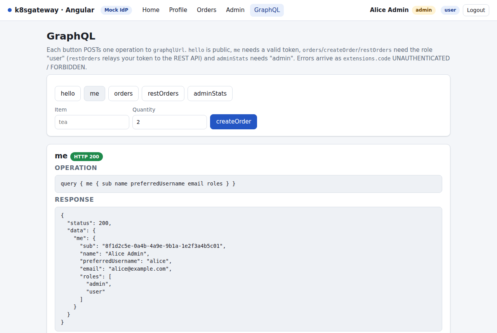

# The GraphQL API

The GraphQL API applies the rules of the [REST API](10-rest-api-go.md) in another runtime and protocol: Node 22, Apollo Server 5 on Express 5, token verification with `jose`. GraphQL adds two twists a REST developer does not meet - one request can select public and protected fields at once, and errors travel inside a `200` body by default - and one useful pattern: the `restOrders` query calls the Go API inside the cluster with the caller's own token.

## What you will learn

- how the Apollo context function turns `Authorization: Bearer` into a `user` (or refuses the whole request)
- how `jose` verifies tokens: `createRemoteJWKSet` caching and cooldown, `jwtVerify` options, why `exp` is made mandatory
- how `UNAUTHENTICATED` and `FORBIDDEN` map to `401`/`403`, and why non-null fields turn "partial errors" into "no data"
- how per-resolver role gates and the token-relay pattern work, and when to use client credentials instead
- CORS, Apollo's CSRF prevention, the embedded Sandbox, tests and the image

Source: [apps/graphql-api](../apps/graphql-api).

## How a request flows

```mermaid
sequenceDiagram
    participant C as Client (Angular / Next.js BFF / curl)
    participant A as graphql-api
    participant I as IdP (JWKS)
    participant R as rest-api
    C->>A: POST /graphql  Authorization: Bearer <access token>
    A->>I: GET jwks_uri (once; cached 10 min, refetched on unknown kid)
    A->>A: jwtVerify: alg allow-list, signature, iss, aud, exp (required), nbf
    Note over A: invalid token -> 401 for the whole request
    A->>A: context.user = { sub, roles, claims, token }
    A->>A: resolver: requireRole(ctx, "user")
    A->>R: GET /api/orders  Authorization: Bearer <same token>  (restOrders only)
    R-->>A: orders (validated again by the REST API)
    A-->>C: { data, errors } + HTTP 200 / 401 / 403
```

Three places do the work. `buildContext` in [src/app.ts](../apps/graphql-api/src/app.ts) runs once per HTTP request and verifies the token. Resolvers in [src/resolvers.ts](../apps/graphql-api/src/resolvers.ts) call `requireUser`/`requireRole` and throw `GraphQLError`s with `extensions.code`. A small Apollo plugin (`httpStatusPlugin`, also in `app.ts`) looks at the codes after execution and sets the HTTP status.

## The schema

[src/schema.ts](../apps/graphql-api/src/schema.ts) deliberately keeps authorization out of the SDL - no `@auth` directive - so the rules are visible in the resolver code:

```graphql
scalar JSON
type Query {
  hello: String!          # public
  me: Me                  # any valid token
  orders: [Order!]!       # role user - local in-memory store
  restOrders: [Order!]!   # role user - token relay to the REST API
  adminStats: Stats!      # role admin
}
type Mutation { createOrder(item: String!, quantity: Int!): Order! }   # role user
type Me    { sub: ID!  name: String  preferredUsername: String  email: String  roles: [String!]!  claims: JSON! }
type Order { id: ID!  item: String!  quantity: Int!  owner: String!  createdAt: String! }
type Stats { orders: Int!  users: Int!  uptimeSeconds: Int! }
```

Only `me` is nullable - a detail that decides the shape of error responses later.

## Building the user from the bearer token

```ts
export function buildContext(verifier: Verifier, logger: Logger = silentLogger) {
  return async ({ req }: { req: Request }): Promise<Context> => {
    let result;
    try {
      result = await verifier.authenticate(req.headers.authorization);
    } catch (e) { /* keys cannot be loaded: throw GraphQLError IDP_UNAVAILABLE with http.status 503 - fail closed */ }
    if (result.error) {      // a token WAS sent and is invalid: refuse the whole request (RFC 6750 §3.1)
      throw new GraphQLError(`invalid token: ${result.error}`, { extensions: { code: 'UNAUTHENTICATED',
        http: { status: 401, headers: new Map([['www-authenticate', wwwAuthenticate(result.error)]]) } } });
    }
    return { user: result.user };   // null when no Authorization header was sent
  };
}
```

Three outcomes, on purpose:

| Authorization header | Context | HTTP |
|---|---|---|
| absent | `user: null` - public fields work, protected fields throw `UNAUTHENTICATED` | decided per operation |
| present and valid | `user: { sub, name, preferredUsername, email, roles, claims, token }` | decided per operation |
| present and invalid | no context at all - the operation never runs | `401` + `WWW-Authenticate: Bearer realm="graphql-api", error="invalid_token", error_description="..."` |
| present but the JWKS cannot be loaded | no context | `503 IDP_UNAVAILABLE` |

Refusing a *presented* but invalid token even for `{ hello }` is a choice: it is what RFC 6750 asks, it is what Envoy Gateway's JWT `SecurityPolicy` does at the edge ([chapter 12](12-gateway-jwt.md)), and it means a client with an expired token sees a `401` it can act on (refresh) instead of getting anonymous data. Apollo would answer `500` for an exception in the context function; the `extensions.http` block is what turns it into a proper `401`/`503`.

## Verification with jose

[src/auth.ts](../apps/graphql-api/src/auth.ts) holds one `createRemoteJWKSet` per process and one `jwtVerify` call:

```ts
const set = createRemoteJWKSet(new URL(jwksUri), {
  cooldownDuration: 30_000, // an unknown kid refetches at most every 30 s (protects the IdP)
  cacheMaxAge: 600_000,     // keys are refreshed at least every 10 minutes
  timeoutDuration: 5_000,
});
await set.reload();         // fetch once now: "ready" means the keys are really loaded
...
const { payload } = await jwtVerify(token, getKey, {
  issuer: expectedIssuer,        // exact match against iss
  audience: cfg.audience,        // aud (string or array) must contain it
  algorithms: [...ALLOWED_ALGS], // RS256 RS384 RS512 PS256 ES256 - checked before any key lookup
  requiredClaims: ['exp', 'sub'],// jose validates exp only when present: without this a never-expiring token would pass
  clockTolerance: 60,            // seconds, applies to exp and nbf
});
```

Two jose behaviors are worth knowing. First, `createRemoteJWKSet` (jose 6 uses the global `fetch`) refetches on an unknown `kid` only if `cooldownDuration` has passed since the last successful fetch - after a key rotation within 30 s of a fetch, new tokens are rejected until the cooldown ends; the repo persists the mock IdP's signing key in a Secret so restarts do not rotate it ([chapter 4](04-mock-idp.md)). Second, `issuer` and `audience` require the claim to be present, but `exp` is validated only if it exists; `requiredClaims` closes that gap, as RFC 9068 demands for JWT access tokens.

Errors are mapped to short, configuration-free descriptions: `JWTExpired` becomes `token expired`, `JWKSNoMatchingKey` becomes `no matching signing key (kid)`, any other `JOSEError` keeps its message (`signature verification failed`, `unexpected "aud" claim value`, ...); a `JWKSTimeout` or network failure while refreshing keys becomes `idp_unavailable` and thus `503`.

## Discovery with retry and readiness

`createVerifier` never blocks startup: `start()` runs a background loop that calls `ensureKeys()` with exponential back-off (`DISCOVERY_RETRY_MS`, default 1 s, doubling to 30 s), and `ensureKeys()` is single-flight, so a burst of first requests triggers one discovery. `/readyz` reports the state:

```json
{"status":"ready","discovery":{"ready":true,"source":"discovery","issuer":"http://keycloak.127.0.0.1.nip.io/realms/k8sgateway","attempts":1,"lastAttemptAt":"2026-09-18T02:42:48.685Z","jwksUri":"http://keycloak.127.0.0.1.nip.io/realms/k8sgateway/protocol/openid-connect/certs"}}
```

Discovery enforces the OIDC rule that the advertised `issuer` equals the expected `iss`. One slip is tolerated: when `OIDC_ISSUER` was pasted with a trailing slash and `OIDC_ISSUER_CLAIM` is *not* set, the verifier adopts the advertised form and logs a warning. Set `OIDC_ISSUER_CLAIM` explicitly (as the Oracle IAM Identity Domains overlay does, together with `OIDC_JWKS_URI`, which skips discovery entirely) and the comparison is strict.

## Role gates in resolvers

```ts
export function requireUser(ctx: Context): AuthUser {
  if (!ctx.user) throw new GraphQLError('authentication required', { extensions: { code: 'UNAUTHENTICATED' } });
  return ctx.user;
}
export function requireRole(ctx: Context, role: string): AuthUser {
  const user = requireUser(ctx);
  if (!user.roles.includes(role))
    throw new GraphQLError(`role "${role}" required`, { extensions: { code: 'FORBIDDEN', requiredRole: role } });
  return user;
}
// usage
orders:     (_p, _a, ctx) => { requireRole(ctx, cfg.roleUser);  return orders.list(); },
adminStats: (_p, _a, ctx) => { requireRole(ctx, cfg.roleAdmin); return { ... }; },
```

`user.roles` is the raw list found at `ROLES_CLAIM` (array or space-separated string, via `extractRoles`), compared against `ROLE_USER`/`ROLE_ADMIN`. Unlike the REST API's `/api/me`, `Me.roles` therefore shows the *raw* values - with Keycloak, `["offline_access","default-roles-k8sgateway","uma_authorization","user"]` for `bob` - handy when working out `ROLES_CLAIM` for a new IdP.

## Error semantics: 401, 403 and the non-null effect

GraphQL's default is `200` for everything, with problems reported in `errors`. `httpStatusPlugin` keeps that default and overrides it in exactly two cases (the first two rows); the table is the resulting policy:

| Situation | HTTP | `extensions.code` |
|---|---|---|
| token sent but invalid (context refused it) | `401` + `WWW-Authenticate ... error="invalid_token"` | `UNAUTHENTICATED` |
| no token and a protected field was selected | `401` + `WWW-Authenticate: Bearer realm="graphql-api"` | `UNAUTHENTICATED` |
| role missing and **no** field produced data | `403` | `FORBIDDEN` (+ `requiredRole`) |
| role missing but other fields succeeded | `200`, partial result | `FORBIDDEN` |
| bad arguments | `200` | `BAD_USER_INPUT` |
| REST relay failed | `200` | `UPSTREAM_UNAVAILABLE` / `UPSTREAM_ERROR` (+ `upstreamStatus`) |
| keys not loadable while a token was sent | `503` | `IDP_UNAVAILABLE` |

Captured: `{ hello me { sub } }` without a token is a partial result *and* a `401`, because `UNAUTHENTICATED` anywhere wins:

```http
HTTP/1.1 401 Unauthorized
www-authenticate: Bearer realm="graphql-api"

{"errors":[{"message":"authentication required","path":["me"],"extensions":{"code":"UNAUTHENTICATED"}}],
 "data":{"hello":"Hello, anonymous! Send a bearer token to see more.","me":null}}
```

`carol` (no roles) asking `{ hello orders { id } }`:

```http
HTTP/1.1 403 Forbidden

{"errors":[{"message":"role \"user\" required","path":["orders"],"extensions":{"code":"FORBIDDEN","requiredRole":"user"}}],"data":null}
```

Why is `data` `null` although `hello` succeeded - and why does the "partial result" row of the table never show up in practice? Because `orders` is declared `[Order!]!`. An error in a non-null field propagates to the nearest nullable parent, and for a root field that is the response itself, so `data` becomes `null`. Every role-gated field in this schema is non-null, so a `FORBIDDEN` error always wipes the data and the plugin always answers `403`; `me` is nullable, which is why the first example kept `hello`. Partial results next to forbidden fields require nullable fields - a schema decision, not an auth one.

An invalid token, whatever the operation:

```http
HTTP/1.1 401 Unauthorized
www-authenticate: Bearer realm="graphql-api", error="invalid_token", error_description="signature verification failed"

{"errors":[{"message":"invalid token: signature verification failed","extensions":{"code":"UNAUTHENTICATED"}}]}
```

An expired one says `error_description="token expired"`; a token from a different IdP says `no matching signing key (kid)`. Stack traces are never included (`includeStacktraceInErrorResponses: false`).

## Token relay: `restOrders`

```ts
const res = await fetchImpl(`${cfg.restApiInternalUrl}/api/orders`, {
  headers: { authorization: `Bearer ${user.token}`, accept: 'application/json' }, // the caller's own token
  signal: AbortSignal.timeout(5000),
});
if (!res.ok) // the upstream body goes to the log, never into the response
  throw new GraphQLError(`REST API answered HTTP ${res.status}`, { extensions: { code: 'UPSTREAM_ERROR', upstreamStatus: res.status } });
```

The GraphQL API forwards the *same* bearer token to `REST_API_INTERNAL_URL` (`http://rest-api.k8sgateway.svc.cluster.local:8080` - the Service name, no round trip through the gateway). The REST API validates it independently: same issuer, same audience `k8sgateway-api`, its own JWKS cache, its own role check. Nothing is re-issued and nothing is trusted transitively; if the REST API said `403`, the GraphQL client gets `UPSTREAM_ERROR` with `upstreamStatus: 403`.

When is this the right pattern? When the downstream call is *on behalf of the user* and the downstream service should apply the user's permissions - the audit trail shows `alice`, not "the GraphQL service". It works here because both APIs share one audience; with per-API audiences you would need token exchange (RFC 8693) at the IdP. When a call is *not* on behalf of a user - a nightly batch, a queue consumer - use the client-credentials grant with a service account: the IdP configuration ships one (`svc-batch`, roles `[admin]`, `scripts/get-token.sh --client-credentials`). Never fall back to a service token when a user token is present; that is how confused-deputy bugs start.

## CORS and CSRF prevention

`corsOptions` in `app.ts` runs before Apollo on `/graphql`: explicit origin list from `CORS_ORIGINS` (wildcards such as `http://*.127.0.0.1.nip.io` are expanded to a regex), `Authorization` allowed, `WWW-Authenticate` exposed, `credentials: false`. A preflight from the Angular origin answers:

```http
HTTP/1.1 204 No Content
access-control-allow-origin: http://angular.127.0.0.1.nip.io
access-control-allow-methods: GET,POST,OPTIONS
access-control-allow-headers: Content-Type,Authorization,Apollo-Require-Preflight,X-Apollo-Operation-Name
access-control-expose-headers: WWW-Authenticate
```

Apollo Server's CSRF prevention is on by default: a `POST` whose `Content-Type` is `text/plain`, `application/x-www-form-urlencoded` or `multipart/form-data` (the "simple" request types a browser sends without a preflight) is refused with `400` unless an `Apollo-Require-Preflight` or `X-Apollo-Operation-Name` header is present. `curl -d '{...}'` without a header sends `application/x-www-form-urlencoded`, so **every curl example must send `-H 'Content-Type: application/json'`**. Express 5 also leaves `req.body` undefined without a parser, hence `express.json({ limit: '100kb' })` before `expressMiddleware`.

## The embedded Sandbox

`GET http://graphql.127.0.0.1.nip.io/graphql` in a browser serves the Apollo Sandbox: paste an access token as `Authorization: Bearer ...` under *Headers* and run queries interactively. The container sets `NODE_ENV=production`, which would normally disable introspection and the local landing page, so `createApolloServer` passes `introspection: true` and `ApolloServerPluginLandingPageLocalDefault({ embed: true })` explicitly; the page itself loads from Apollo's CDN (internet required). For a real deployment set `introspection: false` and `ApolloServerPluginLandingPageDisabled()`.



*The Angular `/graphql` page sends the same operations with `fetch` and the bearer token ([chapter 8](08-angular.md)).*

## Try it

```bash
GQL=http://graphql.127.0.0.1.nip.io/graphql
TOKEN=$(scripts/get-token.sh bob)                    # bob: role user only
curl -s $GQL -H 'Content-Type: application/json' -d '{"query":"{ hello }"}'   # no token on purpose
curl -s $GQL -H "Authorization: Bearer $TOKEN" -H 'Content-Type: application/json' \
  -d '{"query":"{ me { sub name preferredUsername email roles } }"}' | jq .
curl -s $GQL -H "Authorization: Bearer $TOKEN" -H 'Content-Type: application/json' \
  -d '{"query":"mutation { createOrder(item: \"Laptop stand\", quantity: 2) { id owner } }"}'
curl -s $GQL -H "Authorization: Bearer $TOKEN" -H 'Content-Type: application/json' \
  -d '{"query":"{ restOrders { id item owner } }"}' | jq .
curl -si $GQL -H "Authorization: Bearer $TOKEN" -H 'Content-Type: application/json' \
  -d '{"query":"{ adminStats { orders users uptimeSeconds } }"}' | head -1          # 403 for bob
```

Captured: the first call carries no token and answers `{"data":{"hello":"Hello, anonymous! Send a bearer token to see more."}}` (add the bearer token and the greeting becomes `Hello Bob User!`); with `bob`'s token, `{"data":{"createOrder":{"id":"ord-4","owner":"bob"}}}`, and `restOrders` returns bob's orders from the Go store (`[{"id":"ord-2","item":"USB-C cable","owner":"bob"}, ...]`), which differ from the local `orders` list because the two services keep separate in-memory data. Use `alice` for `adminStats` and `carol` to see `FORBIDDEN`.

## Logs

One JSON line per operation with operation name, `sub`, raw roles, status, error codes and duration; a request refused in the context function is logged with its reason. Tokens are never logged.

```json
{"time":"2026-09-18T03:37:32.742Z","level":"info","msg":"graphql","operationName":"WhoAmI","operation":"query","sub":"c490b647-9c37-4aa7-8933-11f83d7912af","roles":["offline_access","admin","default-roles-k8sgateway","uma_authorization","user"],"status":200,"errors":[],"durationMs":0.6}
{"time":"2026-09-18T03:36:00.404Z","level":"info","msg":"graphql","sub":null,"roles":[],"status":401,"errors":["UNAUTHENTICATED"],"reason":"signature verification failed"}
```

`scripts/logs.sh graphql-api` tails them.

## Tests

```bash
cd apps/graphql-api && npm ci && npm test
```

39 tests in three `node --test` suites, all against [test/helpers/test-idp.ts](../apps/graphql-api/test/helpers/test-idp.ts), an in-process IdP that generates an RSA key with jose and serves discovery + JWKS: [auth.test.ts](../apps/graphql-api/test/auth.test.ts) (issuer/audience/expiry/`nbf`, missing `exp`, `alg=none` and `HS256`, unknown `kid`, roles extraction, `OIDC_JWKS_URI`, retry and fail-closed behavior), [resolvers.test.ts](../apps/graphql-api/test/resolvers.test.ts) (every gate through `executeOperation`, the 401/403 policy, the relay against a fake REST server) and [http.test.ts](../apps/graphql-api/test/http.test.ts) (the real Express app: readiness, landing page, CORS preflights, malformed JSON without stack traces).

## The image, and running it locally

[apps/graphql-api/Dockerfile](../apps/graphql-api/Dockerfile) compiles TypeScript in a `node:22-alpine` build stage, then installs production dependencies only and runs `dist/server.js` as the unprivileged `node` user (uid 1000) on port 4000; `/healthz` and `/readyz` are the probes. `NODE_EXTRA_CA_CERTS` points at the optional TLS-mode CA, Node's equivalent of Go's `SSL_CERT_FILE`.

Without Kubernetes (the host reaches the in-cluster mock IdP through the gateway on port 80):

```bash
cd apps/graphql-api && npm ci
OIDC_ISSUER=http://idp.127.0.0.1.nip.io CORS_ORIGINS=http://localhost:4200 PORT=4001 npm run dev
curl -s localhost:4001/readyz | jq .discovery.ready       # true
```

`restOrders` then answers `UPSTREAM_UNAVAILABLE` for `http://rest-api.k8sgateway.svc.cluster.local:8080`, because the Service name only resolves inside the cluster; point `REST_API_INTERNAL_URL` at `http://api.127.0.0.1.nip.io` (the REST API through the gateway, configured for the same IdP) to relay from your laptop.

## Next

[JWT at the edge with Envoy Gateway](12-gateway-jwt.md)
