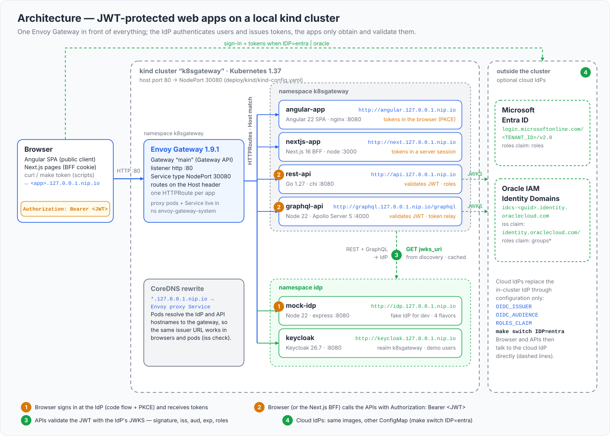

# JWT at the edge with Envoy Gateway

Every API in this repository validates access tokens itself. This chapter adds a second, independent check in front of them: an Envoy Gateway `SecurityPolicy` that makes the gateway reject requests to the REST API without a valid JWT before they reach the pod, and optionally enforces a role for `/api/admin`. It is defense in depth, not a replacement - the apps keep validating, and you will see why. Along the way it explains the Gateway API resources the whole tutorial runs on.

## What you will learn

- How the objects in `deploy/gateway` (GatewayClass, EnvoyProxy, Gateway, HTTPRoute) fit together, and why the project uses Gateway API instead of an Ingress controller.
- What each field of `deploy/gateway-policies/*.yaml` does: `targetRefs`, `jwt.providers`, `issuer`, `audiences`, `remoteJWKS`, `claimToHeaders`, `optional`, `authorization` rules and the `cors` block.
- Exactly what Envoy answers when a token is missing, tampered, expired, for the wrong audience, or lacks a role.
- Why the policy also blocks `/api/public`, and how to split the route when you want a public path.
- How to apply, verify and remove the policy, what changes when you switch the IdP, and how this compares with other Gateway API implementations.

## Gateway API as used in this repository



*One Gateway, one HTTPRoute per hostname; the CoreDNS rewrite lets pods reach the same `*.127.0.0.1.nip.io` names through the gateway.*

Gateway API is the Kubernetes-native successor of Ingress: routing is split into role-oriented resources instead of one object with vendor annotations. The project uses it because Ingress NGINX, the controller most tutorials still show, was retired by Kubernetes SIG Network: per the [retirement announcement](https://kubernetes.io/blog/2025/11/11/ingress-nginx-retirement/) of November 2025, best-effort maintenance continued until March 2026, after which "there will be no further releases, no bugfixes, and no updates to resolve any security vulnerabilities" - the announcement's own advice is to "consider migrating to Gateway API, the modern replacement for Ingress". Envoy Gateway v1.9.1 is the implementation here; its `install.yaml` bundles the Gateway API CRDs (v1.6.1), and [scripts/up.sh](../scripts/up.sh) applies it with `kubectl apply --server-side`.

| Resource | File | Role |
|---|---|---|
| `GatewayClass eg` | [deploy/gateway/gatewayclass.yaml](../deploy/gateway/gatewayclass.yaml) | Names the controller and points via `parametersRef` at the EnvoyProxy below (the `namespace` there is mandatory - Envoy Gateway would otherwise look in `default`). |
| `EnvoyProxy k8sgateway-proxy` | [deploy/gateway/envoyproxy.yaml](../deploy/gateway/envoyproxy.yaml) | Envoy Gateway's CRD for the data plane. kind has no cloud load balancer, so the generated Service is `NodePort` and a `StrategicMerge` patch pins port 80 to nodePort 30080, which [deploy/kind/kind-config.yaml](../deploy/kind/kind-config.yaml) maps to host port 80 (strategic merge adds `nodePort` to the generated port entry instead of replacing the list). Port 8080 is an in-cluster alias for the `HTTP_PORT=8080` setup. |
| `Gateway main` | [deploy/gateway/gateway.yaml](../deploy/gateway/gateway.yaml) | One `http` listener on port 80 accepting routes from every namespace (`allowedRoutes.namespaces.from: All`): apps live in `k8sgateway`, IdPs in `idp`. |
| `HTTPRoute` per app | [deploy/base/rest-api/httproute.yaml](../deploy/base/rest-api/httproute.yaml) and siblings | `parentRefs` names the Gateway, `hostnames` selects the traffic (`api.127.0.0.1.nip.io`), one rule sends `PathPrefix /` to the app's Service. |
| `SecurityPolicy` | [deploy/gateway-policies/](../deploy/gateway-policies/) | Envoy Gateway extension attached to a route: JWT validation, authorization, CORS. Optional; this chapter. |

Two things surprise people. The proxy does not live next to the Gateway: its Deployment and Service are created in `envoy-gateway-system` as `envoy-<namespace>-<gateway>-<hash>` (here `envoy-k8sgateway-main-7cab4a6a`), so select them by label. And Envoy listens on 10080 inside the pod for listener port 80 - privileged ports are shifted by 10000 - so access logs showing `:10080` are not a bug.

```bash
kubectl get gatewayclass
kubectl -n k8sgateway get gateway main          # PROGRAMMED True, ADDRESS = node IP
kubectl get httproute -A
kubectl -n envoy-gateway-system get svc,deploy \
  -l gateway.envoyproxy.io/owning-gateway-name=main,gateway.envoyproxy.io/owning-gateway-namespace=k8sgateway
```

## How a SecurityPolicy works

A `SecurityPolicy` becomes HTTP filters on the routes it targets, in a fixed order: **CORS → JWT authentication → RBAC (authorization)**. A request to the REST API therefore goes through:

1. The CORS filter. A browser preflight (`OPTIONS` with an allowed `Origin`) is answered here and never reaches the next filters - important, because preflights carry no `Authorization` header.
2. The JWT filter. It takes the token from `Authorization: Bearer …` (or an `access_token` query parameter), picks the provider whose `issuer` equals the token's `iss`, checks the signature against that provider's cached JWKS, then `exp`/`nbf` (60 s clock skew) and `aud` against `audiences`.
3. The RBAC filter, only when the policy has an `authorization` block: rules are evaluated in order, the first match wins, a request matching none gets `defaultAction`.
4. Then the request is forwarded to the pod - with the `Authorization` header intact. Envoy Gateway configures the JWT filter with `forward: true`, so the app validates the same token again.

## The policy, field by field

[deploy/gateway-policies/securitypolicy-rest-jwt.yaml](../deploy/gateway-policies/securitypolicy-rest-jwt.yaml) is the JWT-only variant for the mock IdP:

```yaml
apiVersion: gateway.envoyproxy.io/v1alpha1
kind: SecurityPolicy
metadata:
  name: rest-api-jwt
  namespace: k8sgateway
spec:
  targetRefs:
    - group: gateway.networking.k8s.io
      kind: HTTPRoute
      name: rest-api
  jwt:
    optional: false
    providers:
      - name: idp
        issuer: http://idp.127.0.0.1.nip.io
        audiences: ["k8sgateway-api"]
        remoteJWKS:
          uri: http://mock-idp.idp.svc.cluster.local:8080/jwks
          cacheDuration: 300s
        claimToHeaders:
          - header: x-jwt-sub
            claim: sub
          - header: x-jwt-preferred-username
            claim: preferred_username
  cors:
    allowOrigins: ["http://*.127.0.0.1.nip.io", "http://localhost:4200"]
    allowMethods: [GET, POST, PUT, PATCH, DELETE, OPTIONS]
    allowHeaders: [Authorization, Content-Type]
    exposeHeaders: [WWW-Authenticate]
    maxAge: 86400s
```

| Field | Meaning and constraints |
|---|---|
| `targetRefs` | Which route(s) the policy protects. The reference is local: the policy **must be in the same namespace** as the HTTPRoute. `kind: Gateway` would protect every route of the gateway (a route-level policy then overrides it). The singular `targetRef` is deprecated. |
| `jwt.optional` | `false` (default): a request **without** a token is rejected with 401. `true` lets token-less requests through while an invalid token is still 401 - useful when the backend decides what is public. |
| `providers[].name` | Free name; `authorization` rules refer to it. Up to 16 providers, so one policy can trust several IdPs. |
| `issuer` | Compared **verbatim** with the token's `iss` - no trailing-slash normalization. Omitted means "not checked", so never omit it. Plain `http://` is fine here; the v1.9.1 change "HTTP is no longer supported as an OIDC issuer" concerns `spec.oidc`. |
| `audiences` | Any-of list (max 8) matched against `aud`. Omitted means "not checked" - always set it. |
| `remoteJWKS.uri` | Where Envoy fetches the keys; plain `http://` is allowed. The in-cluster Service name avoids the gateway round trip and works without the CoreDNS rewrite. The key set is cached for `cacheDuration` (default 300 s), fetched asynchronously with a 10 s timeout and retried after 1 s on failure. HTTPS with a private CA needs a `Backend` plus `BackendTLSPolicy`. |
| `claimToHeaders` | Copies **scalar** claims (string, int, double, bool) into request headers; nested claims use a dotted path. Array claims such as `roles` cannot be forwarded - one reason the apps decode the token themselves. |
| `cors` | Origins are `scheme://host[:port]` with one wildcard label allowed (`http://*.127.0.0.1.nip.io`); `maxAge` is a duration string. The CORS filter answers preflights and adds headers to allowed responses - it never rejects a request. |

The `cors` block exists because of `optional: false`: without it a preflight would reach the JWT filter without a token and be answered 401, which the browser reports as a CORS failure. Keep this allow-list in step with `CORS_ORIGINS` of the API ([deploy/overlays/mock/rest-api.env](../deploy/overlays/mock/rest-api.env)).

## Apply it and watch what changes

Apply the variant matching the IdP you have deployed (`scripts/urls.sh` prints it). All three files share the name `rest-api-jwt`, so applying another one replaces the first.

```bash
kubectl apply -f deploy/gateway-policies/securitypolicy-rest-jwt.yaml            # mock IdP
kubectl apply -f deploy/gateway-policies/securitypolicy-rest-jwt-keycloak.yaml   # Keycloak
kubectl -n k8sgateway describe securitypolicy rest-api-jwt                        # Status: Accepted=True
```

Then repeat the checks from the API chapter:

```bash
curl -i http://api.127.0.0.1.nip.io/api/me                                      # 401 from Envoy: "Jwt is missing"
TOKEN=$(scripts/get-token.sh alice)
curl -i -H "Authorization: Bearer $TOKEN"  http://api.127.0.0.1.nip.io/api/me   # 200, answered by the API
curl -i -H "Authorization: Bearer ${TOKEN}x" http://api.127.0.0.1.nip.io/api/me # 401 from Envoy: "Jwt verification fails"
```

The two kinds of 401 look different. The API's answer ([apps/rest-api/internal/auth/middleware.go](../apps/rest-api/internal/auth/middleware.go)) is JSON - `{"error":"unauthorized","error_description":"…"}` with `WWW-Authenticate: Bearer realm="k8sgateway-api"`. Envoy's is a short plain-text body, the fixed message of the `jwt_authn` or `rbac` filter that refused the request:

| Situation | Status | Body | `www-authenticate` |
|---|---|---|---|
| no token | 401 | `Jwt is missing` | `Bearer realm="<request URL>"` |
| bad signature (tampered) | 401 | `Jwt verification fails` | `…, error="invalid_token"` |
| `exp` in the past | 401 | `Jwt is expired` | `…, error="invalid_token"` |
| `iss` matches no provider | 401 | `Jwt issuer is not configured` | `…, error="invalid_token"` |
| `aud` not in `audiences` | 403 | `Audiences in Jwt are not allowed` | — |
| valid token, no authorization rule matched | 403 | `RBAC: access denied` | — |

In the Envoy access log (`scripts/logs.sh envoy`) such requests carry `response_code_details` starting with `jwt_authn_access_denied` instead of `via_upstream`.

**The whole route is protected.** The policy targets HTTPRoute `rest-api`, whose single rule is `PathPrefix /`, so `GET /api/public` - public by design in the API - now also answers 401, as do `/healthz` and `/readyz` through the gateway (kubelet probes talk to the pod directly and are unaffected). Expected side effects while the policy is applied: `scripts/test.sh` reports `GET /api/public without token -> 401 (expected 200)` as FAIL, and `scripts/up.sh` / `scripts/switch-idp.sh` warn that `/api/public` or `/readyz` "does not answer 200 yet".

### Keeping a public path

Gateway API attaches policies to routes, not to paths, so a public path needs its own route: exact path matches beat prefix matches across routes, and the policy keeps targeting only `rest-api`. The repository ships one route per app on purpose so the effect above is visible; if you want the split:

```bash
kubectl apply -f - <<'EOF'
apiVersion: gateway.networking.k8s.io/v1
kind: HTTPRoute
metadata:
  name: rest-api-public
  namespace: k8sgateway
spec:
  parentRefs:
    - name: main
      namespace: k8sgateway
  hostnames: [api.127.0.0.1.nip.io]
  rules:
    - matches:
        - path: { type: Exact, value: /api/public }
        - path: { type: Exact, value: /healthz }
        - path: { type: Exact, value: /readyz }
      backendRefs:
        - name: rest-api
          port: 8080
EOF
```

`kubectl delete httproute -n k8sgateway rest-api-public` removes it. The alternative, `jwt.optional: true`, reopens every path for token-less callers and leaves the decision to the API.

## Claim-based authorization at the gateway

[deploy/gateway-policies/securitypolicy-rest-authz.yaml](../deploy/gateway-policies/securitypolicy-rest-authz.yaml) adds an `authorization` block that lets only tokens whose `roles` array contains `admin` reach `/api/admin/*`:

```yaml
  authorization:
    defaultAction: Deny
    rules:
      - name: admin-area-needs-admin-role
        action: Allow
        operation:
          path: { type: PathPrefix, value: /api/admin }
        principal:
          jwt:
            provider: idp
            claims:
              - name: roles              # Keycloak: realm_access.roles
                valueType: StringArray
                values: ["admin"]
      - name: admin-area-otherwise-forbidden
        action: Deny
        operation:
          path: { type: PathPrefix, value: /api/admin }
        principal:
          jwt:
            provider: idp
            claims:
              - name: iss
                values: ["http://idp.127.0.0.1.nip.io"]
      - name: any-authenticated-request
        action: Allow
        principal:
          jwt:
            provider: idp
            claims:
              - name: iss
                values: ["http://idp.127.0.0.1.nip.io"]
```

How to read it:

- `defaultAction: Deny` plus ordered rules, first match wins; a request matching nothing gets 403. An `authorization` block with neither rules nor `defaultAction` denies everything.
- `principal.jwt.provider` must name a provider of the same policy (the CRD enforces it). All listed `claims` must match; within one claim any of the `values` may match. `valueType: StringArray` is what makes `roles: ["admin","user"]` match `admin`; `name` is a dotted path, so the Keycloak form is `realm_access.roles`. `scopes` would match a space-separated `scope`/`scp` claim the same way.
- The middle `Deny` rule exists because every rule needs a principal and a user without the admin role must not fall through to the catch-all. "`iss` equals our issuer" holds for every token the JWT filter accepted - it means "any authenticated request".
- There is no `OPTIONS` rule: with the `cors` block, preflights from allowed origins never reach RBAC. Without the block, or from an origin outside the list, a preflight reaches the JWT filter token-less and gets 401. Add an explicit allow rule for the method if you rely on non-CORS `OPTIONS` calls.

With this file applied, `bob` (role `user`) gets Envoy's `RBAC: access denied` on `/api/admin/stats` instead of the API's `{"error":"forbidden","required_role":"admin"}` - the request never reaches the pod.

## The Keycloak variant and the issuer coupling

[securitypolicy-rest-jwt-keycloak.yaml](../deploy/gateway-policies/securitypolicy-rest-jwt-keycloak.yaml) differs in two values: `issuer: http://keycloak.127.0.0.1.nip.io/realms/k8sgateway` (the realm URL Keycloak puts into `iss`, pinned by `KC_HOSTNAME`) and `remoteJWKS.uri: http://keycloak.idp.svc.cluster.local:8080/realms/k8sgateway/protocol/openid-connect/certs` - Keycloak advertises the public hostname, but the keys behind the Service are the same. Its access tokens carry `aud: ["k8sgateway-api","account"]` thanks to an audience mapper in the realm.

A gateway policy is bound to **one issuer string**, while the apps take theirs from the overlay ConfigMaps. After `make switch IDP=keycloak` a mock IdP policy rejects every Keycloak token with `Jwt issuer is not configured`. [scripts/switch-idp.sh](../scripts/switch-idp.sh) therefore reads `spec.jwt.providers[0].issuer` of `rest-api-jwt` after the switch and warns:

```text
warn SecurityPolicy rest-api-jwt still trusts issuer http://idp.127.0.0.1.nip.io - apply the matching file from deploy/gateway-policies/ or delete the policy
```

The same coupling applies to `BASE_DOMAIN`, `SCHEME` and `HTTP_PORT`: the policy files are applied as-is, not through `scripts/render.sh`. Rewrite the issuer first, for example `sed 's#http://idp.127.0.0.1.nip.io#http://idp.127.0.0.1.nip.io:8080#' deploy/gateway-policies/securitypolicy-rest-jwt.yaml | kubectl apply -f -`. For Microsoft Entra ID or Oracle IAM Identity Domains you would add a provider with that IdP's issuer and JWKS URL (`…/discovery/v2.0/keys`, `https://<domain>/admin/v1/SigningCert/jwk`); Oracle's `iss` is the literal `https://identity.oraclecloud.com/` - verify with a decoded token from your tenant.

## Why the apps still validate

- **The token is forwarded, so double validation is free.** Envoy's default would strip a verified JWT; Envoy Gateway forces `forward: true`. Never add an HTTPRoute filter that removes `Authorization`, or the apps answer 401 for everything.
- **Not every request comes through the gateway.** The GraphQL API relays the caller's token to the REST API via `http://rest-api.k8sgateway.svc.cluster.local:8080`, the Next.js BFF calls both APIs the same way, and anything with network access to the Service can too. Zero trust means the pod checks, always.
- **Policies can be wrong or missing.** A typo in `targetRefs`, a policy deleted after an IdP switch, or a namespace mismatch silently removes the edge check. The app's check ([apps/rest-api/internal/auth/verifier.go](../apps/rest-api/internal/auth/verifier.go), [apps/graphql-api/src/auth.ts](../apps/graphql-api/src/auth.ts)) is part of the image.
- **Headers are not proof.** `x-jwt-sub` from `claimToHeaders` is handy for logging, but a backend may only trust such headers when it is reachable exclusively through the gateway (a NetworkPolicy, see [15-production-checklist.md](15-production-checklist.md)). The apps here ignore them and read the token.

What the edge check buys you is cheap rejection: garbage tokens never reach the pods, which also protects the IdP - the Go verifier refetches the JWKS on every unknown `kid`, so a flood of random tokens would otherwise become a flood of requests to `jwks_uri`.

## Removing the policy

```bash
kubectl delete -f deploy/gateway-policies/securitypolicy-rest-jwt.yaml
kubectl delete securitypolicy -n k8sgateway rest-api-jwt      # same thing, whichever variant is applied
```

`scripts/test.sh` passes again and only the apps validate. To validate a policy file without applying it, `kubectl apply --dry-run=server -f deploy/gateway-policies/securitypolicy-rest-jwt.yaml` runs the CRD's validation rules on the API server.

## Portability: other Gateway API implementations

`GatewayClass`, `Gateway` and `HTTPRoute` are portable across conformant implementations; `SecurityPolicy` is not - it is Envoy Gateway's own CRD, and the Gateway API "policy attachment" pattern (a vendor policy whose `targetRefs` point at a route or gateway) is how every implementation adds what the core API lacks. kgateway (the CNCF project descended from Gloo) attaches a `TrafficPolicy` the same way and, since [v2.2.0](https://github.com/kgateway-dev/kgateway/releases/tag/v2.2.0) (February 2026), carries "JWT Authentication configuration" in the `TrafficPolicy` with "JWT Providers" defined in a `GatewayExtension`; Istio uses `RequestAuthentication` and `AuthorizationPolicy`. Moving between them means rewriting the files in this directory - not the routes, and never the applications, which do not know the gateway exists. With ingress-nginx, JWT and CORS lived in controller-specific annotations with no equivalent elsewhere, and that controller is now unmaintained.

## Next

[Switching identity providers](13-switching-idps.md) - the same images with a different ConfigMap, and what to do about the policy when you switch.
