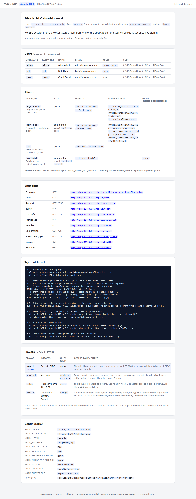

# Troubleshooting

Most problems in this setup fall into a few buckets: the host cannot reach the cluster, pods cannot reach the IdP, an image is missing, or a token is rejected for a reason that becomes obvious once you decode it. This chapter starts with a symptom table and then walks through each case with the commands to confirm the cause and fix it. Commands assume the default hostnames; add `:8080` or your `BASE_DOMAIN` if you changed them.

## What you will learn

- A symptom → cause → fix table you can scan in a hurry.
- How to check each layer separately: host DNS, kind port mapping, the Gateway, CoreDNS, the IdP, the API.
- How to read a rejected token and map the error to a configuration value (`aud`, `iss`, clock, roles claim).
- How to read the logs of every component with `scripts/logs.sh`, and how to reset everything.

## Symptom → cause → fix

| Symptom | Likely cause | Fix |
|---|---|---|
| `kind create cluster`: port 80/443 in use or permission denied | Port taken, or rootless Docker/Podman cannot bind ports below 1024 | [Ports 80/443](#ports-80443-busy-or-rootless-docker) |
| `curl: (6) Could not resolve host` | No internet, or a resolver that blocks answers pointing at 127.0.0.1 | [nip.io](#nipio-does-not-resolve) |
| `curl: (7) … Connection refused` although the name resolves | Cluster created with other host ports than the scripts assume | `docker port k8sgateway-control-plane`; pass the same `HTTP_PORT` to every script |
| Gateway `PROGRAMMED` not `True` | Envoy Gateway not ready, EnvoyProxy patch invalid, proxy pod not running | [Gateway not Programmed](#gateway-not-programmed) |
| `ImagePullBackOff` | Image not loaded into kind, or pull policy `Always` | [ImagePullBackOff](#imagepullbackoff) |
| API pods never `Ready`, `/readyz` says `oidc discovery pending` | Pod cannot reach the issuer URL, or the IdP is still starting | [Pods cannot reach the IdP](#pods-cannot-reach-the-idp) |
| 401 with a token that looks fine | `aud`, `iss` (trailing slash, other IdP), expiry, clock skew, unknown `kid` | [401 with a valid-looking token](#401-with-a-seemingly-valid-token) |
| 401 on `/api/public` | A gateway `SecurityPolicy` covers the whole route | Expected - [12 · JWT at the edge](12-gateway-jwt.md) |
| 403 although the user has the role | `ROLES_CLAIM` points at the wrong path for this IdP | [403](#403-although-the-user-has-the-role) |
| Browser: `No 'Access-Control-Allow-Origin'` | Origin missing from `CORS_ORIGINS`, Keycloak Web Origins or a policy's `cors` | [CORS errors](#cors-errors) |
| Keycloak: "Invalid parameter: redirect_uri"; Next.js `missing_transaction` or login loop | `PUBLIC_URL` wrong, or a `Secure` cookie on plain http | [Next.js](#nextjs-redirect_uri-mismatch-or-cookie-not-set) |
| Angular: `issuer must use HTTPS (with TLS)…` | `requireHttps: true` with an `http://` issuer | [Angular](#angular-requirehttps-and-secure-context) |
| Keycloak restarts, `OOMKilled`, slow | First start builds and imports; heap = 70 % of the memory limit | [Keycloak](#keycloak-slow-start-or-oom) |
| Envoy answers 500 for a whole hostname | A route or policy was not accepted (`direct_response`) | [Envoy 500](#envoy-500-direct_response) |
| Pods log `too many open files` | inotify limits too low for kind | [inotify limits](#inotify-limits) |
| `kind load`: `ctr: content digest … not found` | Docker containerd image store | [Docker 29 and kind load](#docker-29-and-kind-load) |

## Ports 80/443 busy or rootless Docker

The kind config maps container ports 30080/30443 to host ports 80/443 on 127.0.0.1. Rootless Docker and Podman cannot bind ports below 1024 by default. Either allow it once with `sudo sysctl net.ipv4.ip_unprivileged_port_start=80`, or create the cluster on other ports:

```bash
scripts/down.sh                                  # port mappings are fixed at creation time
HTTP_PORT=8080 HTTPS_PORT=8443 scripts/up.sh
```

Only 80/8080 and 443/8443 are supported, because [deploy/gateway/envoyproxy.yaml](../deploy/gateway/envoyproxy.yaml) exposes exactly those alias ports on the Envoy Service for the pods. `scripts/render.sh` then appends `:8080` to every URL in the manifests - issuer included, since `iss` must match what the browser opens - so keep passing `HTTP_PORT=8080` to `deploy.sh`, `switch-idp.sh`, `test.sh`, `get-token.sh` and `urls.sh`. If the cluster already exists with other ports, `scripts/up.sh` warns: `the existing cluster maps host port 80 (not HTTP_PORT=8080); run scripts/down.sh first to change it`.

## nip.io does not resolve

`*.127.0.0.1.nip.io` is answered by public DNS, so it needs internet access, and some resolvers refuse answers pointing into loopback or private ranges - dnsmasq's `stop-dns-rebind` (home routers, OpenWrt, Pi-hole) drops `127.0.0.0/8` answers unless `rebind-localhost-ok` is set. Check on the host:

```bash
dig +short angular.127.0.0.1.nip.io      # expect 127.0.0.1
getent hosts angular.127.0.0.1.nip.io
```

If it stays empty, the simplest fix is one line in `/etc/hosts` (pods are unaffected - inside the cluster CoreDNS answers these names):

```text
127.0.0.1 angular.127.0.0.1.nip.io next.127.0.0.1.nip.io api.127.0.0.1.nip.io graphql.127.0.0.1.nip.io idp.127.0.0.1.nip.io keycloak.127.0.0.1.nip.io
```

Alternatively use a wildcard domain that resolves to loopback on your machine, for example a `*.localhost` name (Chromium, Firefox and systemd-resolved resolve those without DNS): `BASE_DOMAIN=k8sgateway.localhost scripts/up.sh`, and pass the same variable to every later script - `render.sh` and `coredns-rewrite.sh` both honor it. The CI only exercises the default domain, and the files in `deploy/gateway-policies/` keep the literal default issuer.

## Pods cannot reach the IdP

Inside a pod, 127.0.0.1 is the pod itself, so `http://idp.127.0.0.1.nip.io` only works because [scripts/coredns-rewrite.sh](../scripts/coredns-rewrite.sh) rewrites `*.127.0.0.1.nip.io` to the Envoy Service. Symptoms: `rest-api` and `graphql-api` stay not ready, and `curl http://api.127.0.0.1.nip.io/readyz` or `kubectl -n k8sgateway logs deploy/rest-api` reports `oidc discovery pending: … connection refused`. Check the rule and resolve a name from a pod:

```bash
kubectl -n kube-system get configmap coredns -o jsonpath='{.data.Corefile}' | head -8
kubectl run -it --rm dns-test --image=busybox:1.37 --restart=Never -- \
  sh -c 'nslookup idp.127.0.0.1.nip.io; wget -qO- http://idp.127.0.0.1.nip.io/.well-known/openid-configuration'
```

Expected: the Corefile contains the `k8sgateway-rewrite-begin` block, `nslookup` returns the ClusterIP of `envoy-k8sgateway-main-…` (10.96.x.x), and `wget` prints the discovery JSON. Without creating a pod: `kubectl -n k8sgateway exec deploy/graphql-api -- wget -qO- http://idp.127.0.0.1.nip.io/.well-known/openid-configuration`. If the block is missing (for instance after the Envoy Service was recreated with a new hash), rerun `scripts/coredns-rewrite.sh`; it is idempotent and restarts CoreDNS. The rule carries `answer auto` on purpose: glibc-based images reject an answer whose owner name differs from the question, Alpine and Go images do not - so test from a Debian image, not only from a Go pod.

If DNS is fine, the IdP is probably not up yet: `kubectl -n idp get pods`, then `scripts/logs.sh mock-idp` or `scripts/logs.sh keycloak`. The APIs retry with backoff and become ready on their own.

## Gateway not Programmed

```bash
kubectl -n k8sgateway get gateway main
kubectl -n k8sgateway describe gateway main            # Conditions: Accepted, Programmed; listener ResolvedRefs
kubectl -n envoy-gateway-system get pods
kubectl -n envoy-gateway-system logs deployment/envoy-gateway --tail=50
```

`Programmed=True` with `Address assigned to the Gateway, 1/1 envoy replicas available` is the healthy state; a brief `False` right after creation is normal, which is why `scripts/up.sh` waits with `kubectl wait gateway/main --for=condition=Programmed`. If it never flips, the `envoy-gateway` controller must be `Available` first and the proxy Deployment needs a running pod. Envoy Gateway v1.9 lists Kubernetes 1.33–1.36 as tested; kind's default 1.37 works here and in CI, and `kindest/node:v1.36.4` is the in-matrix fallback.

## ImagePullBackOff

The images are built locally and **loaded** into kind, never pulled (`k8sgateway/<app>:dev`, `imagePullPolicy: IfNotPresent` in every Deployment). A `:latest` or missing tag would default the policy to `Always` and make the kubelet contact a registry. Check what the node has, then rebuild and restart:

```bash
docker exec k8sgateway-control-plane crictl images | grep k8sgateway
scripts/build.sh rest-api                 # or: make build APPS="rest-api graphql-api"
kubectl -n k8sgateway rollout restart deployment rest-api
```

Running pods keep the old image after a rebuild - the restart is not optional.

## 401 with a seemingly valid token

Decode the token first; almost every 401 is visible in the payload.

```bash
scripts/get-token.sh --decode alice         # or: make -s token USER=alice DECODE=1
```



*The mock IdP's dashboard links to `/debug/token`, where you can paste any JWT and see header, payload and validity checks.*

Then read the API's reason: the response carries `WWW-Authenticate: Bearer error="invalid_token", error_description="…"`, and the pod logs a `token rejected` line with the full cause.

| `error_description` (REST) | Cause | Fix |
|---|---|---|
| `audience mismatch` (GraphQL: `unexpected "aud" claim value`) | `aud` lacks `OIDC_AUDIENCE`. Keycloak only puts `account` into `aud` unless an Audience mapper adds more - here the client scope `k8sgateway-api` | Keep the mapper in [realm-export.json](../deploy/idp/keycloak/realm-export.json); for Microsoft Entra ID request the API scope, for Oracle IAM Identity Domains the resource scope |
| `issuer mismatch` | `iss` is not byte-for-byte `OIDC_ISSUER_CLAIM`; a trailing slash is enough. Oracle's `iss` is `https://identity.oraclecloud.com/` | One canonical issuer string everywhere; set `OIDC_ISSUER_CLAIM` when the IdP's `iss` differs from the discovery URL |
| `issuer mismatch` right after `make switch` | The browser still holds tokens from the previous IdP (Angular: `localStorage`; Next.js: session cookie) | Log out in the app or clear site data for `*.127.0.0.1.nip.io` |
| `token expired` | Access tokens live 300 s; a token pasted into a shell goes stale | Fetch a fresh one; the apps refresh automatically |
| `token expired` / `token not yet valid` on a fresh token | Clock skew beyond the 60 s tolerance (APIs and Envoy alike), e.g. after a laptop slept | Compare `date -u` with `docker exec k8sgateway-control-plane date -u`; fix the host clock |
| `invalid signature` on a fresh token after the mock IdP restarted | New signing key: without the Secret `idp/mock-idp-key` the mock IdP generates one per start. Go refetches the JWKS on an unknown `kid`, the GraphQL API after a 30 s cooldown, an Envoy policy after 300 s | `scripts/deploy.sh mock` creates the Secret; otherwise wait, or delete and re-apply the policy |
| plain-text `Jwt is missing` / `Jwt verification fails`, no JSON | The 401 comes from a gateway `SecurityPolicy`, not the API | `kubectl -n k8sgateway get securitypolicy`; see [12 · JWT at the edge](12-gateway-jwt.md) |

## 403 although the user has the role

A 403 means the token was accepted but the roles the API extracted do not include the required one. Roles come from the dotted path `ROLES_CLAIM` in the **access** token: `roles` for the mock IdP and Entra ID, `realm_access.roles` for Keycloak, `groups` for Oracle (verify with a decoded token from your tenant). `GET /api/me` returns both the mapped `roles` and the raw `claims`:

```bash
TOKEN=$(scripts/get-token.sh bob)
curl -s -H "Authorization: Bearer $TOKEN" http://api.127.0.0.1.nip.io/api/me | jq '{roles, claims: (.claims | {roles, realm_access, groups})}'
```

If `roles` is empty while the raw claim shows the values, fix `ROLES_CLAIM` (and `ROLE_USER`/`ROLE_ADMIN` if the IdP uses other names) in the overlay and rerun `make switch IDP=…`. `carol` has no roles on purpose and gets 403 on `/api/orders`; `bob` gets 403 on `/api/admin/*`. A plain-text `RBAC: access denied` or `Audiences in Jwt are not allowed` comes from a gateway policy instead.


*The Next.js BFF renders a real HTTP 403 page when the session lacks the role; the API answers the same for a direct call.*

## CORS errors

The browser blocks a cross-origin call when the response lacks `Access-Control-Allow-Origin` for the page's origin. Three lists must contain it: `CORS_ORIGINS` of the REST and GraphQL APIs (`deploy/overlays/<idp>/rest-api.env`, `graphql-api.env`; an empty list means deny all); for the SPA's token requests, Keycloak's **Web Origins** of client `angular-app` (the realm uses `+`, the origins of its valid redirect URIs - the mock IdP allows any origin); and, if a gateway `SecurityPolicy` is applied, its `cors.allowOrigins`, otherwise the preflight is answered 401 before any CORS header is set. Reproduce a preflight without a browser:

```bash
curl -s -i -X OPTIONS http://api.127.0.0.1.nip.io/api/me \
  -H 'Origin: http://angular.127.0.0.1.nip.io' -H 'Access-Control-Request-Method: GET' \
  -H 'Access-Control-Request-Headers: authorization'
```

A healthy answer contains `access-control-allow-origin: http://angular.127.0.0.1.nip.io` and `access-control-allow-headers: Authorization`; an unknown origin gets a 200 without them. The origin includes the port: `http://angular.127.0.0.1.nip.io:8080` is a different origin in the `HTTP_PORT=8080` setup, which `render.sh` handles.

## Next.js: redirect_uri mismatch or cookie not set

The BFF builds every redirect from `PUBLIC_URL` - never from the request, which behind the gateway may show the pod's host - so `redirect_uri` is always `<PUBLIC_URL>/api/auth/callback` ([apps/nextjs-app/src/lib/oidc.ts](../apps/nextjs-app/src/lib/oidc.ts)). Keycloak compares it exactly with the registered `http://next.127.0.0.1.nip.io/api/auth/callback`; the mock IdP accepts any URI while `MOCK_ALLOW_ANY_REDIRECT=true`, so a mismatch only shows with Keycloak or a real IdP. Check `curl http://next.127.0.0.1.nip.io/readyz` (it validates `PUBLIC_URL`, `OIDC_CLIENT_AUTH` and `SESSION_SECRET`) and `kubectl -n k8sgateway get cm -l app.kubernetes.io/name=nextjs-app -o yaml | grep PUBLIC_URL`.

Cookies: session and login-transaction cookies are `HttpOnly`, `SameSite=Lax` and `Secure` **only when `PUBLIC_URL` starts with `https://`** - `http://next.127.0.0.1.nip.io` is not a secure context, and browsers silently drop a `Secure` cookie there. Point `PUBLIC_URL` at `https://` while serving plain http and the callback finds no transaction cookie: `/auth/error?error=missing_transaction`. `SameSite=Strict` would break the flow too, because the cookie must be sent on the top-level redirect back from the IdP. `scripts/logs.sh nextjs-app` shows `login ok` or `callback failed` with the openid-client reason (`unexpected "state" response parameter value`, `discovered metadata issuer does not match…`).

## Angular: requireHttps and secure context

angular-oauth2-oidc defaults to `requireHttps: 'remoteOnly'`, which tolerates plain http only for `localhost`. With an `http://…nip.io` issuer it refuses the discovery document:

```text
issuer  must use HTTPS (with TLS), or config value for property 'requireHttps' must be set to 'false' and allow HTTP (without TLS).
```

The mock and Keycloak overlays set `"requireHttps": false` in `angular-config.json`; keep `true` for Entra ID and Oracle. The ConfigMap is mounted with `subPath`, so a changed `config.json` needs a pod restart - `make switch` does that; `curl http://angular.127.0.0.1.nip.io/config.json` shows what the pod serves.

Related: `http://*.127.0.0.1.nip.io` is **not a secure context** (only `https://`, `localhost` and `*.localhost` are), so `crypto.subtle` is unavailable. The library computes the PKCE challenge with a pure-JavaScript SHA-256, which is why login works; code you add that relies on `crypto.subtle` will not. TLS mode (`make tls`, then `SCHEME=https make switch IDP=mock`) removes the limitation.

## Keycloak slow start or OOM

`start-dev --import-realm` imports the realm during the JVM start - about 15 seconds on a warm node, minutes when the image must be pulled first or the Docker VM is starved; the `startupProbe` allows 5 minutes (150 × 2 s on `:9000/health/started`) and `scripts/deploy.sh` waits up to 10. The JVM heap is 70 % of the memory limit (1.5 Gi here): a lower limit or a starved Docker VM ends in `OOMKilled`.

```bash
kubectl -n idp get pods
kubectl -n idp describe pod -l app.kubernetes.io/name=keycloak | grep -E 'State|Reason|Exit Code|Restart Count'
scripts/logs.sh keycloak
curl -s http://keycloak.127.0.0.1.nip.io/realms/k8sgateway/hostname-debug   # KC_HOSTNAME_DEBUG, dev only
```

The database is the ephemeral `dev-file` H2, so every restart re-imports `realm-export.json` and forgets admin-console edits - edit the JSON instead. `replicas: 1` and `strategy: Recreate` are mandatory with that database.

## Envoy 500 direct_response

When Envoy Gateway cannot accept a resource - a `SecurityPolicy` whose `targetRefs` names a route in another namespace, an invalid `remoteJWKS.uri`, an HTTPRoute with a missing backend - it does not keep the old configuration: the affected route gets a `direct_response` and clients see HTTP 500. Find the resource with a non-`True` condition:

```bash
kubectl get httproute -A -o jsonpath='{range .items[*]}{.metadata.namespace}/{.metadata.name}: {range .status.parents[*].conditions[*]}{.type}={.status} {end}{"\n"}{end}'
kubectl -n k8sgateway describe securitypolicy rest-api-jwt      # Status: Accepted, with the message
kubectl -n envoy-gateway-system logs deployment/envoy-gateway --tail=100 | grep -i -E 'error|warn'
```

Fix or delete the offending resource; Envoy Gateway re-translates within seconds.

## inotify limits

kind runs many watchers (kubelet, Envoy Gateway, CoreDNS) on one machine. Ubuntu's default `fs.inotify.max_user_instances=128` is below kind's recommended 512; the symptom is `too many open files` in pod logs or pods that never start. `scripts/up.sh` warns when the value is low. Fix, and persist in `/etc/sysctl.d/`:

```bash
sudo sysctl fs.inotify.max_user_instances=512 fs.inotify.max_user_watches=524288
```

## Docker 29 and kind load

With the containerd image store enabled (the default on recent Docker), `kind load docker-image` can fail with `ctr: content digest sha256:…: not found` (kind issue #3795), typically for multi-platform images. [scripts/build.sh](../scripts/build.sh) tries `kind load docker-image` first and falls back to `docker image save --platform … | kind load image-archive`; use the same fallback when loading images by hand. kind reloads an image whose ID changed even when the tag did not, but running pods are not restarted.

## Reading logs

Every component logs one structured line per request with `status`, plus `sub` and `roles` when authenticated, so a 401/403 can be traced across the stack:

```bash
scripts/logs.sh rest-api          # default; also graphql-api, angular-app, nextjs-app, mock-idp, keycloak
scripts/logs.sh envoy             # Envoy access log (JSON: response_code, response_code_details, route_name)
scripts/logs.sh envoy-gateway     # the controller: translation errors, status updates
TAIL=500 scripts/logs.sh nextjs-app
make logs APP=graphql-api
```

Envoy's `response_code_details` tells you who answered: `via_upstream` means the pod did, `jwt_authn_access_denied{…}` means a policy rejected the request at the edge. The apps never log bearer tokens; do not paste them into issues either.

## Resetting everything

```bash
make down          # deletes the kind cluster; built images stay in the local Docker cache
make up            # recreates everything; SKIP_BUILD=1 make up skips the image build
```

Lighter resets: `make switch IDP=mock` re-renders the overlay and restarts the four apps; `kubectl -n idp rollout restart deployment/keycloak` reimports the realm; `kubectl delete -k deploy/idp/keycloak` removes Keycloak when you only work with the mock IdP.

## Next

[Production checklist](15-production-checklist.md) - what to change before any of this faces real users.
