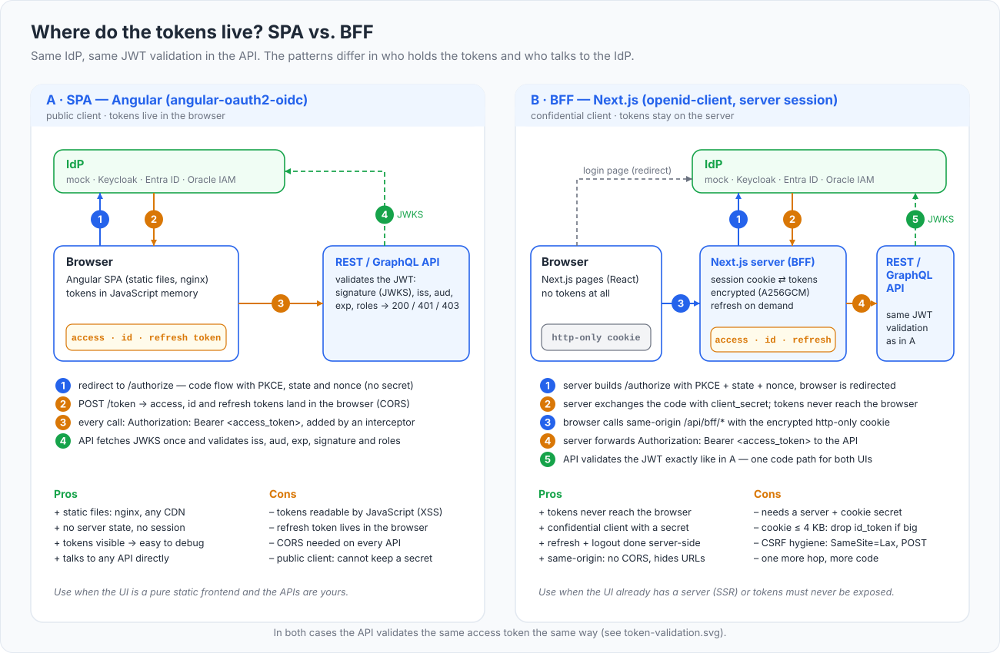

# Production checklist

This repository is built to be read and run on a laptop: plain HTTP, a mock identity provider, demo secrets in Git, one replica of everything. None of that is acceptable in production, and the code is written so that the change is configuration, not rewriting. This chapter lists what to change, why, and where each item lives in the repository, so you can turn the tutorial into a starting point rather than a liability.

## What you will learn

- Which defaults are deliberately unsafe and how each one is switched off.
- How to think about token lifetimes, audiences, roles versus groups, and key rotation before you pick values.
- What breaks when you scale the mock IdP, Keycloak or the Next.js BFF beyond one replica, and how to avoid it.
- A table mapping every checklist item to the file or variable that controls it here.

## TLS everywhere

Plain HTTP is the single biggest deviation. OIDC requires HTTPS for issuer and endpoint URLs; browsers treat `http://*.127.0.0.1.nip.io` as an insecure context (no `Secure` cookies, no `crypto.subtle`); both client libraries need explicit opt-outs (`requireHttps: false`, `allowInsecureRequests`) that must never ship. The repository's TLS mode - `make tls`, then `SCHEME=https make switch IDP=mock` - is a stepping stone: it terminates TLS at the gateway with a locally generated CA ([deploy/tls/README.md](../deploy/tls/README.md)) and shows every place a scheme change touches (issuer, redirect URIs, CORS origins, `KC_HOSTNAME`, the CA mounted into the pods). In production use certificates from a real CA (cert-manager with ACME or your PKI), remove the `http` listener from [deploy/gateway/gateway.yaml](../deploy/gateway/gateway.yaml) or redirect it, set `OIDC_REQUIRE_HTTPS=true` and `"requireHttps": true`, and drop the `k8sgateway-ca` mount once the IdP uses a publicly trusted certificate. Consider TLS between gateway and pods too (`BackendTLSPolicy`) or a mesh; the token is bearer credentials, and anything that can read the wire can replay it.

## Never the mock IdP

`apps/mock-idp` signs tokens for anyone who clicks "Sign in as alice", accepts any redirect URI (`MOCK_ALLOW_ANY_REDIRECT=true`), offers the password grant and keeps state in memory. It exists to imitate claim shapes during development ([04-mock-idp.md](04-mock-idp.md)). Do not build the image into a production pipeline, do not deploy `deploy/overlays/mock`, and make sure no production overlay trusts `http://idp.…` as issuer - the gateway policy variant and the app ConfigMaps both name it.

## Keycloak in production mode

The Keycloak deployment ([deploy/idp/keycloak/deployment.yaml](../deploy/idp/keycloak/deployment.yaml)) is dev mode from top to bottom: `start-dev` (HTTP on, hostname checks relaxed, local caches), the `dev-file` H2 database that Keycloak itself calls unsuitable for production and that forces `replicas: 1` with `strategy: Recreate`, `--import-realm` at every start, the bootstrap admin `admin/admin`, `KC_HOSTNAME_DEBUG=true`, `sslRequired: none` in the realm, and an HTTPRoute that publishes the whole server including `/admin/`. For production: `start` with a real database (`KC_DB=postgres` and friends) so several replicas can share state; `KC_HOSTNAME` stays a full `https://` URL; keep `KC_PROXY_HEADERS=xforwarded` behind Envoy; route only `/realms/<realm>/` and `/resources/` through the gateway and reach the admin console internally; remove the bootstrap admin after creating real ones; manage the realm with the operator or IaC instead of import-on-start. Size it: Keycloak recommends about 2 GB per pod for small production deployments, and heap is 70 % of the container limit.

## Secrets management

Everything secret in this repository is a demo value committed to Git: `SESSION_SECRET` and `OIDC_CLIENT_SECRET=nextjs-secret` in `deploy/overlays/*/nextjs.secret.env`, the client secrets in `realm-export.json` (`nextjs-secret`, `svc-batch-secret`), Keycloak's `admin/admin`, and the mock IdP's signing key that `scripts/deploy.sh` generates into the Secret `idp/mock-idp-key`. Generate real ones (`SESSION_SECRET` is 32 bytes as 64 hex characters: `openssl rand -hex 32`), keep them out of the overlay files, and inject them with a secrets operator (External Secrets, Sealed Secrets, Vault). The Next.js Deployment already reads them from a separate `Secret` (`nextjs-secrets`) rather than the ConfigMap, so the wiring stays the same. Rotate `SESSION_SECRET` knowing that it logs every user out - the cookie cannot be decrypted with the new key.

## Token lifetimes and refresh strategy

Both dev IdPs issue 5-minute access tokens (`MOCK_ACCESS_TOKEN_TTL=300`, Keycloak `accessTokenLifespan: 300`), 30-minute refresh/SSO-idle windows and, for Keycloak, a 10-hour SSO maximum. Short access tokens limit the damage of a leaked token; they work only because refresh is automatic: Angular refreshes at 75 % of the lifetime with the refresh-token grant, the BFF refreshes inside `/api/bff/*` Route Handlers when a token has less than 30 s left, and its session has an absolute 8-hour lifetime counted from login ([apps/nextjs-app/src/lib/session.ts](../apps/nextjs-app/src/lib/session.ts)) that refreshing never extends. Decide on the same three numbers for your IdP: access-token lifetime (minutes), refresh/idle window, absolute session maximum. Keep `offline_access` out of the Keycloak scope - it turns refresh tokens into offline tokens that never expire and survive logout - while Microsoft Entra ID and Oracle IAM Identity Domains need it to issue refresh tokens at all. Refresh-token rotation (Keycloak and the mock IdP rotate) is what you want; see replicas below for the consequence.

## Audience and scope design

`OIDC_AUDIENCE=k8sgateway-api` is one audience for both APIs. That is fine for a small system; for several services give each its own audience (a Keycloak client scope with an Audience mapper per API, a separate app registration and `api://…/scope` per API in Entra ID, a resource per API in Oracle) so a token for the orders API cannot be replayed against the billing API. Scopes are the caller's request, audiences are the IdP's answer; the APIs here check `aud` and roles, not scopes. Whatever you choose, never omit the audience check - a token that validates without `aud` validates everywhere.

## Roles versus groups

The apps read roles from one claim path (`ROLES_CLAIM`) and map two values (`ROLE_USER`, `ROLE_ADMIN`) to application roles; everything else in the claim is ignored, which is what makes Keycloak's `default-roles-*` and `offline_access` harmless. Two design choices remain. Roles defined in the IdP per application (Keycloak realm/client roles, Entra app roles, Oracle app roles) are stable names you control; groups are directory structure that leaks organizational detail into tokens and, in Entra ID, arrive as object-id GUIDs and are replaced by an overage indicator once a user is in too many of them. Prefer application roles, map groups to roles inside the IdP, and keep the claim small. Do not put authorization data the API cannot verify into the ID token - the APIs only ever look at the access token.

## CORS allow-lists

`CORS_ORIGINS` is an exact list per API (`*` wildcards only where the GraphQL API accepts them); an empty value fails closed. In production list exactly the SPA origins, nothing more, and keep it identical in any gateway policy `cors` block and in Keycloak's Web Origins. The BFF needs no CORS at all - same-origin calls to `/api/bff/*` - which is one of the reasons to prefer it.

## Rate limiting and the gateway JWT policy

The APIs have no rate limit. The Go verifier refetches the JWKS on every unknown `kid` (go-oidc has no negative cache), so a flood of garbage tokens becomes a flood of requests to the IdP. Two cheap mitigations at the edge: the `SecurityPolicy` from [12-gateway-jwt.md](12-gateway-jwt.md) rejects invalid tokens before they reach the pods, and Envoy Gateway's `BackendTrafficPolicy` adds local or global rate limiting per route (not shipped here). Keep the policy's issuer in sync with the apps - [scripts/switch-idp.sh](../scripts/switch-idp.sh) warns when it is not - and treat it as a second lock, not the only one.

## Logging and PII

Every component logs one line per request with `sub` and `roles`; the mock IdP and the GraphQL API can log at `debug`, and Angular's `showDebugInformation` prints complete token responses to the browser console. In production: `LOG_LEVEL=info`, `showDebugInformation` absent, never log `Authorization` headers or token bodies (the apps do not - keep it that way in code review), and remember that `sub`, `email` and `preferred_username` are personal data subject to retention rules. Envoy's access log carries `x-request-id`; propagate it into the apps (`request_id` is already logged by the REST API) to correlate.

## Key rotation and JWKS caching

IdPs rotate signing keys; validators must cope without a restart. The REST API fetches the JWKS on an unknown `kid` (concurrent misses share one request); the GraphQL API refetches on an unknown `kid` at most every 30 s and refreshes at least every 10 minutes; Envoy caches the key set for `cacheDuration` (300 s). Three properties make rotation safe: publish the new key in the JWKS **before** signing with it, keep the old key published until every token signed with it has expired, and make `kid` stable per key (the mock IdP derives it from the key thumbprint). The mock IdP's persistent key Secret exists precisely because an ephemeral key on restart invalidates every cached JWKS at once.

## Replicas

`replicas: 1` everywhere is a tutorial simplification with three real constraints behind it:

- **Mock IdP** - authorization codes, refresh tokens and SSO sessions live in memory ([apps/mock-idp/src/store.js](../apps/mock-idp/src/store.js)); a second replica would not know the first one's codes. It stays at one, and it does not go to production anyway.
- **Keycloak** - the H2 file cannot be shared; scale only after moving to a real database and `start`.
- **Next.js BFF** - refresh-token rotation invalidates the old token on use, so two concurrent requests could race. The BFF de-duplicates concurrent refreshes per refresh token **in process** ([apps/nextjs-app/src/lib/tokens.ts](../apps/nextjs-app/src/lib/tokens.ts)); with several pods, two pods can still refresh the same token simultaneously and one of them fails. Options: session affinity at the gateway, a server-side session store keyed by an opaque cookie (which also removes the cookie-size problem), or an IdP setting that tolerates refresh-token reuse for a few seconds. If you add Server Actions, several pods also need a shared `NEXT_SERVER_ACTIONS_ENCRYPTION_KEY`.

The REST and GraphQL APIs are stateless apart from the in-memory demo order store and scale freely - replace the store with a database first.

## NetworkPolicies

There are none in this repository, and that is a gap: today any pod in the cluster can call `rest-api.k8sgateway.svc.cluster.local:8080` directly, bypassing the gateway and any policy on it. Add default-deny policies per namespace and allow only the Envoy proxy (`envoy-gateway-system`, labels `gateway.envoyproxy.io/owning-gateway-name=main`) plus the known callers (GraphQL → REST, Next.js → REST and GraphQL), and egress from the APIs to the IdP only. Only then may a backend trust gateway-added headers such as `x-jwt-sub`.

## Resource limits, image pinning, supply chain

Every Deployment sets requests and memory limits (64–256 Mi for the apps, 1.5 Gi for Keycloak) and a hardened `securityContext` (non-root, no privilege escalation, all capabilities dropped, seccomp `RuntimeDefault`, read-only root filesystem for the Go API) - keep that and add CPU limits if your cluster requires them. Images are tagged `:dev` and loaded into kind; in production build in CI, push to a registry, pin **by digest** (as [deploy/kind/kind-config.yaml](../deploy/kind/kind-config.yaml) already does for the node image), and pin the Envoy Gateway and Keycloak versions you tested. The Dockerfiles are multi-stage with pinned base images, dependency lockfiles (`package-lock.json`, `go.sum`) and `npm ci`; add image scanning and signing (Trivy, cosign) to [.github/workflows/ci.yml](../.github/workflows/ci.yml), and watch the dependencies that matter for security: angular-oauth2-oidc, openid-client, jose, go-oidc.

## Monitoring

The most useful signals are already produced. Every request line has a status: alert on the **rate** of 401 and 403 per service and on `token rejected` reasons - a step change in `issuer mismatch` or `audience mismatch` after a deploy means a configuration regression, a rise in `invalid signature` means a key rotation went wrong. Envoy exposes Prometheus metrics on port 19001 of the proxy pod and JSON access logs with `response_code` and `response_code_details`; the `jwt_authn` filter counts `denied` and `jwks_fetch_failed`. Probe `/readyz` of the APIs from your monitoring - it reports the last discovery error in the body.

## BFF cookie size

The Next.js session is an encrypted cookie holding access, refresh and ID token. Browsers cap a cookie around 4 KB, and Keycloak, Entra ID and Oracle tokens are large: `session.ts` keeps the payload under 3 500 bytes by moving the ID token into a second cookie and, if even that is too big, dropping it (logout then has no `id_token_hint`). Large headers can also trip `431` at the gateway. For production either keep tokens small (fewer claims, no groups) or switch to a server-side session store with an opaque cookie - the code paths that read the session are already concentrated in [apps/nextjs-app/src/lib/session.ts](../apps/nextjs-app/src/lib/session.ts).

## Browser storage trade-offs

*Where the tokens live decides what an XSS bug can steal.*

The Angular app stores tokens in `localStorage` ([apps/angular-app/src/app/app.config.ts](../apps/angular-app/src/app/app.config.ts)) so the session survives reloads and tabs - convenient, and it means any script running on the page can read the refresh token. `sessionStorage` (the library default) narrows the window to one tab, memory-only storage removes persistence entirely, and the BFF pattern removes tokens from the browser altogether at the price of a server and a cookie. Pick per threat model, and pair a SPA with a strict Content-Security-Policy and short token lifetimes.

## OAuth 2.1 strict mode

The applications already follow OAuth 2.1 (Authorization Code + PKCE only, no implicit grant, rotated refresh tokens, bearer tokens only in the `Authorization` header, see [chapter 1](01-concepts.md#oauth-21-what-it-changes-and-where-this-repository-stands)). Two development conveniences in the IdP configuration are OAuth 2.0 only and must go before production:

| Convenience | Why it is there | Strict setting |
|---|---|---|
| Password grant on the test client `cli` (`grant_type=password`, used by `scripts/get-token.sh` and `scripts/test.sh` for per-user tokens) | curl examples and smoke tests without a browser | Mock IdP: remove `"password"` from the `cli` entry in [apps/mock-idp/clients.json](../apps/mock-idp/clients.json) (or drop the client) and rebuild the image. Keycloak: set `directAccessGrantsEnabled: false` on `cli` in [realm-export.json](../deploy/idp/keycloak/realm-export.json) (admin console: client `cli` > Capability config > Direct access grants) or delete the client. Entra ID and Oracle IAM: nothing to do, the overlays never configure it. Machine checks then use `scripts/get-token.sh --client-credentials` (client `svc-batch`); per-user checks move to the browser suite in [e2e/](../e2e) |
| Relaxed redirect URI matching | any hostname works while developing | Mock IdP: `MOCK_ALLOW_ANY_REDIRECT=false` in [deploy/idp/mock/mock-idp.env](../deploy/idp/mock/mock-idp.env) so only the URIs listed in `clients.json` are accepted (prefix wildcards allowed only where you keep them). Keycloak: replace `http://angular.127.0.0.1.nip.io/*` in the `angular-app` client with the exact URIs the SPA uses, `https://<host>/callback` for login and `https://<host>/` as post-logout redirect URI ([auth.service.ts](../apps/angular-app/src/app/core/auth.service.ts) builds both from `window.location.origin`). Entra ID and Oracle IAM enforce exact matching themselves |

Also keep `code_challenge_method=S256` enforced server-side (the mock IdP does; Keycloak through the `pkce.code.challenge.method` client attribute) and `OIDC_REQUIRE_HTTPS=true` / `requireHttps: true` once the issuer is https.

## Where each item is configured

| Item | Where in this repository |
|---|---|
| TLS | [deploy/tls/](../deploy/tls/), [scripts/tls-setup.sh](../scripts/tls-setup.sh), `SCHEME=https`; `OIDC_REQUIRE_HTTPS` / `requireHttps` in `deploy/overlays/*` |
| Mock IdP | [deploy/overlays/mock/](../deploy/overlays/mock/), [deploy/idp/mock/](../deploy/idp/mock/), [apps/mock-idp/](../apps/mock-idp/) - development only |
| Keycloak mode, DB, HA, admin exposure | [deploy/idp/keycloak/deployment.yaml](../deploy/idp/keycloak/deployment.yaml), [deploy/idp/keycloak/httproute.yaml](../deploy/idp/keycloak/httproute.yaml), [realm-export.json](../deploy/idp/keycloak/realm-export.json) (`sslRequired`) |
| Secrets | `deploy/overlays/*/nextjs.secret.env` (`SESSION_SECRET`, `OIDC_CLIENT_SECRET`), `realm-export.json` client secrets, Secret `idp/mock-idp-key` ([scripts/lib.sh](../scripts/lib.sh)) |
| Token lifetimes, refresh | [deploy/idp/mock/mock-idp.env](../deploy/idp/mock/mock-idp.env) (`MOCK_*_TTL`), `realm-export.json` (`accessTokenLifespan`, `ssoSession*`), `SESSION_TTL_SECONDS` in [session.ts](../apps/nextjs-app/src/lib/session.ts), `timeoutFactor` in [auth.service.ts](../apps/angular-app/src/app/core/auth.service.ts), `OIDC_SCOPE` |
| Audience, scope | `OIDC_AUDIENCE`, `OIDC_SCOPE`, `MOCK_AUDIENCE`; client scope `k8sgateway-api` in `realm-export.json`; Entra/Oracle overlay READMEs |
| Roles vs groups | `ROLES_CLAIM`, `ROLE_USER`, `ROLE_ADMIN`; [roles.go](../apps/rest-api/internal/auth/roles.go), [graphql auth.ts](../apps/graphql-api/src/auth.ts), [nextjs roles.ts](../apps/nextjs-app/src/lib/roles.ts), [angular jwt.ts](../apps/angular-app/src/app/core/jwt.ts) |
| CORS | `CORS_ORIGINS` in `rest-api.env` / `graphql-api.env`; `cors` in [deploy/gateway-policies/](../deploy/gateway-policies/); `webOrigins` in `realm-export.json` |
| Gateway JWT policy, rate limiting | [deploy/gateway-policies/](../deploy/gateway-policies/); `BackendTrafficPolicy` not shipped |
| Logging, PII | `LOG_LEVEL` in every env file; `showDebugInformation` in `angular-config.json`; [httpx/logging.go](../apps/rest-api/internal/httpx/logging.go), [graphql log.ts](../apps/graphql-api/src/log.ts), [nextjs log.ts](../apps/nextjs-app/src/lib/log.ts) |
| JWKS caching, key rotation | [verifier.go](../apps/rest-api/internal/auth/verifier.go), [graphql auth.ts](../apps/graphql-api/src/auth.ts) (`cooldownDuration`, `cacheMaxAge`), `remoteJWKS.cacheDuration` in the policies, [apps/mock-idp/src/keys.js](../apps/mock-idp/src/keys.js) |
| Replicas | `replicas:` in `deploy/base/*/deployment.yaml` and `deploy/idp/*/deployment.yaml`; [store.js](../apps/mock-idp/src/store.js); [tokens.ts](../apps/nextjs-app/src/lib/tokens.ts) |
| NetworkPolicies | none (add per namespace) |
| Resource limits, securityContext | `resources:` and `securityContext:` in every `deployment.yaml` |
| Image pinning, supply chain | `apps/*/Dockerfile`, lockfiles, [deploy/kind/kind-config.yaml](../deploy/kind/kind-config.yaml) digest, `imagePullPolicy` in the Deployments, [.github/workflows/ci.yml](../.github/workflows/ci.yml) |
| Monitoring | request logs of every app, Envoy access log (`scripts/logs.sh envoy`), Envoy metrics port 19001, `/readyz` bodies |
| BFF cookie size | `MAX_COOKIE_BYTES` and `MAX_ID_TOKEN_COOKIE_BYTES` in [session.ts](../apps/nextjs-app/src/lib/session.ts) |
| Browser storage | `OAuthStorage` provider in [app.config.ts](../apps/angular-app/src/app/app.config.ts) |
| OAuth 2.1 strict mode | `grant_types` of `cli` in [apps/mock-idp/clients.json](../apps/mock-idp/clients.json), `MOCK_ALLOW_ANY_REDIRECT` in [mock-idp.env](../deploy/idp/mock/mock-idp.env), `directAccessGrantsEnabled` and `redirectUris` in [realm-export.json](../deploy/idp/keycloak/realm-export.json) |

## Next

[Ingress instead of the Gateway API](16-ingress.md) runs the same tutorial behind a classic Ingress controller. Otherwise back to the [README](../README.md) for the chapter index, or start again at [OIDC and JWT concepts](01-concepts.md) with production in mind.
