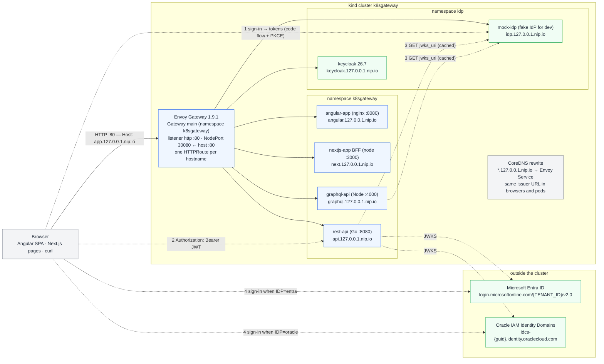
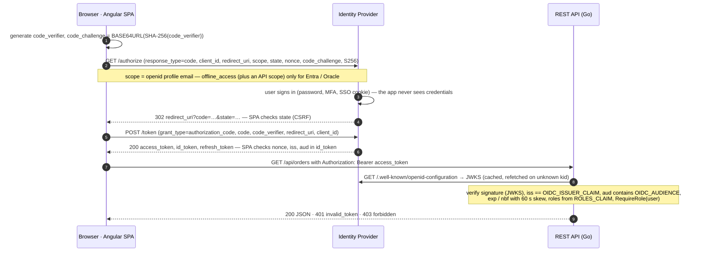
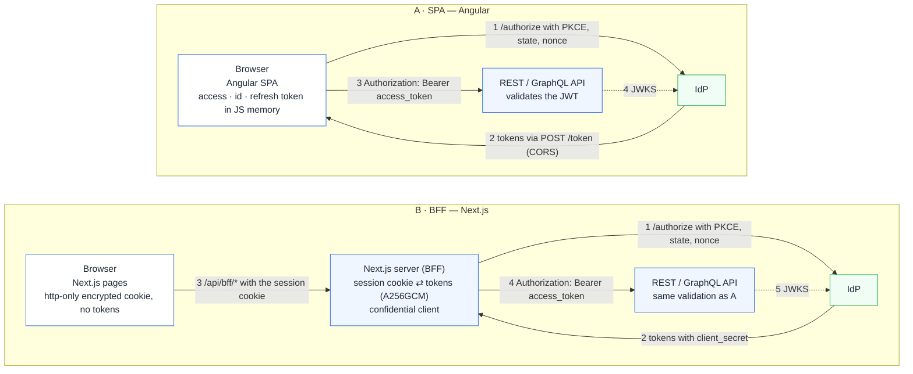
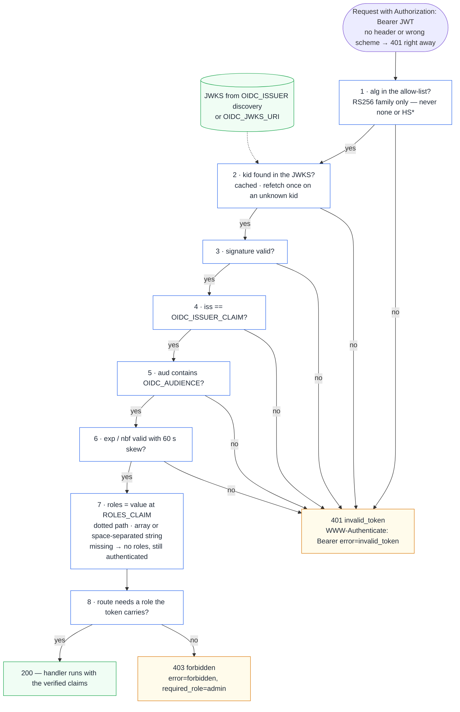
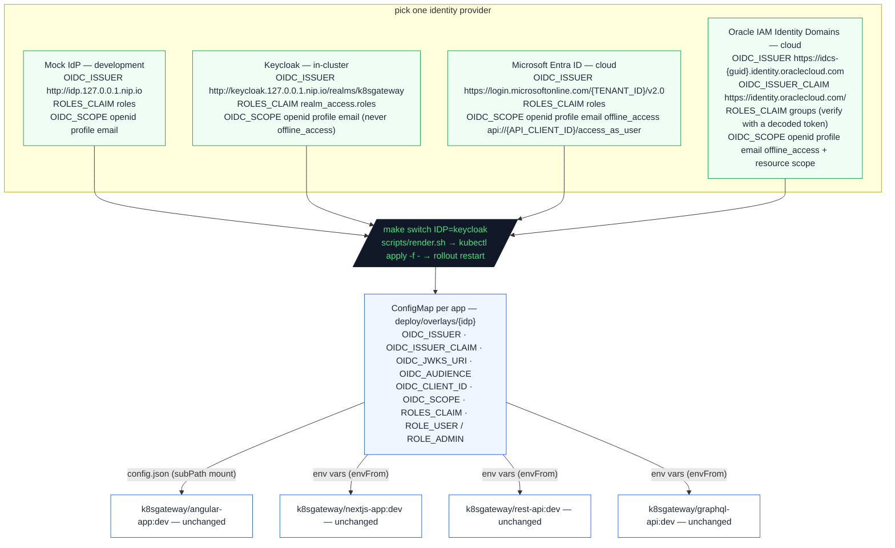

# Mermaid equivalents of the diagrams

GitHub renders Mermaid blocks natively, so a chapter can embed either the SVG
from this folder or the Mermaid source below. Both show the same thing; the SVGs
carry more detail, the Mermaid blocks are easier to keep in sync with text edits.

Colours follow the same convention as the SVGs: blue = application code,
green = identity provider, amber = tokens.

## 1. Architecture (`architecture.svg`)

## 2. Authorization Code Flow with PKCE (`code-flow-pkce.svg`)

## 3. SPA vs. BFF (`bff-vs-spa.svg`)

| | A · SPA (Angular) | B · BFF (Next.js) |
|---|---|---|
| Pros | static files (nginx, any CDN); no server state; tokens visible → easy to debug; talks to any API directly | tokens never reach the browser; confidential client with a secret; refresh and logout server-side; same-origin calls, no CORS |
| Cons | tokens readable by JavaScript (XSS); refresh token in the browser; CORS on every API; public client cannot keep a secret | needs a server and a cookie secret; cookie ≤ 4 KB; CSRF hygiene (SameSite=Lax, POST); one more hop |
| Use when | the UI is a pure static frontend and the APIs are yours | the UI already has a server (SSR) or tokens must never be exposed |

## 4. Token validation in a resource server (`token-validation.svg`)

Every 401 carries `WWW-Authenticate: Bearer error="invalid_token", error_description="…"`
and the JSON body `{"error":"unauthorized","error_description":"…"}`.

## 5. Switching the IdP (`idp-switch.svg`)

